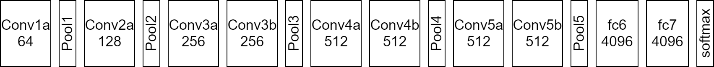

[paper]: https://arxiv.org/pdf/1412.0767.pdf	"Learning Spatiotemporal Features with 3D Convolutional Networks"

The [paper] is by Du Tran, Lubomir Bourdev, Rob Fergus, Lorenzo Torresani, Manohar Paluri.

**Publication date :** 7 Oct 2015

**C3D source code and pre-trained model** are available at [here](http://vlg.cs.dartmouth.edu/c3d).

<!--more-->

# Basic Idea

The authors build **C3D (Convolutional 3D)** model to obtain a **generic, compact, efficient, and simple video descriptor**.

The authors's contributions in this paper are:

+ They show 3D convolutional deep networks are good feature learning machines that **model appearance and motion simultaneously**.
+ They find that **3 × 3 × 3 convolution kernel for all layers to work best** among the limited set of explored architectures. 
+ The proposed features with a simple linear model outperform or approach the current best methods on 4 different tasks and 6 different benchmarks (see Table 1). They are also **compact and efficient to compute**.

## 3D Convolution and 3D Pooling

The difference between 2D and 3D convolution operations is showed in Figure 1.

### Notations

**Video Clip size:**    $c \times l \times h \times w$   ($c$ is the number of channels, $l$ is length in number of frames, $h$ and $w$ are the height and width of the frame, respectively)

**3D convolution and pooling kernel size:**   $d \times k \times k$   ($d$ is kernel temporal depth, $k$ is kernel spatial size)

# Exploring kernel temporal depth

## Common network settings

All video frames are resized into 128 × 171, and then the authors use jittering by using **random crops** with a size of **3 × 16 × 112 × 112** of the input clips during training.

The networks have 5 convolution layers and 5 pooling layers (each convolution layer is immediately followed by a pooling layer), 2 fully-connected layers and a softmax loss layer to predict action labels.

**All convolution kernel size:**   $d$ × 3 × 3   (the authors vary the value of $d$ to search for a good 3D architecture)

**All pooling kernel size:**   2 × 2 × 2   (except for the Pool1 whose size is 1 × 2 × 2, not to merge the temporal signal too early)

**training:** 

+ from scratch
+ mini-batch of 30 clips
+ Initial learning rate: 0.003. The learning rate is divided by 10 after every 4 epochs. The train is stopped after 16 epochs. 
+ dataset: UCF101

## Varying network architectures

The author experiment with two types of architectures:

+ **homogeneous temporal depth**
  + all convolution layers have the same kernel temporal depth.
  + The authors experiment with 4 networks having kernel temporal depth of $d$ equal to 1, 3, 5, and 7, and name these networks as **depth-d**.
  + **depth-1, depth-3, depth-5, depth-7**.
  + depth-1 is the same as 2D ConvNet.
+ **varying temporal depth**
  + kernel temporal depth is changing across the layers.
  + The authors experiment 2 networks with temporal depth **increasing**: 3-3-5-5-7 and **decreasing**: 7-5-5-3-3 from the first to the fifth convolution layer respectively.
  + **increase, decrease.**

## Result

2D ConvNet performs worst and 3D ConvNet with 3 × 3 × 3 kernels performs best among the experimented nets.

The best kernel temporal depth is 3.

# C3D (Convolutional 3D)

## C3D architecture

C3D net has 8 convolution, 5 max-pooling, and 2 fully connected layers, followed by a softmax output layer. All 3D convolution kernels are 3 × 3 × 3 with stride 1 in both spatial and temporal dimensions. Number of filters are denoted in each box. The 3D pooling layers are denoted from *pool1* to *pool5*. All pooling kernels are 2 × 2 × 2, except for *pool1* is 1 × 2 × 2 with the intention of preserving the temporal information in the early phase. Each fully connected layer has 4096 output units.

## Dataset

**Dataset:**   Sports-1M

+ 1.1 million sport videos.
+ each video belongs to one of 487 sports categories.

## Training

**input:**

+ randomly extract five 2-second long clips from every training video.
+ Clips are resized to have a frame size of 128 × 171.
+ On training, clips are randomly crop into 16 × 112 × 112 crops for spatial and temporal jittering.
+ horizontally flip clips with 50% probability.

**optimizer:**

+ SGD with mini-batch size of 30 examples.
+ Initial learning rate is 0.003, and is divided by 2 every 150K iterations. The optimization is stopped at 1.9M iterations (about 13 epochs).

The authors experiment with C3D net trained from scratch and C3D net fine-tuned from the model pre-trained on I380K dataset.

## Result

 

## C3D video descriptor

After training, C3D can be used as a feature extractor for other video analysis task.

+ To extract C3D feature, **a video is split into 16 frame long clips with a 8-frame overlap between two consecutive clips**.
+ These clips are passed to the C3D network to **extract *fc6* activations**.
+ These clip ***fc6* activations are averaged to form a 4096-dim video descriptor/feature** which is then followed by an **L2-normalization**.

## C3D is compact

The authors use PCA to project the features into lower dimensions and report the classification accuracy of the projected features on UCF101 using a linear SVM.

# Action Recogniton

## Dataset

the authors use the tree split setting provided with UCF101 dataset which consists of 13,320 videos of 101 human action categories.

## Model

The authors **extract C3D features** and input them to a **multi-class linear SVM** for training models.

+ **C3D (1 net) + linear SVM**
  + C3D is trained on I380K dataset
+ **C3D (3 nets) + linear SVM**
  + use 3 different nets:
    + C3D trained on 1380K dataset
    + C3D trained on Sports-1M dataset
    + C3D trained on I380K and fine-tuned on Sports-1M
  + **concatenate the L2-normalized C3D features** of these nets.

## Result

# Action Similarity Labeling

## Dataset

The ASLAN dataset consists of 3,631 videos from 432 action classes. The task is to predict if a given pair of videos belong to the same or different action.

The authors use the prescribed 10-fold cross validation with the splits provided with the dataset.

## Features

+ **split videos into 16-frame clips with an overlap of 8 frames**
+ **extract C3D features: *prob(softmax), fc7, fc6, pool5* for each clip**.
+ **averaging the clip features separately for each type of feature**, followed by an **L2 normalization**.

## Model

The authors use the model of Kliper-Gross et al. to **compute the 12 different distances**.

With 4 types of features, the authors **obtain 48-dimensional feature vector (12 × 4 = 48) for each video pair**. 

As these 48 distances are not comparable to each other, the authors **normalize them independently such that each dimension has zero mean and unit variance**.

**A linear SVM is trained to classify video pairs into same or different** on these 48-dim feature vectors.

## Result

# Scene and Object Recognition

## Dataset

**Scene recognition:**

+ **YUPENN**: 420 videos of 14 scene categories.
+ **Maryland**: 130 videos of 13 scene categories.

**Object recogniton:**

+ an egocentric dataset which consists 42 types of everyday objects.

## Model

**Scene recognition:**

+ use the same setup of feature extraction and linear SVM for classification and follow the same leave-one-out evaluation protocol as described by the authors of these datasets.

**Object recognition:**

+ slide a window of 16 frames to extract C3D features. 
+ choose the ground truth label for each clip to be the most frequently occurring label of the clip. If the most frequent label in a clip occurs fewer than 8 frames, the authors consider it as negative clip with no object and discard it in both training and testing.
+ train and test C3D features using linear SVM.

## Result

**Scene recognition:**

**Object recognition:**

C3D obtains 22.3% accuracy and outperforms by 10.3% with only linear SVM where the comparing method used RBF-kernel  on strong SIFT-RANSAC feature matching. Compared with Imagenet baseline, C3D is still 3.4% worse.

# Runtime Analysis

The authors report runtime of the three above-mentioned methods to extract features (including I/O) for the whole UCF101 dataset using a single CPU or a single K40 Tesla GPU.

C3D is much faster than real-time, processing at **313 fps** while the other two methods have a processing speed of less than 4 fps.

