本文详细介绍卷积的定义及性质。

<!--more-->

# 记号说明

| 记号 | 说明                       |
| ---- | -------------------------- |
| $S$  | 系统(具体语境下指线性系统) |
| $*$  | 卷积                       |

# 线性系统 Linear System

在介绍卷积之前，我们需要先弄清楚线性系统，以便更好地理解卷积的由来。

## 线性系统的定义

一个**系统(system)**被定义为修改信号的一种方法，而**线性系统(linear system)**是满足以下线性的性质的系统：

1. **齐次性**(Homogeneity)

   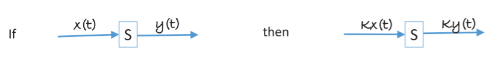

2. **可加性**(Additivity)

   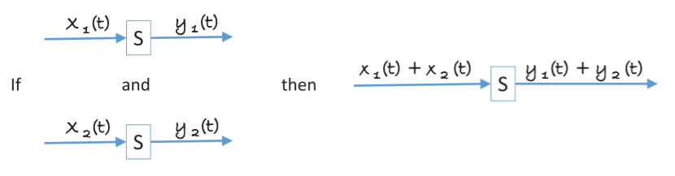

3. **平移不变性**(Shift Invariance)

   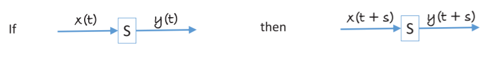

4. **可交换性**(Commutative)

   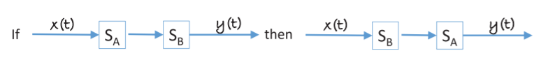

5. **可叠加性**(Superpostion)

   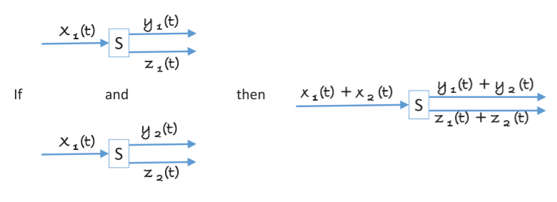

## 线性系统的响应

一个脉冲(impulse), $i[t]$，是一个只有一个非零值的离散信号，即

$$
i[t] = 
\begin{cases}
k, &t=s \\
0, &t \ne s
\end{cases}
$$

特别地，Delta, $\delta[t]$, 是一个当$t=0$时为$1$，当 $t$ 取其他值时为0的脉冲函数，即

$$
\delta[t] = 
\begin{cases}
1, & t=0 \\
0, & t \ne 0
\end{cases}
$$

$\delta[t]$ 可以被认为是最简单的脉冲函数。

任意一个脉冲函数 $i[t]$ 都可以用 $\delta[t]$ 通过平移和缩放得到:

$$
i[t] = k \delta[t-s]
$$

让一个 $\delta[t]$ 通过一个线性系统得到输出 $h[t]$ ，我们称之为该线性系统的**脉冲响应**(impulse response)，又称**卷积核**(kernel)或者**滤波器**(filter)。$h[t]$ 的大小(1D 情况下的宽)也叫做这个核的**支撑**(support)。

对于线性系统的一个一般输入 $x[t]$，我们可以将其分解成 $n$ 个脉冲 $i_1[t]$, $i_2[t]$, $...$, $i_n[t]$，使得$i_l[t]$ 当 $t=l$ 时取非0值，当 $t \ne 0$ 时取0。由此一个一般输入 $x[t]$ 可以表示为多个脉冲的和：

$$
x[t] = \sum_{i=l}^n i_l[t]
$$

对于一个脉冲输入$i_l[t]$，其响应为 $i_l[l]h[t-l]=x[l]h[t-l]$。

由线性系统的可加性，$x[t]$ 的响应为:

$$
R[t] = \sum_{l=1}^n x[l]h[t-l] = x[t] *h[t]
$$

其中 $x[t]*h[t]$ 为 $x[t]$ 与 $h[t]$ 的卷积。于是，一个线性系统的计算可以用输入与脉冲响应的卷积来表示。

在 $x[t]$ 的边界条件下，$x[t]$ 将取不到值可以进行计算，此时常用的措施是假设该点的值，如取0，或者取边界值，但无论如何，这个措施给卷积带来了两个缺点:

1. $R$ 的大小比线性系统的输入$x$ 要大，假如$h$的大小是$m$，则$R$的大小就是 $n+m-1$。
2. 由于引入了一些假设的值，计算出的$R$并不是精确的。

# 卷积的性质

**全通系统**(all pass system): 特殊情况下，线性系统的脉冲响应为$\delta[t]$，那么这个系统就是全通系统。

$$
x[t] * \delta[t] = x[t]
$$

**延迟系统**(delay system): 不改变信号而对信号进行偏移的系统。

$$
x[t] * \delta[t+s] = x[t+s]
$$

卷积操作满足以下性质:

1. 交换律(commutative)

   $$
   a[t] * b[t] = b[t]*a[t]
   $$

2. 结合律(associative)

   $$
   (a[t]*b[t])*c[t] = a[t] * (b[t]*c[t])
   $$

3. 分配律(distributive)

   $$
   a[t]*b[t]+a[t]*c[t]=a[t]*(b[t]+c[t])
   $$

# 线性滤波器 Linear Filter

## 从时域到频域

对于一个时域上的输入 $x[t]$，我们可以将其转换到频域进行观察。

时域与频域的转换有以下性质:

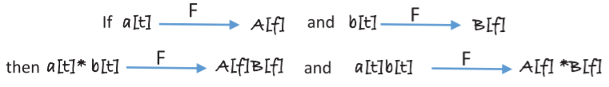

其中, $F$代表一个将函数由时域转换到频域的函数。

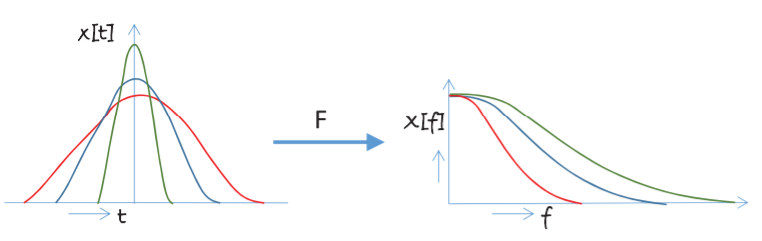

观察上图，我们可以建立一个直观的认识：如果输入$x[t]$ 曲线在某一点$t$变化越平缓，则该点的频率越低，相反，变化越陡峭，则频率越高。由此，一个输入$x[t]$涵盖一定频率$f$的区间，而可能有一部分区间没有涵盖到。特别地，$\delta[t]$涵盖了所有的频率，因此其频率分布是一条直线。

## 全通滤波器 All Pass Filter

前面我们已经介绍了 $\delta[t]$ 就是全通滤波器，但这个"全通"是什么意思呢？

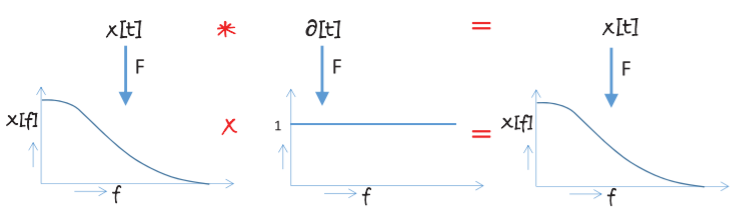

由于 $\delta[t]$ 涵盖了所有频率，且频率分布为一条定值直线，可以使得输入 $x[t]$ 的频率分布不发生改变，所有频率都通过了，因此，称之为全通滤波器。

## 低通滤波器 Low Pass Filter

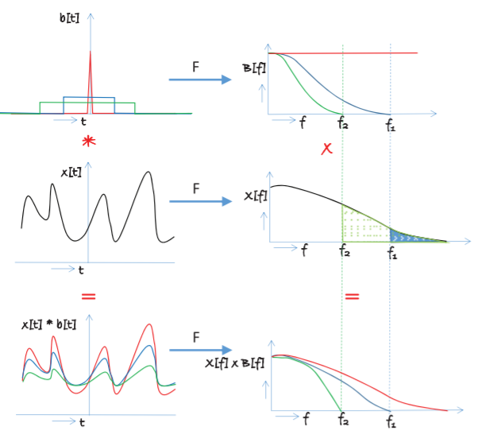

上图中，蓝色滤波器通过卷积使得输入$x[t]$高于$f_2$的频率被截断，绿色滤波器使得$x[t]$高于$f_1$的频率被截断，此类使得低频率通过，而使高频率截断的滤波器统称为低通滤波器。

低通滤波器在二维图像上应用最明显的特点就是图像变模糊了，由于频率可以看作是采样的密度，当使用低通滤波器时，高频率被截去，使得采样的密度降低，由此，图像就变得模糊了。

通过将其转换到傅里叶频谱进行观察，我们可以更直观地对低通滤波器截断高频率进行理解：

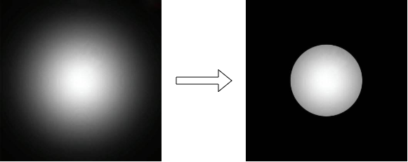

傅里叶频谱中，离中心点越远的点，频率越高。应用低通滤波器后，原傅里叶频谱中高于一定频率的部分被截断，由此，傅里叶频谱被挖出了中间的一个圆。

需要注意的是，低通滤波器不仅仅是截断了高频率，通过的低频率部分也被改变。

## 高通滤波器 High Pass Filter

相对于低通滤波器，高通滤波器使得高频率的部分通过。一个较为简单的构造高通滤波器的方法是让一个全通滤波器减去一个低通滤波器。

假设$I$为输入的图像，$l$为低通滤波器，经过低通滤波器的图像为$I_l$，经过高通滤波器的图像为$I_h$，由此：

$$
\begin{align}
I_h &= I - I_l \\
&= I*\delta -I*l \\
&= I*(\delta - l)
\end{align}
$$

得到的高通滤波器 $\delta - l$ 见下图:

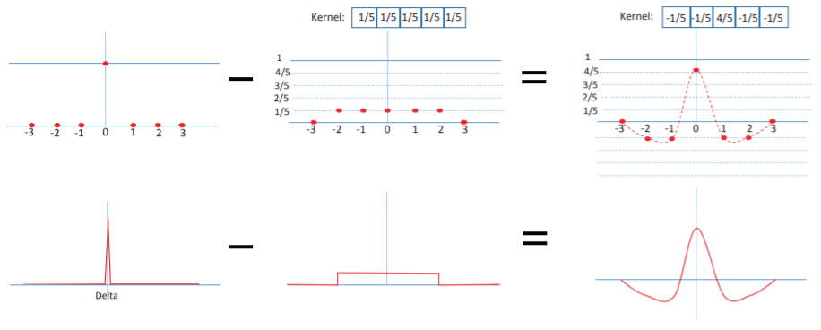

从傅里叶频谱来看:

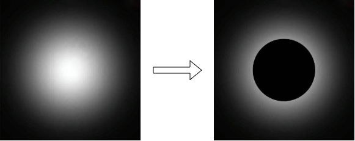

高通滤波器相当于挖去了原频谱中低频部分的圆，需要注意的是上图并不能完全表明高通滤波器对傅里叶频谱的作用，由于低通滤波器对于低频信号进行了修改，使得高通滤波器并不能完美挖去这个圆，仍有部分低通信号残余。

## 带通滤波器 Band Pass Filter

带通滤波器保留了频率在 $f_1$ 到 $f_2$ 之间的信号，截断小于$f_1$和大于$f_2$的信号，可以认为是两个低通滤波器的差。

从傅里叶频谱来看：

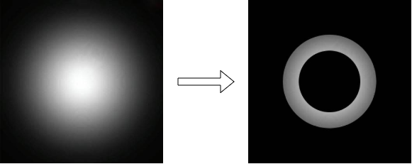

## 二维滤波器的可分离性

当一个二维滤波器$h$可以用两个一维滤波器$a$, $b$进行表示，使得$h[i][j]=a[i] \times b[j]$时，这个二维滤波器是一个可分离的二维滤波器。

$$
I * h = I * (a*b)= (I * a) * b
$$

我们可以图像先用 $a$ 进行滤波，再用 $b$ 进行滤波，达到和直接使用二位滤波器 $h$ 进行滤波同样的效果。

可分离的滤波器的好处是可以更高效地进行运算：

假设一张图像有$N$个像素，二维滤波器$h$的大小为$p \times q$，且可以拆分成大小分别为$p$和$q$的一维滤波器$a$, $b$。直接通过$h$对图像进行卷积需要$pqN$个乘法和$pqN$个加法，加起来就是$2pqN$个浮点运算。而用$a$和$b$依次进行卷积，$a$需要$2pN$个浮点运算，$b$需要$2qN$个浮点运算，加起来就是$2(p+q)N$个浮点运算。由此可见，可分离的二维滤波器分离后再进行卷积会更高效。

# 参考资料

+ Introduction to Visual Computing: Core Concepts in Computer Vision, Graphics, and Image Processing