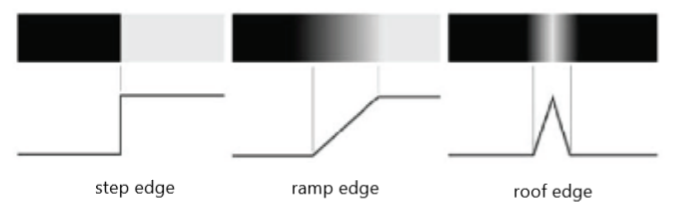
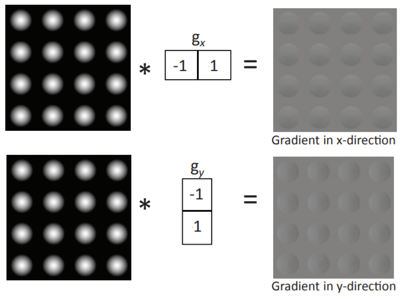
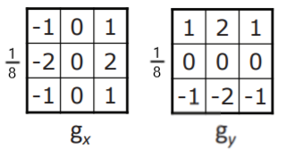
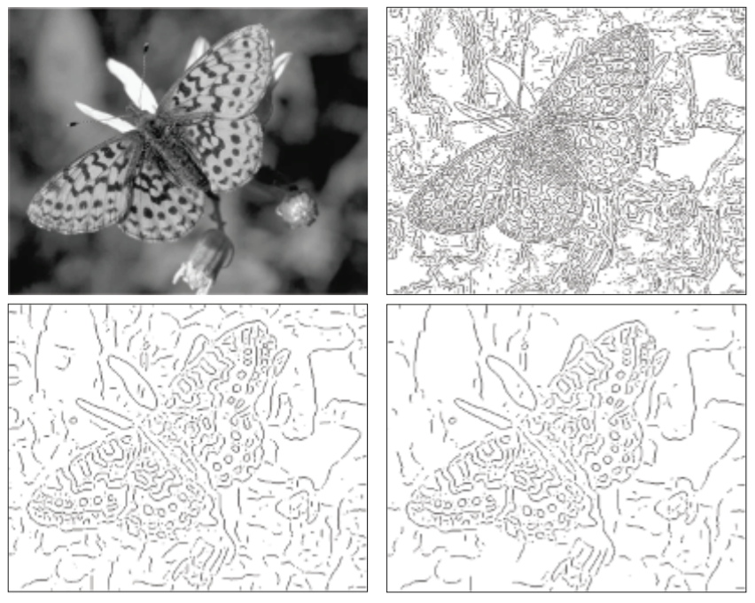
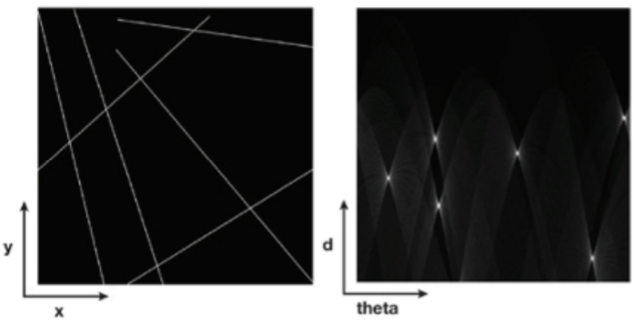
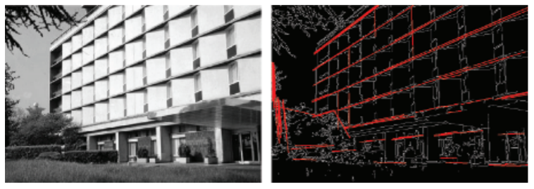
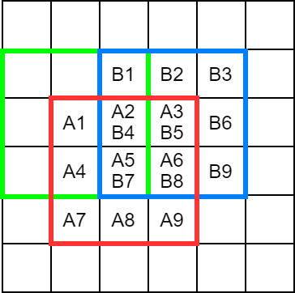
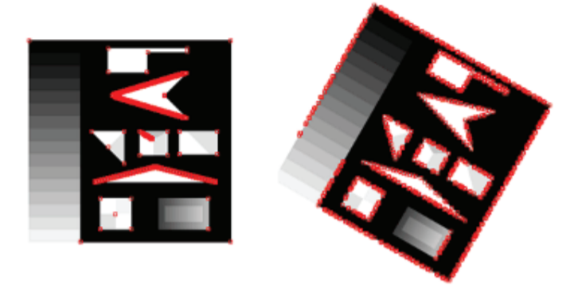
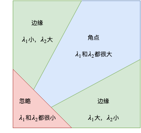
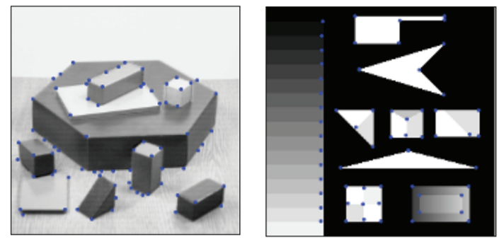

本文介绍计算机视觉特征检测的基础知识。包含：

1. 边缘检测
2. 特征检测

<!--more-->

图像的特征被定义为一张图片与众不同的地方。

# 边缘检测 Edge Detection

**边缘检测通常分为两步：**

1. 找到组成边缘的所有像素点，也称为边缘子(edgel)。
2. 将这些边缘子聚合更长的边，有时候会使用更为紧凑的参数来表示这些边(compact parametric representation)。

## 边缘子检测器 Edgel Detector

### 基于梯度的检测器 Gradient Based Detector

边缘通常是由像素点间急剧的亮度变化构成的，由此会产生阶梯形(step edge)、坡形(ramp edge)、屋顶形(roof edge)的边缘。我们可以将一张图片看成一个函数，函数值急剧的变化会产生边缘。如何去衡量这个“急剧的变化”呢，可以使用一阶导数(或称梯度)，导数可以描述函数陡峭的程度，一阶导数值越大，这个地方变化就越剧烈，就越可能是边缘。

我们将一个图像用一个二维函数 $f$ 来表示。沿着 $x$ 轴和 $y$ 轴两个方向分别求偏导，就是这个函数的梯度:

$$
\nabla f = (\frac{\partial f}{\partial x}, \frac{\partial f}{\partial y}) = (g_x, g_y)
$$

边缘的大小(magnitude)和方向(direction)分别表示为:

$$
\begin{align}
\| \nabla f \| = \sqrt{g_x^2 +g_y^2} \\
\theta = \tan^{-1} \frac{g_y}{g_x}
\end{align}
$$

由于二维图像是离散的，我们可以通过有限差分法(finite differences)得到导数：

$$
\begin{align}
g_x = f(x+1, y) - f(x, y) \\
g_y = f(x, y+1) - f(x, y) 
\end{align}
$$

这个有限差分用卷积来表示

有了梯度，我们可以对这个梯度进行阈值化(thresholding)，即设定一个阈值，当梯度大小 $\| \nabla f \|$ 大于该阈值时，我们认为该点是边缘子。

除了像上图中使用一个 $1 \times 2$ 和 $2 \times 1$ 的卷积核来对图像求梯度，一个更好的方式是使用 $3 \times 3$ 的Sobel算子(Sobel operator)，使用这个算子卷积对噪声更robust。Sobel算子如下图：

对于噪声的处理，一个常见的作法是在求梯度前先对图像用低通滤波器滤波，常用高斯滤波器 $h$ 进行滤波。

$$
\frac{\partial}{\partial x}(h * f) = \frac{\partial h}{\partial x} * f
$$

由上式，该过程也等价于先对高斯滤波器 $h$ 求偏导后再对原图像滤波。

### 基于曲率的检测器 Curvature Based Detector

基于梯度的检测器已经表现得很好了，但它还存在着两个问题：

1. 对于阶梯形和坡形的边缘，它的定位不是很准确。
2. 对于不同边缘的响应(response)各异，及识别到的边缘有的很粗、有的很细、有的边缘甚至细到中途消失。

基于曲率的检测器的基本思想是找到一阶导数的极大值或极小值，这意味着基于曲率的检测器只会找到边缘变化程度最大即最陡峭的地方作为边缘子，而这个极大值和极小值则可以通过二阶导数的零点(且是横跨正负半轴的零点，zero-crossing)找到。

基于曲率的检测器也称为 Marr-Hildreth 边缘检测器，**检测的流程分为两步：**

1. 求图像的二阶导数。
2. 对图像中的每个像素点，检查其四周各点对称方向是否为一正一负，如像素点左一像素点的二阶导数小于0，右一像素点的二阶导数大于0，则可认为中央像素点就是零点，将其标记为边缘子。

对于一个二维图像 $f$，其二阶导数可以描述为：

$$
\nabla^2 f = \frac{\partial^2 f}{\partial x^2} + \frac{\partial^2 f}{\partial y^2}
$$

也可以将其描述为一阶导数的一阶导数，由此，这个二阶导数的可以用有限差分法表示为:

$$
\begin{align}
g_x - g_{x-1} &= (f(x+1, y) - f(x, y)) - (f(x, y) - f(x-1,y)) \\
&= f(x+1, y) -2 f(x, y) + f(x-1, y) \\
g_y - g_{y-1} &= (f(x, y+1) - f(x, y)) - (f(x, y) - f(x,y-1)) \\
&= f(x, y+1) -2 f(x, y) + f(x, y-1)
\end{align}
$$

将其组合成 $3 \times 3$ 的卷积核，我们可以得到 Laplacian 算子:

上图分别为4连通邻域(4-connected neighbors)和8连通邻域(8-connected neighbors)的Laplacian算子。

同样地，我们可以使用低通滤波器对图像先滤波再求导，以降低噪声干扰。这相当于先对低通滤波器求二阶导再与图像卷积。高斯滤波器求二阶导得到的卷积核称作LoG算子(Laplacian of Gaussian)。使用一个高斯滤波器减去一个delta函数，即核中央的值减去1，通常可以得到和LoG相似的效果，这是因为这样得到的卷积核和LoG滤波器非常接近。

### Canny边缘检测器 Canny Edge Detector

Canny检测器由Canny这一科学家发明，他提出了**一个好的边缘检测器应该具备以下特点**：

1. 检测率高(good detection): 检测到假边(spurious edge)数量少。
2. 定位准确(good localization): 检测到的边接近真实的边缘。
3. 最小响应(minimal response): 只有一个单点响应，即边缘的宽度为1个像素点。

**Canny检测器的四个步骤：**

1. 使用低通滤波器消除噪声。

   + 常用高斯滤波器。

2. 计算图像的梯度大小和方向。

   + 使用Sobel算子计算梯度。

3. 对梯度大小图像进行非极大值抑制(non-maxima suppression)。

   + 如果在某个标记的像素点处，梯度的大小没有到达极大值，那么该点就被抑制掉(梯度置为0)。

4. 运用迟滞和连通分析(hysteresis and connectivity analysis)检测边缘。

   + 迟滞分析(hysteresis)是避免边缘断裂的一种方法，它设定了两个阈值 $L$ 和 $H$。对于每个像素点:
   
     $$
     \text{像素点} =
     \begin{cases}
     \text{强边缘像素}, & \text{梯度大小} > H \\
     \text{弱边缘像素}, & L \le \text{梯度大小} \le H \\
     \text{非边缘像素}, & \text{梯度大小} < L 
     \end{cases}
     $$

   + 弱边缘像素(weak edge)需要进行连通分析(connectivity analysis)，当一个弱边缘像素连接着一个强边缘像素(strong edge)时，这个弱边缘像素被认为是这个强边缘像素的延续因此也标记为强边缘。

## 多分辨率边缘检测 Multi-Resolution Edge Detection

低分辨率的边缘通常比高分辨率的边缘更重要，但低分辨率的边缘也难以检测，除非先用低通滤波器将高频部分消除。

随着图像越来越模糊，高分辨率的中检测到的一些边缘会逐渐消失，而低分辨率的边缘会得以保留。

## 聚合边缘子 Aggregating Edgels

上文中，我们介绍了边缘子的检测方法，但边缘子并非完美的边缘，下一步就是将这些边缘子聚合起来，得到更长的边缘。

聚合边缘子有两种方法：

1. 通过局部聚合进行路径跟踪
2. 通过霍夫变换进行全局聚合

### 通过局部聚合进行路径跟踪 Path Tracing Via Local Aggregation

**步骤：**

1. 从某任意一个点开始计算它的近邻中梯度大小和方向相近的点，该点被认为是同一边缘的一个像素点。基于近邻中拥有相似属性的边缘子很有可能在同一条边缘上的思想。
2. 如果没有找到合适的近邻边缘子，则这个边缘子就是边缘的端点。处理结束。
3. 另外找一个没有被标记的点开始，重复上述过程。
4. 当所有边缘子被连接到一条边中或曾被考虑过是否是边的一部分时，算法结束。

**优点：**

+ 适用于找到任意曲线的边缘。

### 通过霍夫变换进行全局聚合 Global Aggregation Via Hough Transform

比较局部聚合，全局聚合希望能够找到一条边缘的矢量表示。比如将一个直线用一个 $y=mx+b$ 的方程来表示，而不是一系列像素点。

霍夫变换考虑的是找到边缘子构成的直线。

对于一个直线方程 $y=mx+b$，可以写成:

$$
b = y - mx
$$

其中，$(x,y)$ 为像素点的坐标，$m$ 为斜率，$b$ 为偏置。上式可以表达，对于同一直线上的点 $(x,y)$， 它们的 $m$ 和 $b$ 都是固定的。

对于竖直的直线，$m$ 为无穷，这就比较麻烦，所以我们干脆换成直线的极坐标的表示，用距离 $d$ 表示直线与原点的垂直距离，角度 $\theta$ 为直线的垂直线与坐标轴的角度。由此，可以将 $(m,b)$ 空间转换成 $(d, \theta)$ 空间。

**步骤：**

1. 对于每个边缘子 $(x,y)$，计算它的 $(d, \theta)$，在 $(d, \theta)$ 空间上投票。
2. 找到 $(d, \theta)$ 空间中的极大值。这就是这条直线的矢量表示。

# 特征检测 Feature Detection

通常来说，特征是一个或一系列与周围不同的像素点。

## Morovac 算子

常用的 Morovac 算子(Morovac operator)用来衡量图像中某个点附近的自相似(self similarity)程度。一个像素点 $(x,y)$ 自相似意味着像素点 $(x,y)$ 邻近像素的周围和像素点 $(x,y)$ 附近很接近。

**计算自相似的方法：** (以上图为例，计算 $A5$ 像素点的自相似度)

1. 将像素点 $A5$ 周围的 $A1 \dots A9$ 记为块 $A$。$A5$ 的邻域中有9个 $3 \times 3$ 的块与其重叠，其中一个是块 $B$，在图中用蓝色框表示，另一个绿色的框表示另外一个块。

2. 块 $A$ 与块 $B$ 的相似度定义为

   $$
   S_{AB} = \sum_{i=1}^n \left( A_i - B_i \right)^2
   $$

3. $A5$ 的自相似度为块 $A$ 与其周围9个块的相似度的和。 

一个图像中自相似度的极大值点称为**角点(corner)**。

**缺点：**

+ Morovac 算子对噪声会产生响应，也会被一条边触发。
+ Morovac 算子并非各向同性(isotropic)。如果图像旋转一下，像素点是不是角点判断也会轻易改变。

## Harris and Stephens-Plessey 角点检测器

为了解决Morovac算子的缺陷，Harris and Stephens-Plessey角点检测器被提出。

**步骤：**

1. 生成图像的梯度图像 $g_x$ 和 $g_y$。

2. 对于像素附近的点 $(u, v)$，计算以下矩阵

   $$
   A = \sum_u \sum_v w(u, v)
   \begin{pmatrix}
   g_x(u, v)^2 & g_x(u,v) g_y(u,v) \\
   g_x(u,v) g_y(u,v) & g_y(u, v)^2
   \end{pmatrix}
   $$
   
   其中，$w(u,v)$ 是一个用来描述距离 $(u,v)$ 距离的权重。当 $w$ 是一个高斯函数时，这个检测器就是各向同性的。

3. 计算上述矩阵 $A$ 的特征值 $\lambda_1$ 和 $\lambda_2$，这两个特征值与点 $(u,v)$ 处的主曲率成正比。当 $\lambda_1$ 和 $\lambda_2$ 都大时，判定该点为角点；当 $\lambda_1$ 和 $\lambda_2$ 都小时，不考虑该点；当 $\lambda_1$ 和 $\lambda_2$ 一大一小时，判定该点是边缘。

   

# 参考资料

- Introduction to Visual Computing: Core Concepts in Computer Vision, Graphics, and Image Processing