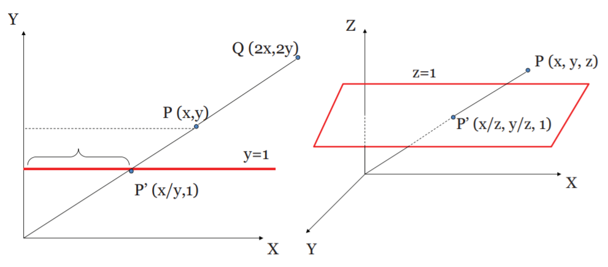
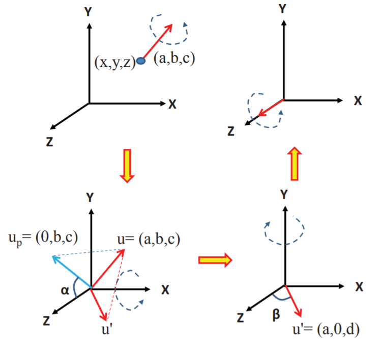

本文介绍几何变换(Geometric Transformation)的相关知识，包括：

1. 齐次坐标
2. 线性变换
   + 欧几里得变换
   + 仿射变换
   + 射影变换
3. 坐标系统

<!--more-->

# 齐次坐标 Homogeneous Coordinate

在介绍几何变换的知识之前，有必要先对坐标进行定义。通常情况下，对于一个点 $P$ ，假设它是一个一维的点，我们通常会用坐标 $x$ 来区分它，而对于二维的点，我们会用 $(x, y)$ 来说明这个点的位置。但是在计算机视觉中，常用齐次坐标来表示坐标的位置，这种表示方法对于 $n$ 维的点需要 $n+1$ 维来表示，通常是在坐标后加上一个1，如对于二维坐标 $(3,4)$，用齐次坐标表示为 $(3, 4, 1)$。

为什么要这么表示？我们可以类比一下我们的相机，相机拍出来的画面是 $2D$ 的，但是它拍摄的东西却是 $3D$ 的，拍摄到的 $2D$ 画面中的每一个点都是从物体上某一点射到照片对应像素上的一条光线。齐次坐标与此类似，但特别的是光线的起点都在坐标原点。

对于一个一条射线 $(x,y)$，当它打在 $y=1$ 这一超平面上，得到的点的坐标是 $(\frac{x}{y}, 1)$，这就是一维点 $\frac{x}{y}$ 的齐次坐标表示。类似地，射线 $(x, y, z)$ 打在 $z=1$ 这一超平面上得到的点是 $(\frac{x}{z}, \frac{y}{z}, 1)$，这就是二维点 $(\frac{x}{z}, \frac{y}{z})$ 的齐次坐标。值得注意的是，齐次坐标并没有约束必须在 $z=1$ 这一超平面上表示，因此，$(x,y,z)$ 也可以说是二维点 $(\frac{x}{z}, \frac{y}{z})$ 的齐次坐标，因为它们描述的是同一条射线，是等价的。

特别地，对于形如 $(x,y,0)$ 的齐次坐标，即超平面为 0，我们用它来表示 $(x,y)$ 这一个方向的向量。

这一表示方式对于几何变换的运算更方便，之后的讨论中，所有点的坐标将以齐次坐标表示。

对于一个点 $P = (x,y,z,1)$ 或一个向量 $u = (x, y, z, 0)$，，常写成列向量的形式:

$$
P = \begin{pmatrix} x \\ y \\ z \\ 1 \end{pmatrix} \qquad u = \begin{pmatrix} x \\ y \\ z \\ 0 \end{pmatrix}
$$

# 线性变换 Linear Transformation

对于满足以下方程的变换 $\mathcal{L}$ 都称为线性变换：

$$
\mathcal{L} (a P + b Q) = a \mathcal{L} (P) + b \mathcal{L} (Q)
$$

其中, $a$, $b$ 是标量，$P$, $Q$ 是点。

线性变换不会改变曲线的度(degree of curve)。

线性变换可以被表示为一个 $(n + 1) \times (n + 1)$ 维的矩阵，通过左乘点的坐标即可对点进行线性变换。

**常见的线性变换有三种**:

1. **欧几里得变换(Euclidean transformation)**：保持长度和角度不变。又称刚体变换(rigid body transformation)。只能平移和旋转。
2. **仿射变换(affine transformation)**：保持长度和角度的比例不变。除了平移和旋转，还能缩放、剪切。
3. **射影变换(projective transformation)**：能够平行线相交，即透视变换。

其中，欧几里得变换是仿射变换的子集，仿射变换又是射影变换的子集。

## 欧几里得变换和仿射变换

### 平移 Translation

$$
P' 
= \begin{pmatrix} x' \\ y' \\ 1 \end{pmatrix} 
= \begin{pmatrix} x + t_x \\ y + t_y \\ 1 \end{pmatrix} 
= \begin{pmatrix} 1 & 0 & t_x \\ 0 & 1 & t_y \\ 0 & 0 & 1 \end{pmatrix} \begin{pmatrix} x \\ y \\ 1 \end{pmatrix} 
= \mathcal{T}(t_x, t_y) P
$$

平移矩阵用 $\mathcal{T}$ 表示。

$$
\mathcal{T}^{-1}(t_x, t_y) = \mathcal{T}(- t_x, -t_y)
$$

对于三维的平移:

$$
\mathcal{T}(t_x, t_y, t_z)
= \begin{pmatrix}
1 & 0 & 0 & t_x \\
0 & 1 & 0 & t_y \\
0 & 0 & 1 & t_z \\
0 & 0 & 0 & 1 
\end{pmatrix}
$$

### 旋转 Rotation

$$
P' 
= \begin{pmatrix} x' \\ y' \\ 1 \end{pmatrix} 
= \begin{pmatrix} x \cos(\theta) - y \sin(\theta) \\ x \sin(\theta) + y \cos(\theta) \\ 1 \end{pmatrix} 
= \begin{pmatrix} 
\cos(\theta) & -\sin(\theta) & 0 \\ 
\sin(\theta) & \cos(\theta) & 0 \\ 
0 & 0 & 1 
\end{pmatrix} \begin{pmatrix} x \\ y \\ 1 \end{pmatrix} 
= \mathcal{R}(\theta) P
$$

旋转矩阵用 $\mathcal{R}$ 表示。

$$
\mathcal{R}^{-1}(\theta) = \mathcal{R}(-\theta) = \mathcal{R}^T(\theta)
$$

对于三维中绕某一坐标轴的旋转：

$$
\mathcal{R}_x(\theta)
= \begin{pmatrix}
1 & 0 & 0 & 0 \\
0 & \cos(\theta) & -\sin(\theta) & 0 \\ 
0 & \sin(\theta) & \cos(\theta) & 0 \\
0 & 0 & 0 & 1 
\end{pmatrix}
$$

$$
\mathcal{R}_y(\theta)
= \begin{pmatrix}
\cos(\theta) & 0 & -\sin(\theta) & 0 \\ 
0 & 1 & 0 & 0 \\
\sin(\theta) & 0 & \cos(\theta) & 0 \\
0 & 0 & 0 & 1 
\end{pmatrix}
$$

$$
\mathcal{R}_z(\theta)
= \begin{pmatrix}
\cos(\theta) & -\sin(\theta) & 0 & 0 \\ 
\sin(\theta) & \cos(\theta) & 0 & 0 \\
0 & 0 & 1 & 0 \\
0 & 0 & 0 & 1 
\end{pmatrix}
$$

### 缩放 Scaling

$$
P' 
= \begin{pmatrix} x' \\ y' \\ z' \\ 1 \end{pmatrix} 
= \begin{pmatrix} s_x x \\ s_y y \\ s_z z \\ 1 \end{pmatrix} 
= \begin{pmatrix}
s_x & 0 & 0 & 0 \\
0 & s_y & 0 & 0 \\
0 & 0 & s_z & 0 \\
0 & 0 & 0 & 1 
\end{pmatrix} \begin{pmatrix} x \\ y \\ z \\ 1 \end{pmatrix} 
= \mathcal{S}(s_x, s_y, s_z) P
$$

缩放矩阵用 $\mathcal{S}$ 表示。

$$
\mathcal{S}(s_x, s_y, s_z)^{-1} = \mathcal{S}(\frac{1}{s_x}, \frac{1}{s_y}, \frac{1}{s_z})
$$

###  剪切 Shear

剪切的概念是一个点的某一坐标轴保持不变，其他坐标轴与这一坐标轴呈正比变化。

$$
P' 
= \begin{pmatrix} x' \\ y' \\ 1 \end{pmatrix} 
= \begin{pmatrix} x + ay \\ y \\ 1 \end{pmatrix} 
= \begin{pmatrix} 1 & a & 0 \\ 0 & 1 & 0 \\ 0 & 0 & 1 \end{pmatrix} \begin{pmatrix} x \\ y \\ 1 \end{pmatrix} 
= \mathcal{H}_y(a) P
$$

$$
P' 
= \begin{pmatrix} x' \\ y' \\ z' \\ 1 \end{pmatrix} 
= \begin{pmatrix} x +az \\ y+bz \\ z \\ 1 \end{pmatrix} 
= \begin{pmatrix}
1 & 0 & a & 0 \\
0 & 1 & b & 0 \\
0 & 0 & 1 & 0 \\
0 & 0 & 0 & 1 
\end{pmatrix} \begin{pmatrix} x \\ y \\ z \\ 1 \end{pmatrix} 
= \mathcal{H}_z(a,b) P
$$

剪切矩阵用 $\mathcal{H}$ 表示。

$$
\mathcal{H}_z (a,b)^{-1} = \mathcal{H}_z (-a,-b)
$$

## 射影变换

射影变换将点 $P = (x, y, z, w)$ 变换到 $P' = (x', y', z', w')$ 的变换 $\mathcal{P}$ 可以表示为:

$$
P' 
= \begin{pmatrix} x' \\ y' \\ z' \\ w' \end{pmatrix} 
= \begin{pmatrix}
p_{11} & p_{12} & p_{13} & p_{14} \\
p_{21} & p_{22} & p_{23} & p_{24} \\
p_{31} & p_{32} & p_{33} & p_{34} \\
p_{41} & p_{42} & p_{43} & p_{44} 
\end{pmatrix} \begin{pmatrix} x \\ y \\ z \\ w \end{pmatrix} 
= \mathcal{P} P
$$

射影变换中原本确定位置的点可以移到无穷远，平行的线可以变得不平行，但曲线的度不会变，这意味着，直线射影变换后还是直线，度还是1，圆变换后可能是椭圆等，但度还是2，不能变成度为3的曲线。

# 变换的叠加 Concatenation of Transformation

$$
P' = \mathcal{T} P \\
P'' = \mathcal{R} P' = \mathcal{R} \mathcal{T} P
$$

由此可见，变换的叠加可以由变换矩阵左乘得到。

变换过程是可逆的:

$$
P = \mathcal{T}^{-1} \mathcal{R}^{-1} P''
$$

# 复杂变换

对于一个物体复杂的变换的流程如下：

1. 将坐标通过一些简单变换的叠加 $\mathcal{F}$ 变换到方便操作的空间中。
2. 运用一个基本的仿射变换 $\mathcal{B}$。
3. 通过 $\mathcal{F}^{-1}$ 变换回原空间。

以上几步可以叠加成一个操作: $\mathcal{F}^{-1} \mathcal{B} \mathcal{F}$。

例：假设我们想将一个中心点在 $(x,y,z)$ ，方向为 $(a,b,c)$ 的圆柱体以其中心为锚点将圆柱体的高拉伸为s倍。其过程如下：

1. 通过简单变换的叠加将圆柱体的坐标轴移到原点，且方向沿向 $z$ 轴方向。

   
   
   $$
   \mathcal{F} = \mathcal{R_y(\beta)} \mathcal{R_x}(\alpha) \mathcal{T}(-x, -y, -z)
   $$

2. 要对物体做到基本变换: 
   
   $$
   \mathcal{B} = \mathcal{S}(1, 1, s)
   $$
   
3. 将物体变换回原空间。
   
   $$
   \mathcal{F}^{-1} =\mathcal{T}(x, y, z) \mathcal{R_x}(-\alpha) \mathcal{R_y(-\beta)}
   $$

总的变换可以写成:

$$
\mathcal{F}^{-1} \mathcal{B} \mathcal{F} = \mathcal{T}(x, y, z) \mathcal{R_x}(-\alpha) \mathcal{R_y(-\beta)} \mathcal{S}(1, 1, s) \mathcal{R_y(\beta)} \mathcal{R_x}(\alpha) \mathcal{T}(-x, -y, -z)
$$

# 坐标系统 Coordinate System

一个 $n$ 维的坐标系统由原点 $R$ 和坐标轴各方向的单位向量 $u_1, u_2, \dots, u_n$ 组成。

在一个3维坐标系统中，记单位向量 $u_i$ 的齐次坐标为 $(u_{ix}, u_{iy}, u_{iz}, 0)$，原点为 $(R_x, R_y, R_z, 1)$。

点 $P$ 的坐标可以表示为:

$$
P = \begin{pmatrix} u_1 & u_2 & u_3 & R \end{pmatrix} \begin{pmatrix} a_1 \\ a_2 \\ a_3 \\ 1 \end{pmatrix}
= \begin{pmatrix}
u_{1x} & u_{2x} & u_{3x} & R_x \\
u_{1y} & u_{2y} & u_{3y} & R_y \\
u_{1z} & u_{2z} & u_{3z} & R_z \\
0 & 0 & 0 & 1
\end{pmatrix} \begin{pmatrix} a_1 \\ a_2 \\ a_3 \\ 1 \end{pmatrix}
= M_u C_u
$$

其中，$M_u$ 定义了坐标系统，$C_u$ 是点 $P$ 在坐标系统 $M_u$ 中的坐标。

## 坐标系统的变换

假设有两个坐标系统 $M_v$ 和 $M_u$，那么点 $P$ 在这两个坐标系统下的表示为:

$$
P = M_v C_v = M_u C_u
$$

由此可得坐标系统间转换的方法为:

$$
C_v = M_v^{-1} M_u C_u
$$

## 全局坐标系统与局部坐标系统

全局坐标系统和局部系统对应于转换矩阵与点坐标的左乘和右乘。

+ **左乘**：全局坐标系统，坐标系统不变，变换点的坐标。
+ **右乘**：局部坐标系统，点的坐标不变，变换坐标系统。

# 自由度 Degrees of Freedom

自由度定义为一个变换中可以改变的参数个数。自由度 $\le$ 变换矩阵中能改变的元素值。

对于二维的变换：

+ **欧几里得变换**： $\mathcal{T}(t_x, t_y)$ 和 $\mathcal{R}(\theta)$，能够改变的参数为 $t_x$, $t_y$, $\theta$，因此自由度为3。
+ **仿射变换**：$\mathcal{T}(t_x, t_y)$, $\mathcal{R}(\theta)$, $\mathcal{S}(s_x, s_y)$, $H_x(a)$, $\mathcal{H}_y(b)$ ，加起来总共7个参数。但是自由度应该小于等于变换矩阵中能改变的元素值，即应该小于等于6。进一步的探究可以发现旋转可以由缩放和剪切组成，因此旋转是不必要的。自由度为6。
+ **射影变换**：自由度为8。

# 参考资料

+ Majumder A, Gopi M. Introduction to Visual Computing: Core Concepts in Computer Vision, Graphics, and Image Processing[M]. CRC Press, 2018.