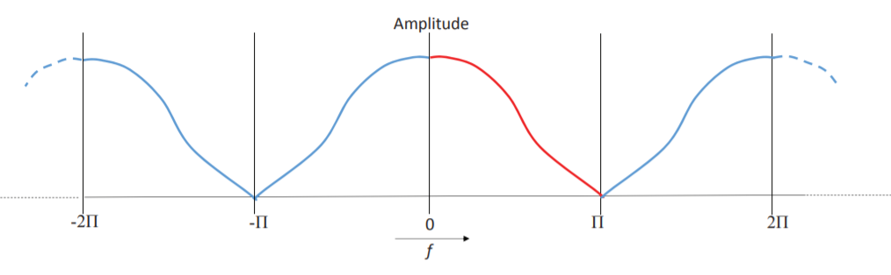

**频谱分析(spectral analysis)**是将一个复杂的信号分解成一系列简单的信号的技术。

<!--more-->

## 离散傅里叶变换 Discrete Fourier Transform

离散傅里叶(DFT)将一个无穷的周期函数分解为一系列余弦波和正弦波。

在使用DFT之前，我们碰到的第一个问题是如何用在数字信号上使用DFT？数字信号并不一定具有周期性，且是有穷的，这并不满足DFT的条件。但没关系，非周期函数又有穷，我们将他构造成无穷周期函数就可以了。

DFT的条件达到了，那么DFT到底是什么？

DFT 将带有$N$个采样点的输入信号$x$分解为$\frac{N}{2}+1$个余弦波和$\frac{N}{2}+1$个正弦波，这些正弦波和余弦波加在一起可以重新得到我们的输入信号$x$。

我们表示输入信号为$x[0,1,\dots,N-1]$，余弦波为$x_c[0,1,\dots,\frac{N}{2}]$，正弦波为$x_s[0,1,\dots,\frac{N}{2}]$，其中$x_c[k]$表示余弦波的振幅，索引 $k$ 表示在这$N$个采样点的范围内余弦波有 $k$ 个周期，也就是说，这个余弦波的频率为 $f=\frac{k}{N}$，正弦波同理。

$x_c[k]$ 和 $x_s[k]$ 的$x$轴与频率 $f$ 成线性关系，相当于是幅值随频率的变化，由此$x_c[k]$ 和 $x_s[k]$ 就可以用来表示信号 $x$ 的频域。

每一个 $x_c[k]$ 都对应着一个余弦波 $c_k$，这个余弦波有 $N$ 个采样点。

$$
c_k[i] = x_c[k] \cos(\frac{2\pi k i}{N}) = x_c[k] \cos(2 \pi f i) = x_c[k] \cos(\omega i)
$$

每一个 $x_s[k]$ 都对应着一个正弦波 $s_k$，这个正弦波有 $N$ 个采样点。

$$
s_k[i] = x_s[k] \sin(\frac{2 \pi k i}{N}) = x_s[k] \sin(2 \pi f i) = x_s[k] \sin(\omega i)
$$

由此，信号 $x$ 可以表示为:

$$
x[i] = \sum_{k=0}^{\frac{N}{2}} x_c[k] \cos(\frac{2 \pi k i}{N}) + \sum_{k=0}^{\frac{N}{2}} x_s[k] \sin(\frac{2 \pi k i}{N})
$$

但事情没有这么简单，$x_c[k]$ 和 $x_s[k]$ 并非这些余弦波真实的幅值，真实的只是 $\hat x_c[k]$ 与 $\hat x_s[k]$ 与它们成倍数关系:

$$
\hat x_c[k] =
\begin{cases}
\frac{2}{N} x_c[k], & k \ne 0 \\
\frac{1}{N} x_c[k], & k = 0
\end{cases}
\\
\hat x_s[k] =
\begin{cases}
\frac{2}{N} x_s[k], & k \ne \frac{N}{2} \\
\frac{1}{N} x_s[k], & k = \frac{N}{2}
\end{cases}
$$

真正的表达式应该为:

$$
x[i] = \sum_{k=0}^{\frac{N}{2}} \hat x_c[k] \cos(\frac{2 \pi k i}{N}) + \sum_{k=0}^{\frac{N}{2}} \hat x_s[k] \sin(\frac{2 \pi k i}{N})
$$

而 $x_c[k]$ 和 $x_s[k]$ 可以用以下公式得到:

$$
\begin{align}
x_c[k] &= \sum_{i=0}^{N-1} x[i] \cos \left( \frac{2 \pi k i}{N} \right) \\
x_s[k] &= \sum_{i=0}^{N-1} x[i] \sin \left( \frac{2 \pi k i}{N} \right)
\end{align}
$$

## 频域的极坐标表示

上文中，我们用 $x_c$ 和 $x_s$ 来表示信号 $x$ 的频域，这种表示方法称为频域的矩形表示(rectangular representation)。

对于同一个频率的正弦波和余弦波，有以下关系:

$$
x_c[k] \cos(\omega i) + x_s[k] \sin(\omega i) = M[k] \cos(\omega i + \theta[k])
$$

其中 $M[k] = \sqrt{x_c[k]^2 + x_s[k]^2}$， $\theta[k] = \tan^{-1} \left( \frac{x_s[k]}{x_c[k]} \right)$。

也就是说，一对 $x_c[k]$ 和 $x_s[k]$ 可以用一对 $M[k]$ 和 $\theta[k]$ 来表示，这种表示称为频域的极坐标表示(polar representation)。

## 离散傅里叶变换的性质

1. **齐次性** (Homogeneity)

   $$
   \begin{align}
   & x[t] \to (M[f], \theta[f]) \\
   \Rightarrow & kx[t] \to (kM[f], \theta[f])
   \end{align}
   $$

2. **可加性** (Additivity)

   $$
   \begin{align}
   &x[t] \to (x_c[f], x_s[f]), y[t] \to (y_c[f], y_s[f]) \\
   \Rightarrow & x[t] + y[t] \to (x_c[f] + y_c[f], x_s[f] + y_s[f])
   \end{align}
   $$

3. **线性相位平移** (Linear Phase Shift)

   $$
   \begin{align}
   & x[t] \to (M[f], \theta[f]) \\
   \Rightarrow & x[t+s] \to (M[f], \theta[f] + 2 \pi f s)
   \end{align}
   $$

## 信号的复共轭 complex conjugate

如果一个信号有着和信号 $x$ 相同的幅值，但有着相反的相位，这个信号被称为信号 $x$ 的复共轭，用 $x*$ 表示。即若 $x \to (M[f], \theta[f])$, 则 $x* \to (M[f], -\theta[f])$。

**性质：**

1. 一个信号与其复共轭信号相加会消除所有频率的相位，使得相加后的信号只有多个余弦波构成，不含正弦波。
2. 复共轭信号在时域上是原信号以 $\frac{N}{2}$ 为轴的水平翻转。

## 频域的周期性和奇偶性

由于余弦函数的周期性和对称性:

$$
A \cos(f) = A \cos(-f) = A \cos(2\pi -f) = A \cos(n2\pi -f)
$$

我们可以得到

$$
M[f] = M[-f]
$$

因此，**$M[f]$ 是一个周期为 $2\pi$ 的偶函数。**

由于

$$
\cos (f+\theta) = \cos(-f-\theta)
$$

我们可以的得到

$$
\theta[f] = -\theta[-f]
$$

因此，**$\theta[f]$ 是一个周期为 $2\pi$ 的奇函数**。

## 幅度调制 amplitude modulation

对于一个信号 $x$，我们将其乘以一个高频的正弦波 $y$ (又称载波 carrier ware 或载波频率 carrier frequency)，这个过程称为幅度调制(amplitude modulation, AM)。

幅度调制有两点需要注意：

1. 由于幅度是偶函数，频域幅度卷积时应考虑在内，卷积后的结果才会是关于 $f=c$ 轴对称。
2. 在添加多个信号是，幅度调制可以将不同信号的频率分布到高频的不同位置，只要使用不同频率的载波即可。但为了信号之间不混叠，载波之间频率应该相隔 $2b$。

## 混叠 aliasing

在幅度调制中我们已经提及了，如果载波的频率相隔小于 $2b$ ，不同信号幅度调制后就会发生重叠，这个现象称为混叠。

## 对偶性 Duality

DFT有着奇妙的对偶性，我们可以看看以下几个例子初步理解对偶性的含义。

1. 一个尖峰的频域是一个定值，一个定值的频域则是一个尖峰。

2. 随着时域上高斯函数的拉伸，频域上开始变窄。

   

## 参考资料

+ Introduction to Visual Computing: Core Concepts in Computer Vision, Graphics, and Image Processing