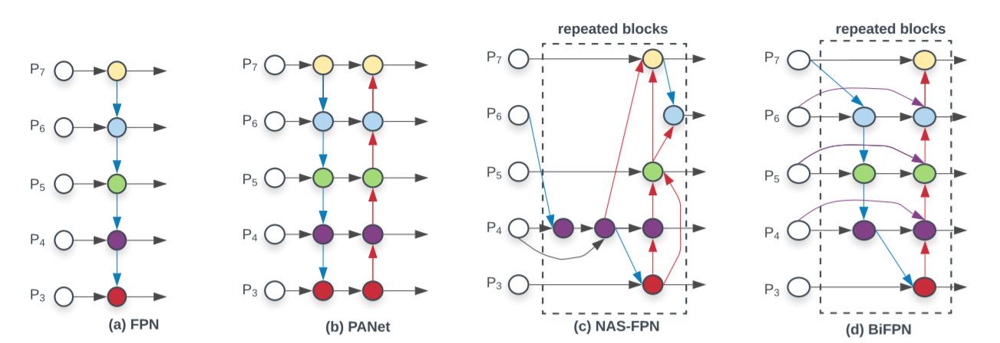
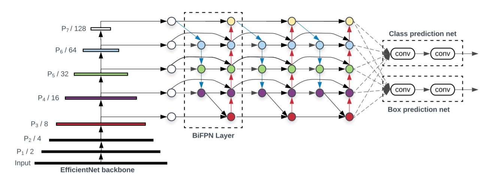
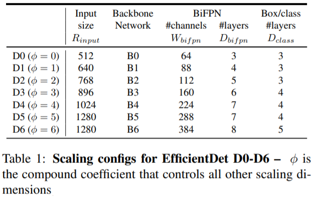
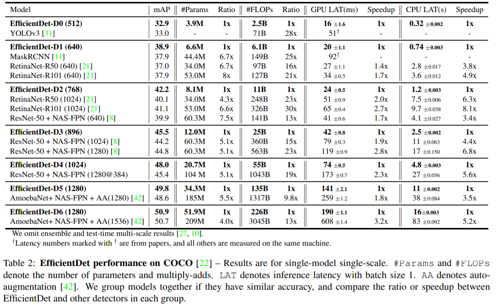
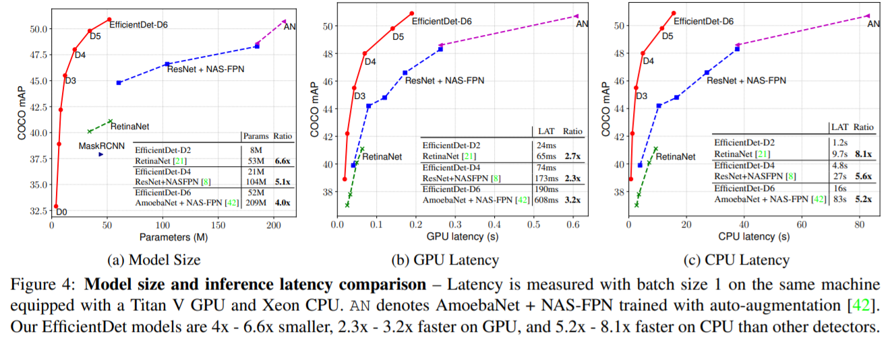

作者提出了 **bi-directional feature pyramid network (BiFPN)**，实现了更简单高效的多尺度特征融合(multi-scale feature fusion)；通过复合缩放方法，在EfficientNet的基础上提出了EfficientDet目标检测模型。

<!--more-->

# 构建one-stage检测器的两大挑战

1. **高效的多尺度特征融合**
   + FPN已广泛用于多尺度特征融合，但作者发现由于特征的输入来源于不同尺度的特征，它们融合后对输出的融合特征的贡献并不相等。因此作者提出了weighted BiFPN，通过可学习的权重学习不同输入特征的重要程度，并反复进行自顶向下和自底向上的多尺度特征融合。
2. **模型缩放**
   + 在放大模型时应该同时放大特征提取网络和box/class预测网络，并权衡准确率和效率。

# BiFPN

**主要思想**： 高效的双向跨尺度连接和加权特征融合。

## 多尺度特征融合问题定义

给定一系列多尺度特征 $\vec P^{in} = \left( P_{l_1}^{in}, P_{l_2}^{in}, \dots \right)$，其中 $P_{l_i}^{in}$ 表示 $l_i$ 层的特征。目标是找到一个转换 $f$ 能够高效的聚合不同特征，并输出一系列新特征 $\vec P^{out} = f(\vec P^{in})$。

假定输入的特征为 $\vec P^{in} = \left( P_3^{in}, \dots, P_7^{in} \right)$ ，一个经典的FPN的融合操作为:

$$
\begin{align}
P_7^{out} &= Conv(P_7^{in}) \\
P_6^{out} &= Conv(P_6^{in} + Resize(P_7^{out})) \\
\dots \\
P_3^{out} &= Conv(P_3^{in} + Resize(P_4^{out}))
\end{align}
$$

其中 $Resize(\cdot)$ 通常为上采样或下采样操作。

## 跨尺度连接

经典的自顶向下FPN受单向信息流的影响，还不能很好地融合特征。NAS-FPN和PANet对FPN做了改进。

1. NAS-FPN
   + 通过neural architecture search搜索得到，使用了上千块GPU，代价高昂，且难以解释和进行修改。
2. PANet (Pyramid attention network)
   + PANet增加了一条自底向上的通路，更好地融合了特征，准确率也比FPN和NAS-FPN高。

作者又对PANet做了以下改进得到了BiFPN：

1. 移除只有单个入边的节点。因为只有单个入边的节点对特征融合没有作用。
2. 为同级的输入结点和输出节点增加一个连接。
3. 将自顶向下和自底向上的通路当成一个BiFPN模块，堆叠多个BiFPN来提取特征。

## 加权特征融合

作者对BiFPN中的每条边都赋予了一个可学习的权重，用于学习不同尺度特征的重要程度。

**快速归一化融合:**

$$
O = \sum_i \frac{w_i}{\epsilon +  \sum_j w_j} \cdot I_i
$$

其中，权重 $w_i \ge 0$ 可以通过 ReLU 实现。$\epsilon = 0.0001$ 用于避免数值错误。

以BiFPN中的 $P_6$ 层为例：

$$
\begin{align}
P_6^{td} &= Conv \left( \frac{w_1 \cdot P_6^{in} + w_2 \cdot Resize(P_7^{in})}{w_1 + w_2 + \epsilon} \right) \\
P_6^{out} &= Conv \left( \frac{w_1' \cdot P_6^{in} + w_2' \cdot P_6^{td} + w_3' \cdot Resize(P_5^{out})}{w_1' + w_2' + w_3' + \epsilon} \right) 
\end{align}
$$

其中，$P_6^{td}$ 是第6层自顶向下通路的中间特征，$P_6^{out}$ 是第6层的自底向上通路的输出特征。

# EfficientDet

1. backbone network

   + 直接采用EfficientNet-B0 到 B6。

2. BiFPN

   + 放大模型时，BiFPN的宽度由复合缩放方法决定，深度线性增长。
   
     $$
     \begin{align}
     W_{bifpn} &= 64 \cdot (1.35^\phi) \\
     D_{bifpn} &= 3 + \phi
     \end{align}
     $$

3. box/class prediction network

   + 放大模型时，宽度由 $W_{bifpn}$ 决定，深度线性增长。
   
     $$
     \begin{align}
     W_{box} &= W_{class} = W_{bifpn} \\
     D_{box} &= D_{class} =3+ \lfloor \phi / 3 \rfloor
     \end{align}
     $$

4. Input image resolution

   + 由于BiFPN特征的输入使用了 3-7 层的特征，输入分辨率应该保证可以被 $2^7$ 整除。放大模型输入分辨率时也应该注意这一点。
   
     $$
     R_{input} = 512 + \phi \cdot128
     $$

