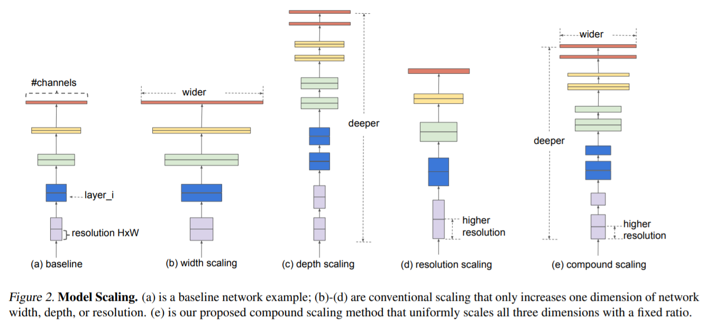
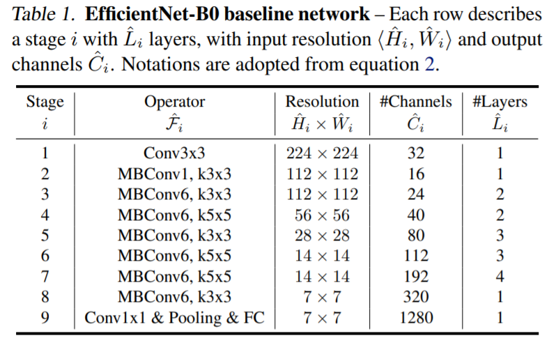
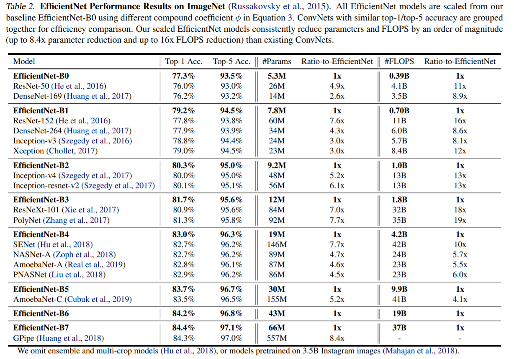
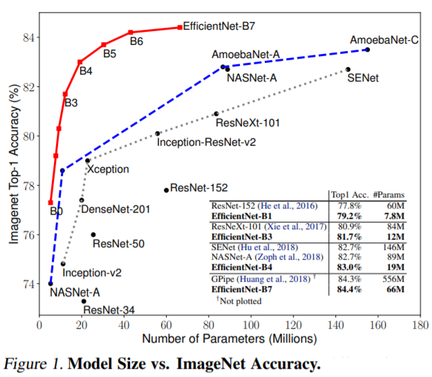
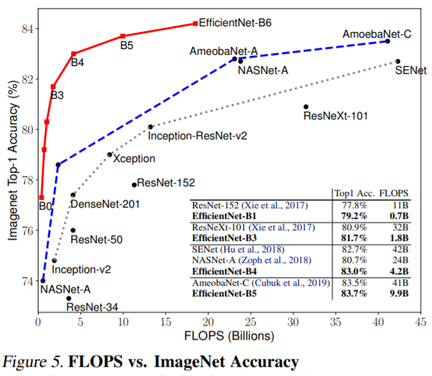

作者提出了一个统一缩放CNN模型深度(depth)/宽度(width)/分辨率(resolution)三个维度的复合缩放方法(compound scaling method)，通过将小模型放大，提升模型的性能。在此基础上，作者又通过神经架构搜索(neural architecture search)设计了一组模型，EfficientNet，使用了更少的参数，达到了更快的速度，更高的准确率。

<!--more-->

# 统一缩放

通过将CNN模型放大能够使模型达到更高的准确率，然而放大CNN的过程一直没有被系统地研究过，之前的工作中针对模型的深度、宽度、分辨率(图像大小)三个维度单独进行过单独的实验，但没有得出一个缩放模型的主要方法来提高模型的准确率和性能。作者发现平衡CNN模型的三个维度 深度/宽度/分辨率 对于获得更好的模型而不造成太大的速度损失很重要，并提出了一种简单有效的复合缩放方法，即使用一组固定的系数来缩放模型三个维度的缩放系数。

## 问题定义

一个卷积层 $i$ 可以被定义为一个函数：

$$
Y_i = \mathcal{F}_i(X_i)
$$

其中，$\mathcal{F}_i$ 是操作，$X_i$ 是输入的张量，大小为 $\langle H_i, W_i, C_i \rangle$， $Y_i$ 是输出的张量。

一个卷积神经网络 $\mathcal{N}$ 通常可以表示为一系列卷积层的复合函数：

$$
\mathcal{N} = \mathcal{F}_k \odot \dots \odot \mathcal{F}_2 \odot \mathcal{F}_1(X_1) = \bigodot_{j=1 \dots k} \mathcal{F}_j (X_1)
$$

然而，一个卷积神经网络通常分成了很多个段(stage)，而在每一个段中，卷积层基本是相同的，比如ResNet就有着五个段。由此，可以进一步简化CNN的表示。

$$
\mathcal{N} = \bigodot_{i=1\dots s} \mathcal{F}^{L_i}(X_{\langle H_i, W_i, C_i \rangle})
$$

模型缩放(model scaling)要做的就是放大网络的深度($L_i$)、宽度($C_i$)和分辨率($H_i, W_i$)而不改变$\mathcal{F_i}$，使得模型在给定的资源限制下最大化准确率。

$$
\max_{d,w,r} Accuracy(\mathcal{N}(d,w,r)) \\
\begin{align}
s.t. \quad
& \mathcal{N} = \bigodot_{i=1\dots s} \mathcal{\hat F}^{d \cdot L_i}(X_{\langle r \cdot \hat H_i, r \cdot \hat W_i, w \cdot \hat C_i \rangle}) \\
& \text{Memory} (\mathcal{N}) \le \text{target memory} \\
& \text{FLOPS} (\mathcal{N}) \le \text{target flops}
\end{align}
$$

## 缩放的维度

1. **深度(Depth, $d$)**
   + 缩放网络的深度通常是最通用的方法。
   + 但随着网络深度增大，梯度爆炸问题使得网络更难训练，为此产生了很多应对的技术，如跳连接(skip connection)和批归一化(batch normalization)。
   + 但对于非常深的网络继续增大网络深度获得的准确率提升已经很小了。
2. **宽度(Width, $w$)**
   + 缩放网络的宽度广泛应用于小型模型中。
   + 更宽的网络能捕捉更多容易处理的特征，也更容易训练。但过宽的宽度也会难以捕获高层的特征。
   + 当网络越来越宽，准确率的提升也会变得越来越缓慢。
3. **分辨率(Resolution, $r$)**
   + 当输入更高分辨率的图像，卷积网络能够捕捉到更多的模式。
   + 早期的卷积网络常用 $224 \times 224$ 的模型输入，更为现代化的模型偏向于使用 $299 \times 299$ 或 $331 \times 331$ 的模型输入以获得更高的准确率。
   + 非常高的分辨率下再提高分辨率也很难带来准确率的提升。

## 复合缩放方法 Compound Scaling

作者提出的复合缩放方法使用一个复合系数 $\phi$ 来统一缩放模型的深度、宽度和分辨率。

$$
\begin{align}
\text{depth}: \space &d = \alpha^\phi \\
\text{width}: \space &w = \beta^\phi \\
\text{resolution}: \space &r = \gamma^\phi \\
s.t. \space & \alpha \cdot \beta^2 \cdot \gamma^2 \approx 2 \\
& \alpha \ge 1, \beta \ge1, \gamma \ge 1
\end{align}
$$

通过一个简单的网格搜索(grid search)，可以确定 $\alpha$, $\beta$, $\gamma$ 三个常数。用户只需要调整 $\phi$ 即可控制使用的资源量。

一个常规卷积层的 FLOPS 正比于 $d$, $w^2$, $r^2$，通过 $\phi$ 缩放网络，模型的总 FLOPS 会被缩放 $(\alpha \cdot \beta^2 \cdot \gamma^2)^\phi$ 倍。通过限制 $\alpha \cdot \beta^2 \cdot \gamma^2$ 约等于2，模型的总 FLOPS 缩放约为 $2^\phi$ 倍。

# EfficientNet

作者首先通过nerual architecture search设计了EfficientNet-B0。

其中 $\text{MBConv}$ 层为mobile inverted bottleneck MBConv。

接下来基于EfficientNet-B0，通过复合缩放方法将模型放大：

**步骤：**

1. 固定 $\phi = 1$，即假设允许使用两倍的资源，使用网格搜索确定 $\alpha$, $\beta$, $\gamma$。得到EfficientNet-B0的最佳值为 $\alpha=1.2$, $\beta=1.1$, $\gamma=1.15$。
2. 固定 $\alpha$, $\beta$, $\gamma$，使用不同的 $\phi$ 放大模型得到 EfficientNet-B1 到 B7。

