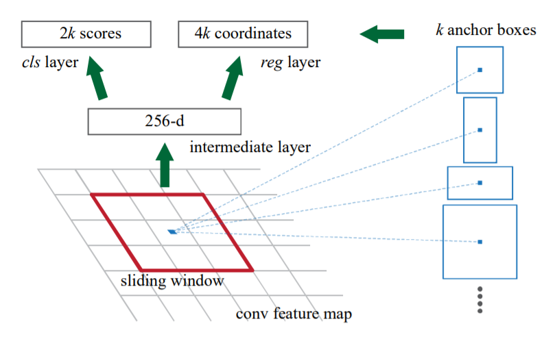
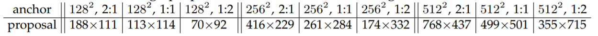

Faster R-CNN在Fast R-CNN的基础上做改进，提出用RPN（Region Proposal Network, 一种全卷积神经网络）代替Selective Search，降低检测耗时。Faster R-CNN由RPN和Fast R-CNN构成，RPN和Fast R-CNN共享卷积计算得到的特征图，以此降低计算量，使得Faster R-CNN可以在单GPU上以5fps的速度运行，且精度达到SOTA。

<!--more-->

## 术语缩写

| 缩写  | 全称                              |
| ----- | --------------------------------- |
| R-CNN | Region Convolution Neural Network |
| RPN   | Region Proposal Network           |
| FCN   | Fully Convolutional Network       |
| SS    | Selective Search                  |
| ZF    | Zeiler and Fergus model           |
| IoU   | Intersection-over-Union           |
| RoI   | Region of Interest                |

## Faster R-CNN

Faster R-CNN is a single, unified network for object detection. The RPN module serves as the 'attention' of the unified network.

Faster R-CNN 由以下两个部分组成:

+ Deep fully convolutional network that proposes regions
+ Fast R-CNN detector that uses the proposed regions

>  The RPN module tells the Fast R-CNN module where to look.

## Region Proposal Network

A Region Proposal Network (RPN) takes an image (of any size) as input and outputs a set of rectangular object proposals, each with an objectness score.

The authors model this process with a **fully convolutional network**.

+ To generate region proposals, the authors **slide a small network($n \times n$ spatial window, $n=3$) over the convolutional feature map** output by the last shared convolution layer. 

+ Each sliding window is mapped to a lower-dimensional feature (256-d for ZF and 512-d for VGG, with ReLU following). 
+ This feature is **fed into two sibling fully-connected layers** -- a **box-regression layer** ($reg$) and a **box-classification layer** ($cls$). This architecture is naturally implemented with and $n \times n$ convolutional layer followed by two sibling $1 \times 1$ convolutional layers (for $reg$ and $cls$ respectively).

### Anchor

the number of maximum possible proposals for each location is denoted as $k$. 

+ $reg$ layer has $4k$ outputs $(x, y, w, h)$ encoding the coordinates of $k$ boxes
+ $cls$ layer has $2k$ outputs scores that estimate probability of object or not object for each proposal. (implemented as a two-class softmax layer)

The $k$ proposals are parameterized relative to $k$ reference boxes, which we call **anchors**.

+ An anchor is centered at the sliding window in question, and is associated  with **a scale and aspect ratio** (宽高比).
+  For a convolutional feature map of a size $W \times H $ , there are $WHk$ anchors in total.

use 3 scales with box areas of $128^2$, $256^2$, $512^2$ pixels, and 3 aspect ratios of 1:1, 1:2, 2:1.

#### Multi-Scale Anchors as Regression Reference

作者采取b)和c)变化窗口形状和大小的方法，而不使用a)变换图片大小的方法。

### Lost Function

**Positive anchor**:

+ the anchor/anchors with the highest Intersection-over-Union(IoU) overlap with a ground-truth box (作者采用).
+ an anchor that has an IoU overlap > 0.7 with any grouth-truth box (作者不采用).

**Negative anchor**:

+ non-positive anchor if its IoU < 0.3 for all grouth-truth boxes.

#### lost  function for an image

$$
L(\{p_i\}, \{t_i\}) = \frac1{N_{cls}} \sum_i{L_{cls}} (p_i, p_i^*) + \lambda \frac{1}{N_{reg}} \sum_i {L_{reg}(t_i, t_i^*)}
$$

+ $L_{cls}$ is log loss over two classes (object $vs.$ not object)
+ $L_{reg}(t_i, t_i^*) = R(t_i - t_i^*)$ where $R$ is the robust loss function (smooth $L_1$)
+ $N_{cls}$ is the mini-batch size (i.e., $N_{cls}=256$)
+ $N_{reg}$ is the number of anchor locations (i.e., $N_{reg} \approx 2400$) 
+ $\lambda = 10$ and thus both $cls$ and $reg$ terms are roughly equally weighted.

> The normalization as above is not required and could be simplified.

$$
\begin{align}
&t_x = (x-x_a)/w_a, & t_y = (y-y_a)/h_a, \\
&t_w = \log(w/w_a), & t_h = log(h/h_a),  \\
&t^*_x = (x-x^*_a)/w_a, & t^*_y = (y^*-y_a)/h_a, \\
&t^*_w = \log(w^*/w_a), & t^*_h = log(h^*/h_a),  \\
\end{align}
$$

#### Training RPNs

The RPN can be trained **end-to-end** by back-propagation and **stochastic gradient descent (SGD)**.

+ 一张图片包含多个正样本和负样本(正样本少于负样本)
+ 随机采样256个样本用于计算loss of a mini-batch
+ 初始化: Gaussian distribution (mean=0, standard deviation=0.01)
+ momentum: 0.9,   weight decay: 0.0005

## Sharing Features for RPN and Fast R-CNN

### 4 - Step Alternating Training

1. Train the RPN as described previously.
2. Train a separated detection network (ImageNet-pre-trained) by Fast R-CNN using the proposals generated by step-1 RPN.
3. Use the detector network to initialize RPN training, but fix the shared convolutional layers and only fine-tune the layers unique to RPN.
4. keeping the shared convolutional layers fixed, fine-tune the unique layers of Fast R-CNN.