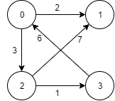

本文介绍使用 Floyd 算法求解完全最短路径。

<!--more-->

# 问题

**完全最短路径问题(all-pairs shortest-paths problem)**给定一个加权连通图，找到从每个顶点出发到其他所有顶点之间的最短距离(最短路径的长度)。

为了方便起见，将最短路径的长度记录在一个称为距离矩阵的 $n$ 阶矩阵中。我们要求的就是距离矩阵 $D$.

**有向图：**



**对应的权重矩阵：**

$$
W = 
\begin{bmatrix}
0 & \infty & 3 & \infty \\
2 & 0 & \infty & \infty \\
\infty & 7 & 0 & 1 \\
6 & \infty & \infty & 0
\end{bmatrix}
$$

**对应的距离矩阵：**

$$
D =
\begin{bmatrix}
0 & 10 & 3 & 4 \\
2 & 0 & 5 & 6 \\
7 & 7 & 0 & 1 \\
6 & 16 & 9 & 0 
\end{bmatrix}
$$


# 算法思想

Floyd 算法和 Warshall的思想类似，通过对于图中的一个点，如果图中另外任意两个点不通过该点的距离比通过该点的距离大，则这两点的最短路径应该通过该点，由此可将距离迭代地缩小。


Floyd 算法通过一系列 $n$ 阶矩阵来计算距离矩阵。

$$
D^{(0)}, \cdots , D^{(n-1)}, D^{(n)}
$$

其中，$D^{(0)}$ 即为有向图对应的权重矩阵，$D^{(n)}$ 即为我们要求解的距离矩阵。

矩阵间的关系如下：

$$
D_{ij}^{(k)} = \min \left(D_{ij}^{(k-1)}, \quad D_{ik}^{(k-1)} + D_{kj}^{(k-1)} \right)
$$

边界条件为：

$$
D_{i0} = D_{0j} = 0
$$

利用动态规划即可求解。

# 代码实现

## C++实现

```cpp
#include <iostream>

const int inf = 5000;  // assume that this number is infinity and unreachable

int Min(int a, int b) {
    return a > b? b : a;
}

/* Floyd Algorithm
 * to solve the completed shortest path problem
 * 
 * Args:
 *     src (int*): a source matrix of n x n, each element [i, j] is the weight from node i to node j,
 *                 if the element greater than or equal to inf, it means that node i and node is not connected directly.
 *     dst (int*): a destination matrix of n x n to store the shortest paths distances, 
 *                 if dst is NULL, the result will be stored in the src
 *     n (int): the width and height of matrix src and dst
 */
void Floyd(int* src, int* dst, int n) {
    if (dst != NULL) {
        // copy the src to dst
        for(int i = 0; i < n * n; i++) {
            dst[i] = src[i];
        }
    }
    else {
        dst = src;
    }
    
    // calcualte the shortest path distances
    for (int k = 0; k < n; k++) {
        for (int i = 0; i < n; i++) {
            for (int j = 0; j < n; j++) {
                dst[i * n + j] = Min(dst[i * n + j], dst[i * n + k] + dst[k * n + j]);
            }
        }
    }
}

void Test() {
    int A[4][4] = {
        {0,   inf, 3,   inf},
        {2,   0,   inf, inf},
        {inf, 7,   0,   1  },
        {6,   inf, inf, 0  }
    };

    int D[4][4];

    Floyd(&A[0][0], &D[0][0], 4);
    
    for (int i = 0; i < 4; i++) {
        for (int j = 0; j < 4; j++) {
            std::cout << D[i][j] << " ";
        }
        std::cout << std::endl;
    }
}

int main() {
    Test();
    return 0;
}
```


