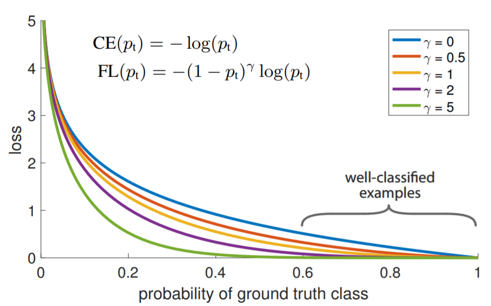
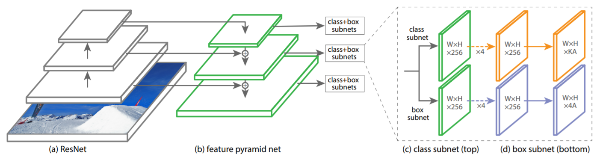
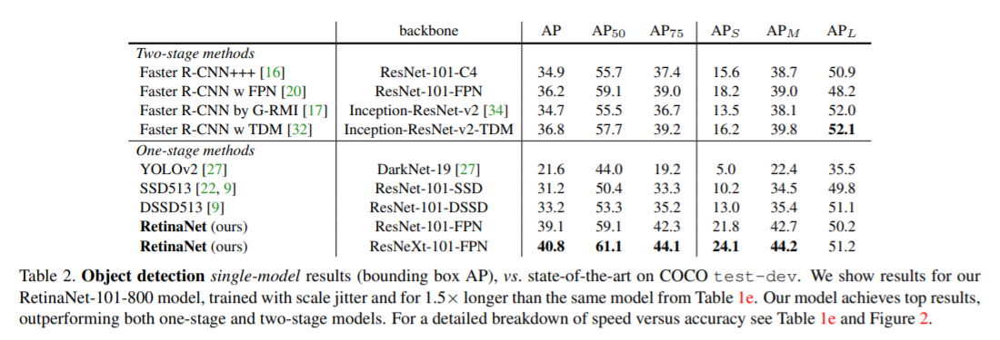
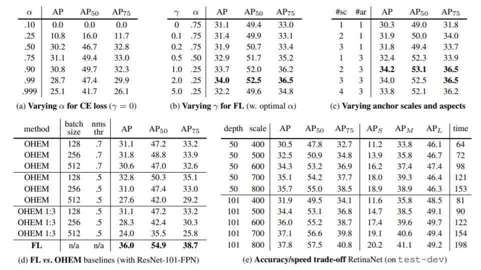

作者提出了 Focal Loss 损失函数，在交叉熵损失的基础上加入因子 $(1 - p_t)^\gamma$，用于处理one-stage检测器样本不均衡的问题。同时，作者提出了 RetinaNet one-stage检测器。

<!--more-->

# 问题

目前的检测器主要分为one-stage检测器和two-stage检测器，two-stage检测器的准确率高但速度慢，one-stage检测器的速度快但准确率略低，作者发问是否能让one-stage检测器达到与two-stage检测器相似的准确率。

| 检测器    | 准确率 | 速度 |
| --------- | ------ | ---- |
| one-stage | 高     | 慢   |
| two-stage | 低     | 快   |

作者发现导致one-stage检测器的原因是**类别不均衡(class imbalance)**。one-stage检测器会生成大量的候选目标位置，需要检测器判别这些候选目标位置哪些是前景、哪些是背景，但其中只有一小部分是包含目标的前景，这y种类别不均衡导致了one-stage的准确率较低。

# 损失函数

## 交叉熵损失 Cross Entropy Loss

原本one-stage的类别分类采用的CE(cross-entropy)交叉熵损失函数:

$$
\text{CE}(p,y) = 
\begin{cases}
- \log (p) & \text{if} \space \space y = 1 \\
- \log (1 - p) & \text{otherwise}
\end{cases}
$$

其中，$y \in \{-1, +1\}$，表示ground-truth类别，$p \in [0, 1]$ 表示模型估算其类别为 $y=1$ 的概率。

为了简化表示方法，记

$$
p_t = 
\begin{cases}
p & \text{if} \space \space y=1 \\
1 - p & \text{otherwise}
\end{cases}
$$

由此，可以简写交叉熵损失函数为

$$
\text{CE}(p,y) = \text{CE}(p_t) = - \log (p_t)
$$

## 平衡交叉熵损失 Balanced Cross Entropy

一个常用的处理类别不均衡的方法是引入一个权值 $\alpha \in [0,1]$，用来控制类别 $y=1$ 的权重，而用 $(1-\alpha)$ 控制类别 $y=-1$ 的权重。

同样的记：

$$
\alpha_t = 
\begin{cases}
\alpha & \text{if} \space \space y=1 \\
1 - \alpha & \text{otherwise}
\end{cases}
$$

由此，$\alpha$平衡交叉熵损失函数为:

$$
\text{CE}(p_t) = - \alpha_t \log(p_t)
$$

## Focal Loss

$\alpha$平衡交叉熵损失函数平衡了正负样本的重要程度，达到了正负样本间的平衡，但它并没有区分出易样本和难样本(easy/hard examples)。当一个样本被模型正确判别类型时，这个样本我们称之为易样本(easy example)，如果类型判别错误，就称为难样本(hard example)。

作者提出 Focal Loss 通过降低易样本的权重，让模型作用于训练难样本。

Focal Loss 定义为

$$
\text{FL}(p_t) = - (1-p_t)^\gamma \log(p_t)
$$

其中，$\gamma \ge 0$ 是一个可以人为调整的超参数。

对于TP和TN这种被正确分类的样本，Focal Loss 损失值下降被巨幅下降，而对FP和FN这种错误分类的样本，Focal Loss 损失值只会轻微降低，由此达到了易样本与难样本的平衡。

当 $\gamma=0$ 时，focal loss 退化成普通的交叉熵损失函数，$\gamma$ 值越大对易样本的损失降低就越大，作者找到的最佳值是 $\gamma = 2$。

## 平衡 Focal Loss

普通的 Focal Loss 只是关注于难易样本的平衡问题，与正负样本的平衡并不冲突，因此也可以为 focal loss 加上 $\alpha$ 平衡。

$$
\text{FL}(p_t) = - \alpha_t (1-p_t)^\gamma \log(p_t)
$$

采用这种形式对于准确率有轻微的提升。

$\gamma$ 和 $\alpha$ 两个参数相互影响，作者发现，当 $\alpha$ 取值越小时，应该选取更大的 $\gamma$，以达到更好的效果。作者查到的最佳取值为 $\gamma=2$, $\alpha=0.25$。

正负样本平衡和难易样本平衡的叠加使得负样本中的易样本，即经常很容易被判别为背景的样本，对损失的贡献很小，正样本中的难样本是模型重点的优化对象，损失值最大。

各类样本对损失的影响：

|        | 易样本(正确分类)               | 难样本(错误分类)               |
| ------ | ------------------------------ | ------------------------------ |
| 正样本 | 损失下降较多                   | 损失下降较少(对损失的贡献最大) |
| 负样本 | 损失巨幅下降(对损失的贡献很小) | 损失下降较多                   |

# RetinaNet

1. backbone
   + RetinaNet 采用 ResNet50 + FPN 作为backone。
   + 取ResNet50的 p3 到 p7 层，即原输入图像的 $\frac{1}{2^3}$ 到 $\frac{1}{2^7}$ 大小的特征图作为FPN的输入。
   + 由于ResNet50最多到 p5 层，作者在没有像FPN论文中一样下采样 p5 层获得 p6 层，而是让 p5 层通过一个 $3 \times 3$ 卷积得到 p6 层，再让 p6 层 relu 激活后 $3\times 3$ 卷积得到 p7 层。
2. class subnet
   + 分类网络预测每个位置对应的A个anchor和K个类别的概率。
   + 以FPN每一级得到的 $C$ 通道数的特征图作为输入，首先通过四个 $3\times 3$ 的卷积，每个卷积后用 ReLU 激活，最后使用一个 $3 \times 3$、输出通道数为 $KA$ 的卷积生成对应每个位置每个anchor各类别的概率。 
3. box subnet
   + box回归网络回归左上、右下两个点距anchor左上、右下两个点的偏差。
   + 以FPN每一级得到的 $C$ 通道数的特征图作为输入，首先通过四个 $3\times 3$ 的卷积，每个卷积后用 ReLU 激活，最后使用一个 $3 \times 3$、输出通道数为 $4A$ 的卷积生成对应每个位置每个anchor的顶点坐标。 

4. focal loss
   + 总的focal loss计算为所有anchor的focal loss的和，并用被分配给ground-truth box的anchor数量归一化(normalized by the number of anchors assigned to a ground-truth box)。
   + 最佳的超参数取值是 $\gamma=2$，$\alpha=0.25$。
5. 总损失
   + 总的损失为总的focal loss加上box回归网络的平滑 $L_1$ 损失(smooth $L_1$ loss)。

# 参考文献

+ Lin T Y, Goyal P, Girshick R, et al. Focal loss for dense object detection[C]//Proceedings of the IEEE international conference on computer vision. 2017: 2980-2988.