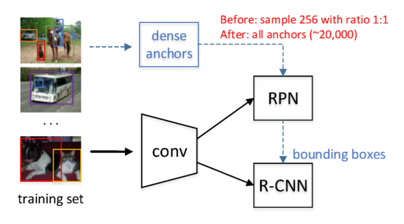
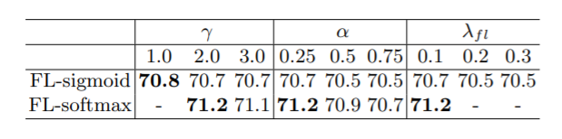
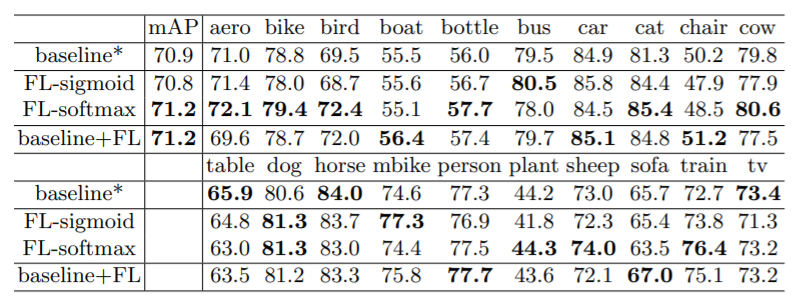

类别不均衡的问题不止存在于one-stage检测器中，two-stage检测器面临着同样的问题，鉴于focal loss在one-stage上的成功应用，作者将focal loss应用于RPN，检验 focal loss 在two-stage检测器中的作用。

<!--more-->

# 标准RPN

标准的RPN使用一个卷积层卷积特征，并在之后接上两个卷积层分别用于回归box和判断该位置的anchor是否存在目标。

对于用于判断该位置的anchor是否存在目标的分类网络，即需要判别前景和背景，其损失函数采用交叉熵损失：

$$
\begin{align}
CE(p,y) &= \frac{1}{N_{cls}} \sum_i CE(p_i, y_i) \\
&= \frac{1}{N_{cls}} \sum_i y_i \log(p_i) + (1-y_i) \log (1-p_i)
\end{align}
$$

对于生成box的回归网络，采用平滑 $L_1$ 损失:

$$
smooth_{L_1}(x) = 
\begin{cases}
0.5 x^2  & \text{if} \space \space |x| \le 1 \\
|x| - 0.5 & \text{otherwise}
\end{cases}
$$

其中 $x$ 是候选框与grouth-truth bounding box的差。

总的损失函数为:

$$
L_{RPN} = \frac{1}{N_{cls}} \sum_i CE(p_i, p_i^t) + \frac{1}{N_{reg}} \sum_i I(t_i^t) L_{reg} (t_i, t_i^t)
$$

其中, $N_{cls}$ 和 $N_{reg}$ 是归一化系数， $I(t_i^t)$ 是指示函数，只计算anchor分配到grouth-truth上的box的回归损失。

标准RPN同样面临着背景比前景多很多而导致的样本不均衡问题，但RPN采用了采样的方法，从前景和背景中按1:1比例采样正样本和负样本，使用少量平衡的样本计算损失，以此克服样本不平衡的问题，但这也导致了部分前景/背景没有计算损失而得不到优化的情况。

# Focal Loss 改造的 RPN

使用Focal Loss就不再需要RPN进行正负样本的平衡采样，能够对所有anchor计算损失。因此，首先去除RPN的采样。

损失函数如下：

$$
L_{RPN-FL} = \frac{\lambda_{fl}}{N_{cls}'} \sum_i FL(p_i^t) + \frac{1}{N_{reg}'} \sum_i I(t_i^t) L_{reg} (t_i, t_i^t)
$$

其中，$\lambda_{fl}$ 用于平衡损失，作者取 $\lambda_{fl} = 0.1$。$N_{cls}' = |p_i^t \in object|$ ，$N_{reg}' = 2 *|p_i^t \in object|$。Focal Loss中的超参数取 $\alpha=0.25$，$\gamma=2$。

对于 faster RCNN 框架，总损失如下：

$$
L = L_{RPN-FL} + L_{RCNN}
$$

# 实验结果

鉴于RPN中分类网络可能采用sigmoid或者softmax进行前景与背景的二分类，作者实验了两种形式下focal loss的表现，实验结果表明focal loss能稍微提升检测的准确率，且softmax形式要优于sigmoid形式。

作者还发现应用focal loss后RPN的分类损失下降平稳，但回归损失不稳定，容易巨幅变化，作者认为这是因为回归网络和分类网络共用了前面所有的特征层进行特征提取，两个网络的优化目标有冲突导致的，并认为RetinaNet中分类网络和回归网络独立拥有各自的一部分卷积层进行特征提取，解决了这个冲突，但作者并没有继续探究这个问题。

# 参考文献

+ Chen C, Song X, Jiang S. Focal Loss for Region Proposal Network[C]//Chinese Conference on Pattern Recognition and Computer Vision (PRCV). Springer, Cham, 2018: 368-380.