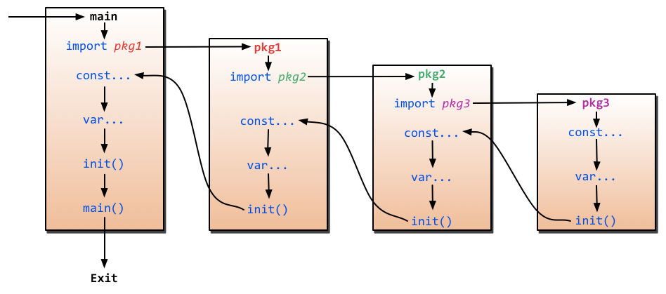

本文是我学习 golang 时的笔记。

<!--more-->


# Go package

`package <pkgName>`（在我们的例子中是`package main`）这一行告诉我们当前文件属于哪个包，而包名`main`则告诉我们它是一个可独立运行的包，它在编译后会产生可执行文件。除了`main`包之外，其它的包最后都会生成`*.a`文件（也就是包文件）并放置在`$GOPATH/pkg/$GOOS_$GOARCH`中（以Mac为例就是`$GOPATH/pkg/darwin_amd64`）。

> 每一个可独立运行的Go程序，必定包含一个`package main`，在这个`main`包中必定包含一个入口函数`main`，而这个函数既没有参数，也没有返回值。

> 包名和包所在的文件夹名可以是不同的，此处的`<pkgName>`即为通过`package <pkgName>`声明的包名，而非文件夹名


# 变量

```golang
var variablename type
var vname1, vname2, vname3 type 
var vname1, vname2, vname3 type = value1, value2, value3
var vname1, vname2, vname3 = value1, value2, value3
vname1, vname2, vname3 := value1, value2, value3 // 只能用在函数内部，局部变量
var(
   vname1 type
   vname2 type
) // 只能用在函数外，全局变量
```

# 常量

```golang
const constantName type = value
const constantName = value
const(
	name1 = value1
    name2 = value2
)
```

# 内置基础类型

## 数值类型

`int`, `float`,`uint`, `rune`, `int8`, `int16`, `int32`, `int64`和`byte`, `uint8`, `uint16`, `uint32`, `uint64`，`complex32`, `complex64`。

其中，`rune`是`int32`的别称，`byte`是`uint8`的别称。

> 注意： 不同类型之间不能互相赋值或操作，否则编译错误
>
> 如`int8`,  `int32`不能互相赋值或相加等
>
> 另外，尽管int的长度是32 bit, 但int 与 int32并不可以互用。

## 字符串

Go中的字符串都是采用`UTF-8`字符集编码。字符串是用一对双引号（`""`）或反引号（`` ` ` `` ）括起来定义，它的类型是`string`。

在Go中字符串是不可变的.

```golang
m := `hello
	world`
```

`` ` `` 括起的字符串为Raw字符串，即字符串在代码中的形式就是打印时的形式，它没有字符转义，换行也将原样输出。

## 错误类型

Go内置有一个`error`类型，专门用来处理错误信息，Go的`package`里面还专门有一个包`errors`来处理错误：

```golang
err := errors.New("emit macho dwarf: elf header corrupted")
if err != nil {
	fmt.Print(err)
}
```

## iota枚举

Go里面有一个关键字`iota`，这个关键字用来声明`enum`的时候采用，它默认开始值是0，const中每增加一行加1：

```
package main

import (
	"fmt"
)

const (
	x = iota // x == 0
	y = iota // y == 1
	z = iota // z == 2
	w        // 常量声明省略值时，默认和之前一个值的字面相同。这里隐式地说w = iota，因此w == 3。其实上面y和z可同样不用"= iota"
)

const v = iota // 每遇到一个const关键字，iota就会重置，此时v == 0

const (
	h, i, j = iota, iota, iota //h=0,i=0,j=0 iota在同一行值相同
)

const (
	a       = iota //a=0
	b       = "B"
	c       = iota             //c=2
	d, e, f = iota, iota, iota //d=3,e=3,f=3
	g       = iota             //g = 4
)

func main() {
	fmt.Println(a, b, c, d, e, f, g, h, i, j, x, y, z, w, v)
}
```

> 除非被显式设置为其它值或`iota`，每个`const`分组的第一个常量被默认设置为它的0值，第二及后续的常量被默认设置为它前面那个常量的值，如果前面那个常量的值是`iota`，则它也被设置为`iota`。

## 公有与私有

- 大写字母开头的变量是可导出的，也就是其它包可以读取的，是公有变量；小写字母开头的就是不可导出的，是私有变量。
- 大写字母开头的函数也是一样，相当于`class`中的带`public`关键词的公有函数；小写字母开头的就是有`private`关键词的私有函数。

## 数组array

```golang
var arr [10]int  // 声明了一个int类型的数组
arr[0] = 42      // 数组下标是从0开始的
arr[1] = 13      // 赋值操作
fmt.Printf("The first element is %d\n", arr[0])  // 获取数据，返回42
fmt.Printf("The last element is %d\n", arr[9]) //返回未赋值的最后一个元素，默认返回0
```

由于长度也是数组类型的一部分，因此`[3]int`与`[4]int`是不同的类型，数组也就不能改变长度。数组之间的赋值是值的赋值，即**当把一个数组作为参数传入函数的时候，传入的其实是该数组的副本，而不是它的指针**。如果要使用指针，那么就需要用到后面介绍的`slice`类型了。

```golang
a := [3]int{1, 2, 3} // 声明了一个长度为3的int数组

b := [10]int{1, 2, 3} // 声明了一个长度为10的int数组，其中前三个元素初始化为1、2、3，其它默认为0

c := [...]int{4, 5, 6} // 可以省略长度而采用`...`的方式，Go会自动根据元素个数来计算长度
```

### 多维数组

```golang
// 声明了一个二维数组，该数组以两个数组作为元素，其中每个数组中又有4个int类型的元素
doubleArray := [2][4]int{[4]int{1, 2, 3, 4}, [4]int{5, 6, 7, 8}}

// 上面的声明可以简化，直接忽略内部的类型
easyArray := [2][4]int{{1, 2, 3, 4}, {5, 6, 7, 8}}

fmt.Print(doubleArray[1][3])
```

## 切片slice

`slice`并不是真正意义上的动态数组，而是一个引用类型。`slice`总是指向一个底层`array`，`slice`的声明也可以像`array`一样，只是不需要长度。

```golang
var fslice []int // 和声明array一样，只是少了长度
slice := []byte {'a', 'b', 'c', 'd'}
```

```golang
// 声明一个含有10个元素元素类型为byte的数组
var ar = [10]byte {'a', 'b', 'c', 'd', 'e', 'f', 'g', 'h', 'i', 'j'}

// 声明两个含有byte的slice
var a, b []byte

// a指向数组的第3个元素开始，并到第五个元素结束，
a = ar[2:5]
//现在a含有的元素: ar[2]、ar[3]和ar[4]

// b是数组ar的另一个slice
b = ar[3:5]
// b的元素是：ar[3]和ar[4]
```

```golang
var a = [5]int{6, 7, 8, 9, 10}
var a_slice []int
a_slice = a[1:3]

fmt.Println("len(a)=", len(a), ", len(a_slice)=", len(a_slice)) // 长度
fmt.Println("cap(a)=", cap(a), ", cap(a_slice)=", cap(a_slice)) // 容量，切片指向数组上切片的左端到数组的最右端

b_slice := append(a_slice, 1, 2, 3) // b_slice = [7 8 1 2 3]  a = [6, 7, 8, 9, 10] 插入的值比超过了容量，不对源切片指向数组进行修改，而是新建一个新的
fmt.Println(b_slice)
fmt.Println(a)

c_slice := append(a_slice, 1, 2)    // c_slice = [7 8 1 2]    a = [6, 7, 8, 1, 2]  插入的值比容量小，对指向数组进行修改
fmt.Println(c_slice)
fmt.Println(a)
```

```golang
var a = [5]int{6, 7, 8, 9, 10}
var a_slice []int
a_slice = a[1:3:4] // 多增加一个4，使得len=3-1=2，但cap=4-1=3
```

## 映射map

```golang
// 声明一个key是字符串，值为int的字典,这种方式的声明需要在使用之前使用make初始化
var numbers map[string]int
// 另一种map的声明方式
numbers = make(map[string]int)
numbers["one"] = 1  //赋值
numbers["ten"] = 10 //赋值
numbers["three"] = 3

fmt.Println("第三个数字是: ", numbers["three"]) // 读取数据
// 打印出来如:第三个数字是: 3
```

- 内置的`len`函数同样适用于`map`，返回`map`拥有的`key`的数量
- `map`和其他基本型别不同，它不是thread-safe，在多个go-routine存取时，必须使用mutex lock机制

```golang
// 初始化一个字典
rating := map[string]float32{"C":5, "Go":4.5, "Python":4.5, "C++":2 }
// map有两个返回值，第二个返回值，如果不存在key，那么ok为false，如果存在ok为true
csharpRating, ok := rating["C#"]
if ok {
	fmt.Println("C# is in the map and its rating is ", csharpRating)
} else {
	fmt.Println("We have no rating associated with C# in the map")
}

delete(rating, "C")  // 删除key为C的元素
```

## make & new

`make`用于内建类型（`map`、`slice` 和`channel`）的内存分配。`new`用于各种类型的内存分配。

内建函数`new`本质上说跟其它语言中的同名函数功能一样：`new(T)`分配了零值填充的`T`类型的内存空间，并且返回其地址，即一个`*T`类型的值。用Go的术语说，它返回了一个指针，指向新分配的类型`T`的零值。有一点非常重要：

> `new`返回指针。

内建函数`make(T, args)`与`new(T)`有着不同的功能，make只能创建`slice`、`map`和`channel`，并且返回一个有初始值(非零)的`T`类型，而不是`*T`。本质来讲，导致这三个类型有所不同的原因是指向数据结构的引用在使用前必须被初始化。例如，一个`slice`，是一个包含指向数据（内部`array`）的指针、长度和容量的三项描述符；在这些项目被初始化之前，`slice`为`nil`。对于`slice`、`map`和`channel`来说，`make`初始化了内部的数据结构，填充适当的值。

> `make`返回初始化后的（非零）值。

结构：`new(Point)`

切片slice: `make([]byte, 2, 6)` // len=2， cap=6

## 零值

关于“零值”，所指并非是空值，而是一种“变量未填充前”的默认值，通常为0。 此处罗列 部分类型 的 “零值”

```golang
int     0
int8    0
int32   0
int64   0
uint    0x0
rune    0 //rune的实际类型是 int32
byte    0x0 // byte的实际类型是 uint8
float32 0 //长度为 4 byte
float64 0 //长度为 8 byte
bool    false
string  ""
```

# 流程管理

## if

```golang
if x > 10 {
	fmt.Println("x is greater than 10")
} else if x < 1 {
	fmt.Println("x is less than 1")
} else {
    fmt.Println("x is between 1 and 10")
}

if x := 1; x < 2 {
    println("x < 2")
}
```

## goto

```golang
func myFunc() {
	i := 0
Here:   //这行的第一个词，以冒号结束作为标签
	println(i)
	i++
	goto Here   //跳转到Here去
}
```

> 标签名是大小写敏感的。

## for

```golang
for expression1; expression2; expression3 {
	//...
}
```

```golang
sum := 0;
for index:=0; index < 10 ; index++ {
    sum += index
}
fmt.Println("sum is equal to ", sum)
```

```golang
sum := 1
for sum < 1000 {
	sum += sum
} // 相当于while循环
```

支持`break`, `continue`

`for`配合`range`可以用于读取`slice`和`map`的数据：

```golang
for k,v:=range map {
	fmt.Println("map's key:",k)
	fmt.Println("map's val:",v)
}

for index, value := range slice {
	fmt.Println(index, " - ", value)
}

// 可以用`_`丢弃不需要的值
for _, v := range map{
	fmt.Println("map's val:", v)
}
```

## switch

```golang
switch sExpr {
case expr1:
	some instructions
case expr2:
	some other instructions
case expr3:
	some other instructions
default:
	other code
}
```

```golang
d, e := 2, 1
switch d {
    case 1, 3, 5: // 多情况
    println("one or three or five")
    case 1 + e: // 不必是常量
    println("two")
    default:
    println("unknown")
}
```

> 不需要加break，默认找到后执行完后跳出，不会执行后面的语句
>
> 可以使用`fallthrough`强制执行后面的case代码

```golang
integer := 6
switch integer {
case 4:
	fmt.Println("The integer was <= 4")
	fallthrough
case 5:
	fmt.Println("The integer was <= 5")
	fallthrough
case 6:
	fmt.Println("The integer was <= 6")
	fallthrough
case 7:
	fmt.Println("The integer was <= 7")
	fallthrough
case 8:
	fmt.Println("The integer was <= 8")
	fallthrough
default:
	fmt.Println("default case")
}
```

```golang
switch x.(type){
    case type:
       statement(s);      
    case type:
       statement(s); 
    /* 你可以定义任意个数的case */
    default: /* 可选 */
       statement(s);
}
```


# 函数

```golang
func funcName(input1 type1, input2 type2) (output1 type1, output2 type2) {
	//这里是处理逻辑代码
	//返回多个值
	return value1, value2
}
```

```golang
func max(a, b int) int {
	if a > b {
		return a
	}
	return b
}

//...
x := 3
y := 4
max_xy = max(x, y)
```

```golang
func SumAndProduct(A, B int) (add int, Multiplied int) {
	add = A+B
	Multiplied = A*B
	return
}
```

## 变参/不定参数

Go函数支持变参。接受变参的函数是有着不定数量的参数的。为了做到这点，首先需要定义函数使其接受变参：

```golang
func myfunc(arg ...int) {}
```

`arg ...int`告诉Go这个函数接受不定数量的参数。注意，这些参数的类型全部是`int`。在函数体中，变量`arg`是一个`int`的`slice`：

```golang
for _, n := range arg {
	fmt.Printf("And the number is: %d\n", n)
}
```

## 传值与传指针

```golang
func swap_val(a, b int) {
	temp := a
	a = b
	b = temp
}

func swap_ptr(a, b *int) {
	temp := *a
	*a = *b
	*b = temp
}

//...
a, b := 1, 2
swap_val(a, b)    // a=1, b=2
swap_ptr(&a, &b)  // a=2, b=1
```

> Go语言中`channel`，`slice`，`map`这三种类型的实现机制类似指针，所以可以直接传递，而不用取地址后传递指针。（注：若函数需改变`slice`的长度，则仍需要取地址传递指针）

## 延迟defer

Go语言中有种不错的设计，即延迟（defer）语句，你可以在函数中添加多个defer语句。当函数执行到最后时，这些defer语句会按照逆序执行，最后该函数返回。特别是当你在进行一些打开资源的操作时，遇到错误需要提前返回，在返回前你需要关闭相应的资源，不然很容易造成资源泄露等问题。

```golang
func ReadWrite() bool {
	file.Open("file")
	defer file.Close()\
    //...
	if failureX {
		return false
	}
	if failureY {
		return false
	}
	return true
}
```

在`defer`后指定的函数会在函数退出前调用。如果有很多调用`defer`，那么`defer`是采用后进先出模式.

## 函数作为值、类型

在Go中函数也是一种变量，我们可以通过`type`来定义它，它的类型就是所有拥有相同的参数，相同的返回值的一种类型

```golang
type typeName func(input1 inputType1 , input2 inputType2 [, ...]) (result1 resultType1 [, ...])
```

```golang
package main

import "fmt"

type testInt func(int) bool // 声明了一个函数类型

func isOdd(integer int) bool {
	if integer%2 == 0 {
		return false
	}
	return true
}

func isEven(integer int) bool {
	if integer%2 == 0 {
		return true
	}
	return false
}

// 声明的函数类型在这个地方当做了一个参数

func filter(slice []int, f testInt) []int {
	var result []int
	for _, value := range slice {
		if f(value) {
			result = append(result, value)
		}
	}
	return result
}

func main(){
	slice := []int {1, 2, 3, 4, 5, 7}
	fmt.Println("slice = ", slice)
	odd := filter(slice, isOdd)    // 函数当做值来传递了
	fmt.Println("Odd elements of slice are: ", odd)
	even := filter(slice, isEven)  // 函数当做值来传递了
	fmt.Println("Even elements of slice are: ", even)
}
```

## Panic 和 Recover

Go没有像Java那样的异常机制，它不能抛出异常，而是使用了`panic`和`recover`机制。一定要记住，你应当把它作为最后的手段来使用，也就是说，你的代码中应当没有，或者很少有`panic`的东西。这是个强大的工具，请明智地使用它。

Panic

> 是一个内建函数，可以中断原有的控制流程，进入一个`panic`状态中。当函数`F`调用`panic`，函数F的执行被中断，但是`F`中的延迟函数会正常执行，然后F返回到调用它的地方。在调用的地方，`F`的行为就像调用了`panic`。这一过程继续向上，直到发生`panic`的`goroutine`中所有调用的函数返回，此时程序退出。`panic`可以直接调用`panic`产生。也可以由运行时错误产生，例如访问越界的数组。

Recover

> 是一个内建的函数，可以让进入`panic`状态的`goroutine`恢复过来。`recover`仅在延迟函数中有效。在正常的执行过程中，调用`recover`会返回`nil`，并且没有其它任何效果。如果当前的`goroutine`陷入`panic`状态，调用`recover`可以捕获到`panic`的输入值，并且恢复正常的执行。
>
> 下面这个函数演示了如何在过程中使用`panic`

```golang
var user = os.Getenv("USER")

func init() {
	if user == "" {
		panic("no value for $USER")
	}
}
```

下面这个函数检查作为其参数的函数在执行时是否会产生`panic`：

```golang
func throwsPanic(f func()) (b bool) {
	defer func() {
		if x := recover(); x != nil {
			b = true
		}
	}()
	f() //执行函数f，如果f中出现了panic，那么就可以恢复回来
	return
}
```

## `main`函数和`init`函数

Go里面有两个保留的函数：`init`函数（能够应用于所有的`package`）和`main`函数（只能应用于`package main`）。这两个函数在定义时不能有任何的参数和返回值。虽然一个`package`里面可以写任意多个`init`函数，但这无论是对于可读性还是以后的可维护性来说，我们都强烈建议用户在一个`package`中每个文件只写一个`init`函数。

Go程序会自动调用`init()`和`main()`，所以你不需要在任何地方调用这两个函数。每个`package`中的`init`函数都是可选的，但`package main`就必须包含一个`main`函数。

程序的初始化和执行都起始于`main`包。如果`main`包还导入了其它的包，那么就会在编译时将它们依次导入。有时一个包会被多个包同时导入，那么它只会被导入一次（例如很多包可能都会用到`fmt`包，但它只会被导入一次，因为没有必要导入多次）。当一个包被导入时，如果该包还导入了其它的包，那么会先将其它包导入进来，然后再对这些包中的包级常量和变量进行初始化，接着执行`init`函数（如果有的话），依次类推。等所有被导入的包都加载完毕了，就会开始对`main`包中的包级常量和变量进行初始化，然后执行`main`包中的`init`函数（如果存在的话），最后执行`main`函数。下图详细地解释了整个执行过程：



# import

我们在写Go代码的时候经常用到import这个命令用来导入包文件，而我们经常看到的方式参考如下：

```
import(
    "fmt"
)
```

然后我们代码里面可以通过如下的方式调用

```
fmt.Println("hello world")
```

上面这个fmt是Go语言的标准库，其实是去`GOROOT`环境变量指定目录下去加载该模块，当然Go的import还支持如下两种方式来加载自己写的模块：

1. **相对路径**

```golang
import “./model” //当前文件同一目录的model目录，但是不建议这种方式来import
```

2. **绝对路径**

```golang
import “shorturl/model” //加载gopath/src/shorturl/model模块
```

上面展示了一些import常用的几种方式，但是还有一些特殊的import，让很多新手很费解，下面我们来一一讲解一下到底是怎么一回事

1. **点操作**

   我们有时候会看到如下的方式导入包

```golang
import(
    . "fmt"
)
```

   这个点操作的含义就是这个包导入之后在你调用这个包的函数时，你可以省略前缀的包名，也就是前面你调用的fmt.Println("hello world")可以省略的写成Println("hello world")

2. **别名操作**

   别名操作顾名思义我们可以把包命名成另一个我们用起来容易记忆的名字

```golang
import(
    f "fmt"
)
```

   别名操作的话调用包函数时前缀变成了我们的前缀，即f.Println("hello world")

3. **_操作**

   这个操作经常是让很多人费解的一个操作符，请看下面这个import

```golang
import (
    "database/sql"
    _ "github.com/ziutek/mymysql/godrv"
)
```

​		_操作其实是引入该包，而不直接使用包里面的函数，而是调用了该包里面的init函数。

# struct类型

```golang
type person struct {
	name string
	age int
}

var P person  // P现在就是person类型的变量了

P.name = "Astaxie"  // 赋值"Astaxie"给P的name属性.
P.age = 25  // 赋值"25"给变量P的age属性
fmt.Printf("The person's name is %s", P.name)  // 访问P的name属性.

// 其他声明方式
P := person{"Tom", 25}             // P 为 person 
P := person{age:24, name:"Tom"}    // P 为 person 若在包外，age和name都是私有的，无法访问，没法用这种方式赋值
P := new(person)				   // P 为 *person
```

## struct的匿名字段

我们上面介绍了如何定义一个struct，定义的时候是字段名与其类型一一对应，实际上Go支持只提供类型，而不写字段名的方式，也就是匿名字段，也称为嵌入字段。

当匿名字段是一个struct的时候，那么这个struct所拥有的全部字段都被隐式地引入了当前定义的这个struct。

让我们来看一个例子，让上面说的这些更具体化

```golang
package main

import "fmt"

type Human struct {
	name string
	age int
	weight int
}

type Student struct {
	Human  // 匿名字段，那么默认Student就包含了Human的所有字段
	speciality string
}

func main() {
	// 我们初始化一个学生
	mark := Student{Human{"Mark", 25, 120}, "Computer Science"}

	// 我们访问相应的字段
	fmt.Println("His name is ", mark.name)
	fmt.Println("His age is ", mark.age)
	fmt.Println("His weight is ", mark.weight)
	fmt.Println("His speciality is ", mark.speciality)
	// 修改对应的备注信息
	mark.speciality = "AI"
	fmt.Println("Mark changed his speciality")
	fmt.Println("His speciality is ", mark.speciality)
	// 修改他的年龄信息
	fmt.Println("Mark become old")
	mark.age = 46
	fmt.Println("His age is", mark.age)
	// 修改他的体重信息
	fmt.Println("Mark is not an athlet anymore")
	mark.weight += 60
	fmt.Println("His weight is", mark.weight)
}
```

```golang
// 或者
mark.Human = Human{"Marcus", 55, 220}
mark.Human.age -= 1
```

```golang
// 通过匿名访问和修改字段相当的有用，但是不仅仅是struct字段哦，所有的内置类型和自定义类型都是可以作为匿名字段的。
type Skills []string

type Human struct {
	name string
	age int
	weight int
}

type Student struct {
	Human  // 匿名字段，struct
	Skills // 匿名字段，自定义的类型string slice
	int    // 内置类型作为匿名字段
	speciality string
}
```

### 方法继承

```golang
type Base struct {
}

type SubA struct {
	Base
}

type SubB struct {
	Base
}

// 基类的Do方法，由于SubB类包含了它的匿名字段，相当于继承，因此SubB相当于继承了这个方法，可以直接调用
func (bb *Base) Do() {
	println("in Base")
}

// 重写Base类的Do方法
func (sa *SubA) Do() {
	println("in SubA")
}

obj := Base{}
obj.Do() // Base.Do()

obj = SubA{}
obj.Do() // SubA.Do()

obj = SubB{}
obj.Do() // Base.Do()
```

# 接口interface

```golang
type Student struct {
	name string
}

type Person interface {
	getName() string
	setName(name string)
}

func (s Student) getName() string {
	return s.name
}

func (s *Student) setName(name string) {
	s.name = name
}

var person Person
person = new(Student)
person.setName("Tom")
name := person.getName()
println(name)
```

所有的类型都都实现了空interface即`interface{}`，因此可以用`interface{}`表示任意类型。

```golang
// 定义a为空接口
var a interface{}
var i int = 5
s := "Hello world"
// a可以存储任意类型的数值
a = i
a = s
```

`fmt.Print`使用了接口`Stringer`，只要实现`String()`方法，即可让结构直接用`fmt`打印。

```golang
type Stringer interface {
	 String() string
}
```

```golang
type Human struct {
    name string
    age int
    phone string
}

func (h Human) String() string {
    return "(" + name + ", " + string(age) + ", " + phone + ")"
}

Bob := Human{"Bob", 39, "123456"}
fmt.Println(Bob)
```

## 判断interface变量存储的类型

Comma-ok断言

```golang
value, ok = element.(T)
```

value就是变量的值，ok是一个bool类型，element是interface变量，T是断言的类型。如果element里面确实存储了T类型的数值，那么ok返回true，否则返回false。

### 嵌入interface

Go里面真正吸引人的是它内置的逻辑语法，就像我们在学习Struct时学习的匿名字段，多么的优雅啊，那么相同的逻辑引入到interface里面，那不是更加完美了。如果一个interface1作为interface2的一个嵌入字段，那么interface2隐式的包含了interface1里面的method。

```golang
type Interface1 interface {
    //...
}

type Interface2 interface {
    Interface1
    //...
}
```

```golang
type ReadWriter interface {
	Reader
	Writer
}
```

# 反射reflect

Go语言实现了反射，所谓反射就是能检查程序在运行时的状态。我们一般用到的包是reflect包。

```golang
t := reflect.TypeOf(i)    //得到类型的元数据,通过t我们能获取类型定义里面的所有元素
v := reflect.ValueOf(i)   //得到实际的值，通过v我们获取存储在里面的值，还可以去改变值


tag := t.Elem().Field(0).Tag  //获取定义在struct里面的标签
name := v.Elem().Field(0).String()  //获取存储在第一个字段里面的值
```

```golang
var x float64 = 3.4
v := reflect.ValueOf(x)
fmt.Println("type:", v.Type())
fmt.Println("kind is float64:", v.Kind() == reflect.Float64)
fmt.Println("value:", v.Float())
```

对反射字段的修改

```golang
var x float64 = 3.4
p := reflect.ValueOf(&x)
v := p.Elem()
v.SetFloat(7.1)
```

# 并发

## goroutine

goroutine是Go并行设计的核心。goroutine说到底其实就是协程，但是它比线程更小，十几个goroutine可能体现在底层就是五六个线程，Go语言内部帮你实现了这些goroutine之间的内存共享。执行goroutine只需极少的栈内存(大概是4~5KB)，当然会根据相应的数据伸缩。也正因为如此，可同时运行成千上万个并发任务。goroutine比thread更易用、更高效、更轻便。

goroutine是通过Go的runtime管理的一个线程管理器。goroutine通过`go`关键字实现了，其实就是一个普通的函数。

```golang
go hello(a, b, c)
```

```golang
package main

import (
	"fmt"
	"runtime"
)

func say(s string) {
	for i := 0; i < 5; i++ {
		runtime.Gosched()
		fmt.Println(s)
	}
}

func main() {
	go say("world") //开一个新的Goroutines执行
	say("hello") //当前Goroutines执行
}

// 以上程序执行后将输出：
// hello
// world
// hello
// world
// hello
// world
// hello
// world
// hello
```

上面的多个goroutine运行在同一个进程里面，共享内存数据，不过设计上我们要遵循：不要通过共享来通信，而要通过通信来共享。

> runtime.Gosched()表示让CPU把时间片让给别人,下次某个时候继续恢复执行该goroutine。

> 默认情况下，在Go 1.5将标识并发系统线程个数的runtime.GOMAXPROCS的初始值由1改为了运行环境的CPU核数。

## 通道channel

goroutine运行在相同的地址空间，因此访问共享内存必须做好同步。那么goroutine之间如何进行数据的通信呢，Go提供了一个很好的通信机制channel。channel可以与Unix shell 中的双向管道做类比：可以通过它发送或者接收值。这些值只能是特定的类型：channel类型。定义一个channel时，也需要定义发送到channel的值的类型。注意，必须使用make 创建channel：

```golang
ci := make(chan int)
cs := make(chan string)
cf := make(chan interface{})
```

channel通过操作符`<-`来接收和发送数据

```golang
ch <- v    // 发送v到channel ch.
v := <-ch  // 从ch中接收数据，并赋值给v
```

```golang
package main

import "fmt"

func sum_chan(a []int, c chan int) {
	total := 0
	for _, v := range a {
		total += v
	}
	c <- total  // send total to c
}

func main() {
	a := []int{7, 2, 8, -9, 4, 0}

	c := make(chan int)
	go sum_chan(a[:len(a)/2], c)
	go sum_chan(a[len(a)/2:], c)
	x, y := <-c, <-c  // receive from c

	fmt.Println(x, y, x + y)
}
```

默认情况下，channel接收和发送数据都是阻塞的，除非另一端已经准备好，这样就使得Goroutines 同步变的更加的简单，而不需要显式的lock。所谓阻塞，也就是如果读取（`value := <-ch`）它将会被阻塞，直到有数据接收。其次，任何发送（`ch<-5`）将会被阻塞，直到数据被读出。无缓冲channel是在多个goroutine之间同步很棒的工具。

### Buffered Channel

上面我们介绍了默认的非缓存类型的channel，不过Go也允许指定channel的缓冲大小，很简单，就是channel可以存储多少元素。ch:= make(chan bool, 4)，创建了可以存储4个元素的bool 型channel。在这个channel 中，前4个元素可以无阻塞的写入。当写入第5个元素时，代码将会阻塞，直到其他goroutine从channel 中读取一些元素，腾出空间。

```
ch := make(chan type, value)
```

当 value = 0 时，channel 是无缓冲阻塞读写的，当value > 0 时，channel 有缓冲、是非阻塞的，直到写满 value 个元素才阻塞写入。

我们看一下下面这个例子，你可以在自己本机测试一下，修改相应的value值

```golang
package main

import "fmt"

func main() {
	c := make(chan int, 2)//修改2为1就报错，修改2为3可以正常运行
	c <- 1
	c <- 2
	fmt.Println(<-c)
	fmt.Println(<-c)
}
        //修改为1报如下的错误:
        //fatal error: all goroutines are asleep - deadlock!
```

### Range和Close

上面这个例子中，我们需要读取两次c，这样不是很方便，Go考虑到了这一点，所以也可以通过range，像操作slice或者map一样操作缓存类型的channel，请看下面的例子

```golang
package main

import (
	"fmt"
)

func fibonacci(n int, c chan int) {
	x, y := 1, 1
	for i := 0; i < n; i++ {
		c <- x
		x, y = y, x + y
	}
	close(c)
}

func main() {
	c := make(chan int, 10)
	go fibonacci(cap(c), c)
	for i := range c {
		fmt.Println(i)
	}
}
```

`for i := range c`能够不断的读取channel里面的数据，直到该channel被显式的关闭。上面代码我们看到可以显式的关闭channel，生产者通过内置函数`close`关闭channel。关闭channel之后就无法再发送任何数据了，在消费方可以通过语法`v, ok := <-ch`测试channel是否被关闭。如果ok返回false，那么说明channel已经没有任何数据并且已经被关闭。必须`close(c)`

> 记住应该**在生产者的地方关闭channel**，而不是消费的地方去关闭它，这样容易引起panic

> 另外记住一点的就是channel不像文件之类的，不需要经常去关闭，只有当你确实没有任何发送数据了，或者你想显式的结束range循环之类的

### Select

我们上面介绍的都是只有一个channel的情况，那么如果存在多个channel的时候，我们该如何操作呢，Go里面提供了一个关键字`select`，通过`select`可以监听channel上的数据流动。

`select`默认是阻塞的，只有当监听的channel中有发送或接收可以进行时才会运行，当多个channel都准备好的时候，select是随机的选择一个执行的。

```
package main

import "fmt"

func fibonacci(c, quit chan int) {
	x, y := 1, 1
	for {
		select {
		case c <- x:
			x, y = y, x + y
		case <-quit:
			fmt.Println("quit")
			return
		}
	}
}

func main() {
	c := make(chan int)
	quit := make(chan int)
	go func() {
		for i := 0; i < 10; i++ {
			fmt.Println(<-c)
		}
		quit <- 0
	}()
	fibonacci(c, quit)
}
```

在`select`里面还有default语法，`select`其实就是类似switch的功能，default就是当监听的channel都没有准备好的时候，默认执行的（select不再阻塞等待channel）。

```
select {
case i := <-c:
	// use i
default:
	// 当c阻塞的时候执行这里
}
```

### 超时

有时候会出现goroutine阻塞的情况，那么我们如何避免整个程序进入阻塞的情况呢？我们可以利用select来设置超时，通过如下的方式实现：

```golang
func main() {
	c := make(chan int)
	o := make(chan bool)
	go func() {
		for {
			select {
				case v := <- c:
					println(v)
				case <- time.After(5 * time.Second):
					println("timeout")
					o <- true
					break
			}
		}
	}()
	<- o
}
```

## runtime goroutine

runtime包中有几个处理goroutine的函数：

- Goexit

  退出当前执行的goroutine，但是defer函数还会继续调用

- Gosched

  让出当前goroutine的执行权限，调度器安排其他等待的任务运行，并在下次某个时候从该位置恢复执行。

- NumCPU

  返回 CPU 核数量

- NumGoroutine

  返回正在执行和排队的任务总数

- GOMAXPROCS

  用来设置可以并行计算的CPU核数的最大值，并返回之前的值。

# Test测试方法

`go test` `go test -v`

- test文件的命名为`xxx_test.go`。前面的`xxx`最好是要测试的文件的名称，但没有强制要求。
- 必须`import "testing"`。
- test文件下的每一个test case 都必须以Test开头并且符合TestXXX的形式，否则go test会直接跳过不执行。

```golang
package main

import (
	"fmt"
	"testing"
)

func Print1to20() int {
	for i := 1; i <= 20; i++ {
		fmt.Println(i)
	}
	return 210
}

func TestPrint(t *testing.T) { // 测试函数名必须以Test开头， 参数必须是 *testing.T

	result := Print1to20()
	if result == 210 {
		t.Errorf("Wrong\n") // 打印错误信息并且当前test case会被跳过
		t.SkipNow()         // 加这个否则会继续往后执行
	}
	fmt.Println("test - done")
}

func TestForSubtest(t *testing.T) { // 使用子测试, 能够保证顺序输出
	t.Run("a1", func(t *testing.T) { fmt.Println("a1") })
	t.Run("a2", func(t *testing.T) { fmt.Println("a2") })
	t.Run("a3", func(t *testing.T) { fmt.Println("a3") })
}

func TestMain(m *testing.M) { // TestMain最先初始化，总是第一个被调用
	// 当没有添加TestMain函数时，会自动调用其他的test函数，但当添加TestMain函数后需要手动调用m.Run()调用其他test函数
	fmt.Println("test main first")
	m.Run() // 调用其他test
}
```

## benchmark

`go test -bench=.`

- benchmark函数以Benchmark开头
- benchmark的case一般会跑b.N次，并且每次执行都会如此
- 在执行过程中会根据实际case的执行时间是否稳定会增加b.N的次数以达到稳态

```golang
func BenchmarkAll(b *testing.B) { // 函数名以Benchmark开头，参数为 *testing.B
	// 若TestMain中不加m.Run()则无法执行
	for i := 0; i < b.N; i++ {
		Print1to20()
	}
}
```

