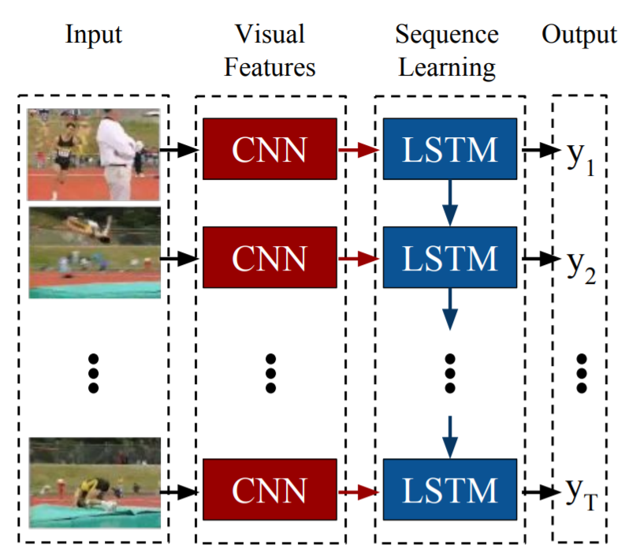

[paper]: https://arxiv.org/pdf/1411.4389.pdf	"Long-term Recurernt Convolutional Networks for Visual Recognition and Description"

The [paper] is by Jeff Donahue, Lisa Anne Hendricks, Marcus Rohrbach, Subhashini Venugopalan, Sergio Guadarrama, Kate Saenko, Trevor Darrell.

**Publication date :** 31 May 2016

**Code and pre-trained model** are availabled at [here](https://people.eecs.berkeley.edu/~lisa_anne/LRCN_video).

<!--more-->

# Basic Idea

The authors propose ***Long-term Recurrent Convolutional Networks*** **(LRCNs)**, a class of architectures for **visual recognition and description** which combines convolutional layers and long-range temporal recursion and is **end-to-end trainable**.

LRCN works by passing each visual input $x_t$ (input at time t, an image in isolation, or a frame from a video) through a feature transformation $\phi_V(.)$ with parameters $V$, usually  a CNN, to produce a fixed-length vector representation $\phi_V(x_t)$. The outputs of $\phi_V$ are then passed into a recurrent sequence learning module with parameters $W$. 

The paper consider three vision problems (**activity recognition, image captioning and video description**), each of which instantiates one of the following broad classes of sequential learning tasks:

- **Sequential input, static output.** 
  - $\langle x_1, x_2, \dots, x_T  \rangle \mapsto y$. 
  - activity recognition.
- **Static input, sequential output.** 
  - $x \mapsto \langle y_1, y_2, \dots, y_T \rangle$. 
  - image captioning.
- **Sequential input, sequential output.** 
  - $\langle x_1, x_2, \dots, x_T \rangle \mapsto \langle y_1, y_2, \dots, y_{T'} \rangle$. 
  - video description. 
  - The number of input and output time steps may differ (we may have $T \ne T'$).

 

For a training set $\mathcal D$ of labeled sequences $(x_t, y_t)_{t=1}^T \in \mathcal D$, we can optimize the parameters $(V,W)$ of the model's visual and sequential components to minimize the expected negative log likelihood of a sequence sampled from the training set.

$$
\mathcal L(V,W, \mathcal D) = -\frac{1}{|\mathcal D|} \sum_{(x_t, y_t)_{t=1}^T \in \mathcal D} \sum_{t=1}^T \log P(y_t | x_{1:t}, y_{1:t-1}, V, W)
$$

The authors train their LRCN models using stochastic gradient descent, with backpropagation used to compute the gradient $\nabla_{V,W} \mathcal L(V,W,\mathcal D)$ of the objective $\mathcal L$ with respect to all parameters $(V,W)$ over $\text{minibatches } D \subset D$ sampled from the training dataset $\mathcal D$.

# Activity Recognition

The CNN base of LRCN in their activity recognition experiments is a hybrid of the *CaffeNet* reference model (a minor variant of *AlexNet*).

The authors consider both RGB and flow as inputs to their recognition system. And they build **LRCN RGB model** and **LRCN flow model**.

Flow is transformed into a "flow image" by shifting x and y flow values to range [-128, 128]. **A third channel for flow image is created by calcualting the flow mangnitude**.

**Some classes the LRCN flow model outperforms the LRCN RGB model and vice versa.** Their explanation is that **activities which are better classified by the LRCN RGB model are best determined by which objects are present in the scene**, while **activities which are better classified by the LRCN flow model are best classified by the kind of motion in the scene**. 

Because RGB and flow signals are complementary, **the best models take both into account**.

# Image Captioning

At time step $t$, the input to bottom-most LSTM is **the embedded word from the previous time step $y_{t-1}$**, and **the output $y_t$ is encoded as a one-hot vector**: vector $y \in \mathbb R^K$ with a single non-zero component $y_i=1$ denoting the $i^{th}$ word in the vocabulary, plus two additional entries for the $\text{<BOS>}$(beginning of sequence) token and the $\text{<EOS>}$ (end of sequence) token. 

The authors build three sequence model architectural variants. 

The unfactored variant ($\text{LRCN}_{2u}$)  performs worse than the other two($\text{LRCN}_{1u}$ and $\text{LRCN}_{2f}$). $\text{LRCN}_{1u}$ and $\text{LRCN}_{2f}$ perform similarly.

# Video Description

The authors use CRF to predict activity, tool, object, and locations present in the video. The CRF is based on the full video input, so we observe the video as whole at each time step, not incrementally frame by frame.

The author build three architectures for video description:

- **LSTM encoder & decoder with CRF max**.
  - Recognize a semantic representation of the video using the maximum a posteriori (MAP) estimate of a CRF with video features as unaries.
  - The representation, e.g., $\langle \text{knife, cut, carrot, cutting board}  \rangle$ which is translated to a natural language sentence ($\text{a person cuts a carrot on the board}$) using an encoder-decoder LSTM.
- **LSTM decoder with CRF max**.
  - provide the full visual input representation at each time step to the LSTM.
- **LSTM decoder with CRF probabilites**.
  - The architecture is the same as LSTM decoder with CRF max, but replace max predictions with probability distributions.

The **LSTM Decoder (CRF-prob)** performs best and gets the highest BLEU score.