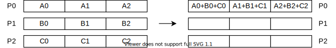

MPI(Message Passing Interface)是消息传递函数库的标准规范，有着多种实现，如MPICH、OPEN-MPI等。本文以MPICH为例介绍MPI的基本使用。

<!--more-->

# 安装

```shell
sudo apt-get install mpich libmpich-dev
```

# 第一个MPI程序

```cpp helloworld.c
#include <stdio.h>
#include "mpi.h"

int main(int argc, char *argv[]) {
    MPI_Init(&argc, &argv); /* MPI的初始化函数 */
    printf("Hello, world!\n");
    MPI_Finalize(); /* MPI的结束函数 */
    return 0;
}
```

+ `MPI_Init()` 和 `MPI_Finalize()` 将被并行化。

**编译：**

```shell
mpicc helloworld.c -o helloworld
```

**运行：**

```shell
mpirun -n 4 ./helloworld
```

+ 其中`-n 4` 指定进程数为4。

**输出：**

```
Hello, world!
Hello, world!
Hello, world!
Hello, world!
```

# 我是谁？世界有多大？

在写MPI程序时，我们常需要知道

+ 任务由多少个进程进行并行计算?
+ 我是哪一个进程？

MPI提供了两个函数分别用于解决以上两个问题：

+ `int MPI_Comm_size(MPI_Comm comm, int *size)`
  + 获取指定通信域的进程数
+ `int MPI_Comm_rank(MPI_Comm comm, int*rank)`
  + 获取指定进程的编号

```cpp
#include <stdio.h>
#include "mpi.h"

int main(int argc, char *argv[]) {
    int id, numProcs;
    MPI_Init(&argc, &argv); /* MPI的初始化函数 */
    MPI_Comm_size(MPI_COMM_WORLD, &numProcs); /* 获取进程数 */
    MPI_Comm_rank(MPI_COMM_WORLD, &id); /* 获取进程号 */
    printf("Hello, I am %d of %d!\n", id, numProcs);
    MPI_Finalize(); /* MPI的结束函数 */
    return 0;
}
```

**输出：**

```
Hello, I am 0 of 4!
Hello, I am 1 of 4!
Hello, I am 2 of 4!
Hello, I am 3 of 4!
```

# MPI数据类型

MPI的数据类型分为两种：**预定义类型**和**派生数据类型**。

+ MPI通过预定义数据类型来解决异构计算中的互操作性问题
+ MPI派生数据类型用于定义由于数据类型不同且地址空间不连续的数据项组成的消息。

## MPI预定义数据类型

| MPI(C语言绑定)       | C                |
| -------------------- | ---------------- |
| `MPI_BYTE`           |                  |
| `MPI_CHAR`           | `signed char`    |
| `MPI_DOUBLE`         | `double`         |
| `MPI_FLOAT`          | `float`          |
| `MPI_INT`            | `int`            |
| `MPI_LONG`           | `long`           |
| `MPI_LONG_DOUBLE`    | `long double`    |
| `MPI_PACKED`         |                  |
| `MPI_SHORT`          | `short`          |
| `MPI_UNSIGNED_CHAR`  | `unsigned char`  |
| `MPI_UNSIGNED`       | `unsigned int`   |
| `MPI_UNSIGNED_LONG`  | `unsigned long`  |
| `MPI_UNSIGNED_SHORT` | `unsigned short` |

+ `MPI_BYTE` 表示一个字节
+ `MPI_PACKED` 预定义数据类型被用来实现传输地址空间不连续的数据项

## MPI常用常量

| 常量名                   | 含义                                             |
| ------------------------ | ------------------------------------------------ |
| `MPI_MAX_PROCESSOR_NAME` | `MPI_Get_processor_name`返回的处理器名称最大长度 |
| `MPI_PROC_NULL`          | 空进程，与空进程进行通信相当于空操作             |
| `MPI_COMM_WORLD`         | 缺省通信域                                       |
| `MPI_COMM_NULL`          | 空通信域                                         |
| `MPI_UNDEFINED_RANK`     | 未定义的进程号                                   |
| `MPI_ANY_SOURCE`         | 接收操作中用于表示从任何源地址接受               |
| `MPI_ANY_TAG`            | 接收操作中用于表示接收任何标签的消息             |

# 消息传递

## `MPI_Send`

```cpp
int MPI_Send(void *buf, int count, MPI_Datatype datatype, int dest, int tag, MPI_Comm comm)
```

+ `buf`：所发送消息的首地址
+ `count`: 将发送的数据的个数
+ `datatype`: 发送数据的MPI数据类型
+ `dest`: 接收消息的进程的标识号，取值范围为0～进程数-1 或 `MPI_PROC_NULL`
+ `tag`: 消息标签，取值为0～`MPI_TAG_UB`
+ `comm`: 通信域

## `MPI_Recv`

```cpp
int MPI_Recv(void *buf, int count, MPI_Datatype datatype, int source, int tag, MPI_Comm comm, MPI_Status *status)
```

+ `buf`: 接收消息数据的首地址
+ `count`: 接收数据的最大个数
+ `datatype`: 接收数据的MPI数据类型
+ `source`: 发送消息的进程的标识号
+ `tag`: 消息标签，取值为0～`MPI_TAG_UB`
+ `comm`: 通信域
+ `status`: 返回状态

```cpp
#include <stdio.h>
#include <string.h>
#include "mpi.h"

const int MAX_STRING = 100;

int main(int argc, char *argv[]) {
    char greeting[MAX_STRING];
    int  comm_size;
    int  my_rank;

    MPI_Init(&argc, &argv);
    MPI_Comm_size(MPI_COMM_WORLD, &comm_size);
    MPI_Comm_rank(MPI_COMM_WORLD, &my_rank);
    if (my_rank != 0) {
        sprintf(greeting, "Hello, world! I am process %d of %d!", my_rank, comm_size);
        MPI_Send(greeting, strlen(greeting) + 1, MPI_CHAR, 0, 0, MPI_COMM_WORLD);
    } else {
        printf("Greetings from process %d of %d!\n", my_rank, comm_size);
        for (int q = 1; q < comm_size; q++) {
            MPI_Recv(greeting, MAX_STRING, MPI_CHAR, q, 0, MPI_COMM_WORLD, MPI_STATUS_IGNORE);
            printf("%s\n", greeting);
        }
    }
    MPI_Finalize();
    return 0;
}
```

输出：

```
Greetings from process 0 of 4!
Hello, world! I am process 1 of 4!
Hello, world! I am process 2 of 4!
Hello, world! I am process 3 of 4!
```

# 通信域

MPI提供了丰富的函数用于管理通信域

| 函数名             | 含义                                                         |
| ------------------ | ------------------------------------------------------------ |
| `MPI_Comm_size`    | 获取指定通信域中进程的个数                                   |
| `MPI_Comm_rank`    | 获取当前进程在指定通信域中的编号                             |
| `MPI_Comm_compare` | 对给定的两个通信域进行比较                                   |
| `MPI_Comm_dup`     | 复制一个已有的通信域生成一个新的通信域，两者除了通信上下文不同，其他都一样 |
| `MPI_Comm_create`  | 根据给定的进程组创建一个新的通信域                           |
| `MPI_Comm_split`   | 从一个指定通信域分裂出多个子通信域，每个子通信域中的进程都是原通信域中的进程 |
| `MPI_Comm_free`    | 释放一个通信域                                               |

# 消息状态

`MPI_Recv`中的`status`存放接收消息的状态

+ `MPI_Status` 是MPI定义的一个数据类型，使用之前需要用户为其分配空间
+ 包含：
  + `status.MPI_SOURCE`：发送数据进程的标识
  + `status.MPI_TAG`：发送数据使用的tag
  + `status.MPI_ERROR`：本接收操作返回的错误代码

还可以通过`status`获取实际接收到的消息的长度

```cpp
int MPI_Get_count(MPI_Status status, MPI_Datatype datatype, int *count)
```

+ `status`: 接收操作的返回值
+ `datatype`: 接收缓冲区中元素的数据类型
+ `count`: 接收消息中的元素个数

# 点对点通信

## 通信模式

MPI提供了以下四种通信模式

+ 标准(standard)模式
  + 发送的结束等于消息已从发送方发出，而不是滞留在发送方的系统缓冲区中
  + 对应 `MPI_Send`
+ 缓冲(buffered)模式
  + 用户需要事先申请一块缓冲区，通过`MPI_Buffer_attch`将缓冲区绑定一个进程后，发送过程中写入此缓冲区，不依赖于接收方的接收操作。
  + 发送结束仅表示消息进入用户指定的缓冲区中。
  + 对应 `MPI_Bsend`
  + 用 `MPI_Buffer_detach` 可以回收申请的缓冲区。
+ 同步(synchronous)模式
  + 双方握手后才进行消息的发送，不需要附加的缓冲区
  + 对应 `MPI_Ssend`
+ 就绪(ready)模式
  + 接收方必须先做出接收操作，处于就绪状态，发送方才能成功发送消息。
  + 对应 `MPI_Rsend`

## 通信机制

### 阻塞通信

`MPI_Send`和`MPI_Recv`都是阻塞型的

阻塞通信返回的条件：

+ 通信操作已完成
+ 调用的缓冲区可用

### 非阻塞通信

`MPI_Send`和`MPI_Recv`都有对应的非阻塞版本：`MPI_Isend`和`MPI_Irecv`。

```cpp
int MPI_Isend(void *buf, int count, MPI_Datatype datatype, int dest, int tag, MPI_Comm comm, MPI_Request *request)
int MPI_Irecv(void *buf, int count, MPI_Datatype datatype, int source, int tag, MPI_Comm comm, MPI_Request *request)
```

+ 与其阻塞版本比较多了一个参数 `request`: 非阻塞通信完成对象(句柄)

其他通信模式也有其非阻塞版本: `MPI_Ibsend`, `MPI_Issend`, `MPI_Irsend`。

#### 通信检测

```cpp
int MPI_Wait(MPI_Request *request, MPI_Status *status)
```

+ 等待指定通信请求完成才返回
+ 成功返回时，`status`包含关于完成的通信的消息，相应的`request`被置为`MPI_REQUEST_NULL`。

```cpp
int MPI_Test(MPI_Request *request, int *flag, MPI_Status *status)
```

+ 无论通信是否完成都立刻返回，`flag` 为1表示通信完成。

**其他通信检测函数：**

```cpp
int MPI_Waitany(int count, MPI_Request *array_of_requests, int *index, MPI_Status *status)
int MPI_Waitall(int count, MPI_Request *array_of_requests, int *index, MPI_Status *array_of_statuses)
int MPI_Waitsome(int incount, MPI_Request *array_of_requests, int *outcount, int *array_of_indices, MPI_Status *array_of_statuses)
int MPI_Testany(int count, MPI_Request *array_of_requests, int *index, int *flag, MPI_Status *status)
int MPI_Testall(int count, MPI_Request *array_of_requests, int *index, int *flag, MPI_Status *array_of_statuses)
int MPI_Testsome(int incount, MPI_Request *array_of_requests, int *outcount, int *array_of_indices, MPI_Status *array_of_statuses)
```

#### 请求释放

```cpp
int MPI_Request_free(MPI_Request request)
```

+ 释放指定的通信请求及其所占用的内存资源
+ 若该通信尚未完成，则等待通信完成后，不会影响该通信
+ 成功返回后`request`被重置为`MPI_REQUEST_NULL`

#### 请求撤销

```cpp
int MPI_Cancel(MPI_Request request)
```

+ 非阻塞型，用于取消一个尚未完成的通信，但不能保证一定会取消，如果通信已经开始，则无法取消。
+ 调用`MPI_Cancel`后仍需要`MPI_Wait`, `MPI_Test`, `MPI_Request_free`来释放该通信请求。

```cpp
int MPI_Test_cancelled(MPI_Status status, int *flag)
```

+ 检测是否取消成功


## 消息探测

`MPI_Probe`和`MPI_Iprobe`函数探测接收消息的内容。用户根据探测到的消息内容决定如何接收这些消息，如根据消息大小分配缓冲区等。前者为阻塞版本，后者为非阻塞版本。

```cpp
int MPI_Probe(int source, int tag, MPI_Comm comm, MPI_Status *status)
int MPI_Iprobe(int source, int tag, MPI_Comm comm, int *flag, MPI_Status *status)
```

+ `source`: 数据源的rank，可以是 `MPI_ANY_SOURCE`
+ `tag`: 数据标签，可以是 `MPI_ANY_TAG`
+ `comm`: 通信域
+ `flag`: 布尔值，探测到与否
+ `status`: 探测到的消息的内容

## `MPI_Sendrecv`

```cpp
int MPI_Sendrecv(void *sendbuf, int sendcount, MPI_Datatype sendtype, int dest, int sendtag,
                 void *recvbuf, int recvcount, MPI_Datatype recvtype, int source, int recvtag, MPI_Comm comm, MPI_Status *status)
```

+ 通过轮转的方式实现一个语句同时向其他进程发送数据和从其他进程接收数据的操作
+ 系统会优化通信次序，从而有效避免不合理的通信次序，最大程度避免死锁

```cpp
int a, b;
// ...
MPI_Status status;
int dest = (rank + 1) % p;  // p 为进程个数
int source = (rank + p - 1) % p;
MPI_Sendrecv(&a, 1, MPI_INT, dest, 99, &b, 1, MPI_INT, source, 99, MPI_COMM_WORLD, &status);
```

## 点对点通信应用示例

**任务：**计算 Z=R(Q(P(W)))​。

### 流水线型


```cpp
while (Not_Done) {
    MPI_Irecv(NextX, ... );
    MPI_Isend(PreviousY, ... );
    CurrentY = Q(CurrentX);
}
```

### 双缓冲流水线型


```cpp
while (Not_Done) {
    if (X == Xbuf0) {X=Xbuf1; Y=Ybuf1; Xin=Xbuf0; Yout=Ybuf0;}
    else {X=Xbuf0; Y=Ybuf0; Y=Ybuf0; Xin=Xbuf1; Yout=Ybuf1;}
    MPI_Irecv(Xin, ..., recv_handle);
    MPI_Isend(Yout, ..., send_handle);
    Y = Q(X); // 重叠计算
    MPI_Wait(recv_handle, recv_status);
    MPI_Wait(send_handle, send_status);
}
```

# 聚合通信

特点：

+ 通信空间中所有进程都参与通信操作
+ 每个进程都需要调用该操作函数

功能：

+ **通信**：完成组内数据的传输
+ **聚集**：在通信的基础上对给定的数据完成一定的操作
+ **同步**：实现组内所有进程在执行进度上取得一致

按通信方向分为：

+ **一对多通信**：一个进程向其他所有的进程发送消息，这个负责发送消息的进程称为Root进程
+ **多对一通信**：一个进程负责从其他所有的进程接收消息，这个负责接收消息的进程也称为Root进程
+ **多对多通信**：每个进程都向其他所有的进程发送或接收消息

<table>
    <tr>
        <th>类型</th>
        <th>函数名</th>
        <th>含义</th>
    </tr>
    <tr>
        <td rowspan="9">通信</td>
        <td>MPI_Bcast</td>
        <td>一对多广播同样的消息</td>
    </tr>
    <tr>
        <td>MPI_Gather</td>
        <td>多对一收集各个进程的消息</td>
    </tr>
    <tr>
        <td>MPI_Gatherv</td>
        <td>MPI_Gather的一般化</td>
    </tr>
    <tr>
        <td>MPI_Allgather</td>
        <td>全局收集</td>
    </tr>
    <tr>
        <td>MPI_Allgatherv</td>
        <td>MPI_Allgather的一般化</td>
    </tr>
    <tr>
        <td>MPI_Scatter</td>
        <td>一对多散播不同的消息</td>
    </tr>
    <tr>
        <td>MPI_Scatterv</td>
        <td>MPI_Scatter的一般化</td>
    </tr>
    <tr>
        <td>MPI_Alltoall</td>
        <td>多对多全局交换消息</td>
    </tr>
    <tr>
        <td>MPI_Alltoallv</td>
        <td>MPI_Alltoall的一般化</td>
    </tr>
    <tr>
        <td rowspan="4">聚集</td>
        <td>MPI_Reduce</td>
        <td>多对一归约</td>
    </tr>
    <tr>
        <td>MPI_Allreduce</td>
        <td>MPI_Reduce的一般化</td>
    </tr>
    <tr>
        <td>MPI_Reduce_scatter</td>
        <td>MPI_Reduce的一般化</td>
    </tr>
    <str>
        <td>MPI_Scan</td>
        <td>前缀和</td>
    </str>
    <tr>
        <td>同步</td>
        <td>MPI_Barrier</td>
        <td>路障同步</td>
    </tr>
</table>

## `MPI_Bcast`

广播，一对多

```cpp
int MPI_Bcast(void *buffer, int count, MPI_Datatype datatype, int root, MPI_Comm comm)
```

+ `buffer`: 发送/接收缓冲区
+ `count`: 元素个数
+ `datatype`: MPI数据类型
+ `root`: root进程号
+ `comm`: 通信域

```cpp
int p, myrank;
float buf;
MPI_Comm comm;
MPI_Init(&argc, &argv);
MPI_Comm_rank(comm, &my_rank);
MPI_Comm_size(comm, &p);
if (myrank == 0) buf = 1.0;
MPI_Bcast(&buf, 1, MPI_FLOAT, 0, comm);
MPI_Finalize()
```

## `MPI_Gather`

多对一，数据收集

```cpp
int MPI_Gather(void *sendbuf, int sendcnt, MPI_Datatype sendtype,
               void *recvbuf, int recvcount, MPI_Datatype recvtype, int root, MPI_Comm comm)
```

```cpp
int p, myrank;
float data[10];
float *buf;
MPI_Comm comm;
MPI_Init(&argc, &argv);
MPI_Comm_rank(comm, &myrank);
MPI_Comm_size(comm, &p);
if (myrank == 0)
    buf = (float*)malloc(p*10*sizeof(float));
MPI_Gather(data, 10, MPI_FLOAT, buf, 0, MPI_FLOAT, 0, comm);
```

## `MPI_Allgather`

多对多，数据收集

```cpp
int MPI_Allgather(void *sendbuf, int sendcount, MPI_Datatype sendtype,
                  void *recvbuf, int recvcount, MPI_Datatype recvtype, MPI_Comm comm)
```

```cpp
int p, myrank;
float data[10];
float *buf;
MPI_Comm comm;
MPI_Init(&argc, &argv);
MPI_Comm_rank(comm, &myrank);
MPI_Comm_size(comm, &p);
buf = (float*)malloc(p*10*sizeof(float));
MPI_Gather(data, 10, MPI_FLOAT, buf, 0, MPI_FLOAT, comm);
```

## `MPI_Scatter`

一对多，数据散发，root进程将一个大的数据块分成小块分散发给各个进程（包括root进程自己），是数据收集的逆操作。

```cpp
int MPI_Scatter(void *sendbuf, int sendcnt, MPI_Datatype sendtype,
                void *recvbuf, int recvcount, MPI_Datatype recvtype, int root, MPI_Comm comm)
```

```cpp
int p, myrank;
float data[10];
float *buf;
MPI_Comm comm;
MPI_Init(&argc, &argv);
MPI_Comm_rank(comm, &myrank);
MPI_Comm_size(comm, &p);
if (myrank == 0)
    buf = (float*)malloc(p*10*sizeof(float));
MPI_Scatter(data, 10, MPI_FLOAT, buf, 0, MPI_FLOAT, 0, comm);
```

## `MPI_Alltoall`

多对多，数据分发

+ 每个进程发送一个消息给n个进程，包括它自己，这n个消息的发送缓冲区中以标号的顺序有序地存放。
+ 一次全局交换中共有 $n^2$ 个消息进行通信。


```cpp
int MPI_Alltoall(void *sendbuf, int sendcount, MPI_Datatype sendtype,
                 void *recvbuf, int recvcount, MPI_Datatype recvtype, MPI_Comm comm)
```

## `MPI_Reduce`

简单归约，将通信域内每个进程输入缓冲区中的数据按给定的操作进行简单运算，并将结果返回到root进程的输出缓冲区中。

+ 归约操作可以使用MPI预定义的运算操作，也可以使用用户自定义的运算操作，但必须满足结合律。
  + 创建自定义归约运算操作：`MPI_Op_create`
  + 释放自定义的归约操作: `MPI_Op_free`

```cpp
int MPI_Reduce(void *sendbuf, void *recvbuf, int count, MPI_Datatype datatype, MPI_Op op, int root, MPI_Comm comm)
```

+ 参数 `recvbuf` 只对根进程有意义
+ 所有进程所提供的数据长度相同、类型相同



**MPI归约预定义操作：**

| 操作         | 含义             |
| ------------ | ---------------- |
| `MPI_MAX`    | 最大值           |
| `MPI_MIN`    | 最小值           |
| `MPI_SUM`    | 求和             |
| `MPI_PROD`   | 求积             |
| `MPI_LAND`   | 逻辑与           |
| `MPI_BAND`   | 按位与           |
| `MPI_LOR`    | 逻辑或           |
| `MPI_BOR`    | 按位或           |
| `MPI_LXOR`   | 逻辑异或         |
| `MPI_BXOR`   | 按位异或         |
| `MPI_MAXLOC` | 最大值及相应位置 |
| `MPI_MINLOC` | 最小值及相应位置 |

## `MPI_Allreduce`

```cpp
int MPI_Allreduce(void *sendbuf, void *recvbuf, int count, MPI_Datatype datatype, MPI_Op op, MPI_Comm comm)
```

+ 所有进程的`recvbuf`将同时获得归约运算的结果
+ 相当于`MPI_Reduce`后再将结果进行一次广播


## `MPI_Scan`

前缀和计算

+ 每一个进程都对排在它前面的进程进行归约操作，操作结束后，第i个进程中的`recvbuf`中将包含前i个进程的归约结果。
+ 0号进程接收缓冲区中的数据就是其发送缓冲区的数据

```cpp
int MPI_Scan(void *sendbuf, void *recvbuf, int count, MPI_Datatype datatype, MPI_Op op, MPI_Comm comm)
```


## `MPI_Barrier`

MPI唯一的同步函数

+ 当通信域内所有进程都执行该函数时才返回，否则将一直等待

```cpp
int MPI_Barrier(MPI_Comm comm)
```

# MPI派生数据类型

派生数据类型可有效减少消息传递次数，增大通信粒度，同时可以避免或减少消息传递时数据在内存中的拷贝。

主要思想：当一个发送数据的函数知道数据项集合的一些信息时，可以在发送前收集好这些数据，而不是在发送时临时抱佛脚；同理，接收数据的函数在接收数据时可以根据这些信息将数据项分发到正确的目标内存地址。

| 函数名                 | 含义                                               |
| ---------------------- | -------------------------------------------------- |
| MPI_Type_contiguous    | 定义由相同数据类型的元素组成的类型                 |
| MPI_Type_vector        | 定义由成块的元素组成的类型，块之间具有相同间隔     |
| MPI_Type_indexed       | 定义由成块的元素组成的类型，块长度和偏移由参数指定 |
| MPI_Type_create_struct | 定义由不同数据类型的元素组成的类型                 |
| MPI_Type_commit        | 提交一个派生数据类型                               |
| MPI_Type_free          | 释放一个派生数据类型                               |
| MPI_Get_address        | 返回内存地址                                       |

## `MPI_Type_contiguous`

将一个已有的数据类型按顺序依次连续进行复制后的新类型。

```cpp
int MPI_Type_contiguous(int count, MPI_Datatype oldtype, MPI_Datatype *newtype)
```


## `MPI_Type_vector`

复制一个数据类型到含有相等大小块的空间，每个块通过连接相同数量的就数据类型的拷贝来获得块与块之间的空间是旧数据类型的extent的倍数。

```cpp
int MPI_Type_vector(int count, int blocklength, int stride, MPI_Datatype oldtype, MPI_Datatype *newtype)
```

+ `count`: 块的数量
+ `blocklength`: 块中所包含的元素个数
+ `stride`: 各块第一个元素之间相隔的元素个数


## `MPI_Type_indexed`

复制一个旧数据类型到块序列中，每个块可以包含不同的拷贝数量和具有不同的偏移，所有的块偏移都是旧数据类型extent的倍数

```cpp
int MPI_Type_indexed(int count, int *array_of_blocklengths, int *array_of_displacements, MPI_Datatype oldtype, MPI_Datatype *newtype)
```

+ `count`: 块的数量
+ `array_of_blocklengths`: 每个块所含的元素个数
+ `array_of_displacements`: 各块偏移值


## `MPI_Type_create_struct`

最通用的类型生成器

```cpp
int MPI_Type_create_struct(int count, int *array_of_blocklengths, MPI_Aint *array_of_displacements, MPI_Datatype *array_of_types, MPI_Datatype *newtype)
```

+ `count`: 块的数量
+ `array_of_blocklengths`: 每个块中所含的元素个数
+ `array_of_displacements`: 每个块偏移字节数,`MPI_Aint`是一个足够存储系统地址的大整数类型
+ `array_of_types`: 每个块中元素的类型


## `MPI_Type_commit`

类型提交，新类型在通信前必须提交

```cpp
int MPI_Type_commit(MPI_Datatype *datatype)
```


## `MPI_Type_free`

释放类型

```cpp
int MPI_Type_free(MPI_Datatype *datatype)
```


## `MPI_Get_address`

返回内存地址

```cpp
int MPI_Get_address(void *location, MPI_Aint *address)
```

