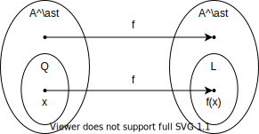

本文是《近世计算理论导引：NP难度问题的背景、前景及其求解方法研究》的第三章《NP完全理论》的笔记。

<!--more-->

# 增长速度

只考虑满足以下条件的数论函数 $f$:

$$
\lim_{n\to +\infty} f(n)= +\infty
$$

**定义1：$f(n) = O(g(n))$，其中 $f$, $g$ 为从 $\mathbb{N}$ 到 $\mathbb{N}$ 的函数，是指存在 $C > 0$ ，使得 $f(n) \le Cg(n)$ 对于充分大的 $n$ 一致成立。**

+ 形式化表示为 $\exists C \in \mathbb{R}^+, \exists k > 0, \forall n > k: f(n) \le C(g(n))$ 。

**定理1：设 $f$, $g$ 为 $\mathbb{N} \mapsto \mathbb{N}$ 的全函数，$\lim_{n\to +\infty} f(n) = + \infty$, $\lim_{n\to +\infty} g(n) = + \infty$，且 $\lim_{n\to +\infty} \frac{f(n)}{g(n)}= \beta$，则**

+ 若 $\beta \in \mathbb{R}^+$，则 $f$，$g$ 有相同的增长速率。
+ 若 $\beta = +\infty$，则 $f$ 比 $g$ 增长快。
+ 若 $\beta = 0$，则 $g$ 比 $f$ 增长慢。

记 $p(n)=a_r n^r+a_{r-1}n^{r-1}+\cdots+a_0$，其中 $a_r \in \mathbb{R}^+$，$\forall i \in (0,r-1): a_i \in \mathbb{R}$，称 $r$ 为多项式 $p$ 的次数。

**定理2：设 $p_1(n)$ 的次数为 $r_1$，$p_2(n)$ 的次数为 $r_2$，则**

+ 若 $r_1 = r_2$，则 $p_1$ 和 $p_2$ 增长速度相同。
+ 若 $r_1 > r_2$，则 $p_1$ 比 $p_2$ 增长速度快。
+ 若 $r_1 < r_2$，则 $p_2$ 比 $p_1$ 增长速度快。

**定理3：函数 $k^n (k>1)$ 比任何多项式的增长速度快。**

# P 和 NP

## P问题

记 Turing机 $T$ 接收输入 $x$ 所历的机器运行步数为 $step(x)$。 

**定义1：多项式时间可判定的语言 $L$**

+ 满足以下条件

+ 存在一个字符表为 $A$ 的Turing机 $T$ 接受语言 $L$。

+ 存在一个多项式 $p(n)$ 使得
  
  $$
  \forall x \in L:step(x) \le p(|x|)
  $$

  其中，$step(x)$ 称为计算时间，$|x|$ 表示 $x$ 的字长。则称 $L$ 是多项式时间可判定的。

+ 若存在机器 $T$，能够在多项式时间内解决 $x \in ? L$ 的问题，则 $L$ 是多项式时间可判定的。

**定义2：当字符表 $A$ 确定后，我们用 $P$ 表示一切“多项式时间可判定的语言”所构成的类。**

+ $$
  P=\{L|\exists T,\exists p ,\forall x\in L: step(x) \le p(|x|) \}
  $$

+ 说 $Q \in P$ 指的是 $x \in ? Q$ 这个问题是多项式时间可判定的。

**定义3：多项式时间可计算的函数 $f$**

+ 设 $f$ 为 $A^* \mapsto A^*$ 的一个全函数，$A$ 为字符表。

+ 存在一个多项式 $p(n)$ 使得

  $$
  \forall x \in A^*:step(x) \le p(|x|)
  $$

  其中，$step(x)$ 称为计算时间，$|x|$ 表示 $x$ 的字长。则称 $f$ 是多项式时间可计算的。

**合并定义：**

+ 说语言 $L$ 是多项式时间可判定的或函数 $f$ 是多项式时间可计算的只需
  + 存在一个Turing机完成计算任务的计算步数 $step(x)\le p(|x|)$ 对充分大的 $|x|$ 一致地成立，其中 $|x|$ 为输入的字。
  + 存在一个Turing机完成计算任务的计算步数 $step(x)=O(|x|^r)$, $r \in \mathbb{N}^+$。
+ 多项式时间可判定的语言 $L$ 和多项式时间可计算的函数 $f$ 的定义区别在于需要Turing机完成的计算任务不同。
  + 多项式时间可判定的语言 $L$ 的定义要求的计算任务是判断 $x\in?L$，即要求对 $x\in L$ 满足。
  + 多项式时间可计算的函数 $f$ 的定义要求的计算任务是对全体 $x \in A^*$ 都满足。

 

**Cook-Karp论题：任给字符表 $A$，对 $A^*$ 上任一全函数 $f:A^* \mapsto A^*$，若由某种装置能在多项式时间内计算函数 $f$，则必存在一台 Turing 机能在多项式时间内计算函数 $f$。**

**定理1：设 $L \in P$, $f$ 为从 $A^*$ 到 $A^*$ 多项式时间可计算函数， $Q=\{x\in A^*|f(x) \in L\}$，则 $Q\in P$。**

+ 

+ 此过程关键在于判断 $x \in? Q$ 这个问题是不是多项式时间可判定的。由于 $f$ 是多项式时间可计算的，$L\in P$，只需要将 $x$ 在多项式时间内映射到 $f(x)$，再在多项式时间内判定 $f(x) \in ? L$ 即可。

+ 由于 $f$ 是多项式时间可计算的，需要时间 $\le p_1(|x|)$；由于 $L\in P$，因此 $f(x) \in ? L$ 这个问题是多项式时间可判定的，即判断所需要时间 $\le p_2(|f(x)|)$。

+ 联系Turing机的运行步骤，由于 $f(x)$ 最多运行 $p_1(|x|)$ 步，最多移动 $p_1(|x|)$ 格，因此 $|f(x)| \le |x| + p_1(|x|)$。

+ 于是判定 $x \in ? Q$ 的运行时间为
  
  $$
  p_1(|x|) + p_2(|f(x)|) \le p_1(|x|) + p_2(|x| + p_1(|x|)) \triangleq p_3(|x|)
  $$

**定理2：设 $f$, $g$ 为多项式时间可计算的部分函数，其中 $g$ 为全函数，而 $f$ 可为真部分函数，即可在某些点上无定义，使得 $h(x) \triangleq f(g(x))$ 为全函数，则 $h$ 为多项式时间内可计算的全函数。**

+ 

+ 计算需要时间为
  
  $$
  p_g(|x|) +p_f(|g(x)|) \le p_f(|x|) + p_f(|x|+p_g(|x|)) \triangleq p_h(|x|)
  $$
  

## 不确定型Turing机与NP问题

**补充定义：不确定型Turing机**

+ 第一章中定义的Turing机要求Turing机的行为准则集（四元组）中前两个元素（当前内部状态和当前指针指向的值）在所有行为准则集中不允许重复。将该条件放宽为允许重复后该Turing机即为**不确定型Turing机**，而原先不允许重复的Turing机称为**确定型Turing机**。
+ 不确定型Turing机会遇到当前内部状态和当前指针指向的值有对应的多条行为准则，因此Turing机的下一步可以在其中选择一条执行。
+ 确定型Turing机是不确定型Turing机的子集。
+ 格局(瞬像)序列 $\gamma_1,\cdots,\gamma_m (m\ge1)$ 是Turing机 $T$ 接收字 $x \in A^*$ 的一条**接收路径**，其中 $\gamma_1$ 是初始格局，$\gamma_m$ 是停机格局。

+ **不确定型Turing机所接收的语言**的重新定义：设 $A=\{ s_1,\cdots, s_n\}$ 是给定的字符表，$x \in A^*$，Turing机 $T$ 的字符表包含 $A$。若存在一条 $T$ 接收 $x$ 的接收路径，则称 $T$ 接收 $x$。如果Turing机的字母表为 $A$，则 $L=\{x\in A^* | T 接收 x\}$ 称为 $T$ 所接收的语言。

**定义4：设字符表 $A$ , $L \subseteq A^*$，如果存在接收语言 $L$ 的非确定型Turing机 $T$ 和多项式 $p(n)$，使得对于每一个 $x\in L$，存在 $T$ 关于 $x$ 的接收路径 $\gamma_1, \cdots, \gamma_m$，其中 $m \le p(|x|)$，则称语言 $L$ 属于 $NP$ 类。**

+ 即存在一个非确定性Turing机 $T$ 能够在多项式时间内解决 $x \in ? L$ 问题，则 $L \in NP$。

**Cook-Karp论题的不确定计算型式：任给字母表 $A$, 语言 $L \subseteq A^*$，若存在着某种不确定计算的装置能够在多项式时间（只要求可能的最短时间）内解决问题 $x \in ? L$，则必有 $L \in NP$，即必有一台不确定的Turing机 $T$ 能够在多项式时间内解决问题 $x \in ? L$。**

**定理3：$P \subseteq NP$。**

+ 若 $L \in P$， 则存在一个确定型Turing机能够在多项式时间内解决 $x \in ? L$ 问题，而确定型Turing机也是非确定型Turing机，即存在一个非确定型Turing机能够在多项式时间内解决 $x \in ? L$ 问题，得到 $L \in NP$。$\forall L \in P:L \in NP$，因此 $P \subseteq NP$。

**定理4：若 $L \in NP$，则 $L$ 为可计算集。**

+ 由 $L \in NP$，对于 $x \in A^*$，$x \in ? L$ 的问题可以由一个非确定型Turing机解决，因此 $L$ 是可计算集。

## 合取范式与SAT

形如 $(P_1 \lor P_2 \lor \bar P_3 \lor P_4) \land (\bar P_1 \lor \bar P_2 \lor \bar P_3 \lor P_4) \land (\bar P_2 \lor \bar P_1 \lor \bar P_3)$ 的式子称为**合取范式**，其中 $P_i$ 称为**命题变元**。若存在一组 $P_i$ ，使得该合取范式为真，则称该合取范式为可满足的。

我们首先介绍一种**SAT问题的直接表示方法**：

令字符表 $A= \{(,),\cdot,\triangle, \lor, \land \}$，令 $A^*$ 中的字 $(\cdot \lor \cdot \cdot \lor \triangle \triangle \triangle \lor \cdot \cdot \cdot \cdot) \land (\triangle \triangle \lor \triangle \lor \triangle \triangle \triangle \lor \cdot \cdot \cdot)$ 表示合取范式 $(P_1 \lor P_2 \lor \bar P_3 \lor P_4) \land (\bar P_1 \lor \bar P_2 \lor \bar P_3 \lor P_4)$。

可将 $A^*$ 中的字分为三类：不符合合取范式的字；代表不可满足的合取范式的字；代表可满足的合取范式的字。

**SAT(可满足性)问题**的一种表示方法为：

$$
SAT = \{ x \in A^* | x 代表可满足的合取范式 \}
$$

SAT问题即是问 $x \in ? SAT$。

上述表示方法能够表示所有的SAT问题，以下考虑**命题变元数量 $\le n$ 条件下SAT问题的另一种表示方法**：

令字符表 $A_n =\{ a_1, \cdots, a_n, \bar a_1, \cdots, \bar a_n, / \}$，字符表 $A_n$ 上任一以 $/$ 开头的行都代表一个合取范式，如 $/a_1 a_2 \bar a_3 a_4 /\bar a_1 \bar a_2 \bar a_3 a_4 /\bar a_2 \bar a_1 \bar a_3$ 表示 $(P_1 \lor P_2 \lor \bar P_3 \lor P_4) \land (\bar P_1 \lor \bar P_2 \lor \bar P_3 \lor P_4) \land (\bar P_2 \lor \bar P_1 \lor \bar P_3)$。

命题变元数量 $\le n$ 条件下的SAT问题表示为：

$$
SAT_n = \{ x \in A_n^* |x 代表可满足的合取范式\}
$$

由此完整的 $SAT$ 可表示为

$$
SAT = \lim_{n \to \infty} SAT_n
$$

**定理5：$\forall n \in \mathbb{N}^+:SAT_n \in NP$。**

+ 构造不确定型Turing机 $T$，使得若 $x \in SAT_n$ 则 $T$ 在多项式时间内接收 $x$；若 $x \notin SAT_n$ 则 $T$ 不接受 $x$。

+ $T$ 的字符表为 $\widetilde A_n=\{ a_1, \cdots, a_n, \bar a_1, \cdots, \bar a_n, /, | \}$。

+ $T$ 的状态表为 $\{ q_1, m_j,r_i^+,r_i^-,v_i^+,v_i^-,w_i^+,w_i^-,p,\bar p \}$。

+ $T$ 的行为准则集为：
  
  $$
  \begin{array}[]{}
  
   \left( \begin{array}[]{l}
  \rule{0mm}{4.5mm} q_1 & B & R & q_1 \\
  \rule{0mm}{4.5mm} q_1 & / & L & m_1 \\
  \rule{0mm}{4.5mm} q_1 & S & L & q_1 \\
  \rule{0mm}{4.5mm} m_i & B & R & r_i^+ \\
  \rule{0mm}{4.5mm} m_i & B & R & r_i^- \\
  \rule{0mm}{4.5mm} r_i^\pm & | & R& v_i^\pm \\
  \rule{0mm}{4.5mm} r_i^\pm & / & R& v_i^\pm \\
  \rule{0mm}{4.5mm} r_i^+ & S & R & r_i^+ \\
  \rule{0mm}{4.5mm} r_i^- & S & R & r_i^- \\
  \rule{0mm}{4.5mm} r_i^+ & a_i & L & w_i^+ \\
  \rule{0mm}{4.5mm} r_i^- & \bar a_i & L & w_i^- \\
  \rule{0mm}{4.5mm} w_i^\pm & S & L & w_i^\pm \\
  \rule{0mm}{4.5mm} w_i^\pm & / & | & v_i^\pm \\
  \rule{0mm}{4.5mm} v_i^\pm & S & R & v_i^\pm \\
  \rule{0mm}{4.5mm} v_i^\pm & / & R & r_i^\pm \\
  \rule{0mm}{4.5mm} r_i^\pm & B & L & m_{i+1} \\
  \rule{0mm}{4.5mm} v_i^\pm & B & L & m_{i+1} \\
  \rule{0mm}{4.5mm} m_{i+1} & S & L & m_{i+1} \\
  \rule{0mm}{4.5mm} m_{n+1} & B & R & p \\
  \rule{0mm}{4.5mm} p & S & R & p \\
  \rule{0mm}{4.5mm} p & / & L & \bar p \\
  \rule{0mm}{4.5mm} \bar p & S & R & p
  \end{array} \right)
  
  \begin{array}[]{l}
  
  \rule[-10mm]{0mm}{22mm} \left.\begin{array}[]{l} \rule{0mm}{4.5mm} \\ \rule{0mm}{4.5mm} \\ S 遍取 a_1,\cdots,a_n,\bar a_1, \cdots, \bar a_n \end{array} \right\} 作查头之用 \\
  \rule[-5mm]{0mm}{15mm} \left. \rule{0mm}{7mm}\right\} 为 a_i选取真假值,i=1,\cdots,n \\
  \rule{0mm}{4.5mm} 当前子句已满足，观察下一子句\\  
  \rule{0mm}{4.5mm} 当前子句尚未满足，寻求满意文字\\
  \rule{0mm}{4.5mm} S 遍取 a_1,\cdots, a_{i-1}, a_{i+1}, \cdots, a_n,\bar a_1, \cdots, \bar a_n；不满意则右移\\
  \rule{0mm}{4.5mm} S 遍取 a_1, \cdots, a_n,\bar a_1, \cdots, \bar a_{i-1}, \bar a_{i+1}, \cdots, \bar a_n；不满意则右移\\ \rule[-5mm]{0mm}{15mm} \left. \rule{0mm}{8mm}\right\} 发现满意文字后，装新内态 w_i^\pm\\
  \rule[-5mm]{0mm}{15mm} \left.\begin{array}[]{l} S 遍取 a_1,\cdots,a_n,\bar a_1, \cdots, \bar a_n \\ \rule{0mm}{4.5mm} \end{array} \right\} 标志被满足了的子句 \\
  \rule[-5mm]{0mm}{15mm} \left.\begin{array}[]{l} S 遍取 a_1,\cdots,a_n,\bar a_1, \cdots, \bar a_n, | \\ \rule{0mm}{4.5mm} \end{array} \right\} 寻找下一个未被满足的子句 \\
  \rule[-5mm]{0mm}{15mm} \left. \rule{0mm}{7mm}\right\} 准备为下一个命题变元选真假值\\
  \rule{0mm}{4.5mm} S 遍取 a_1,\cdots,a_n,\bar a_1, \cdots, \bar a_n, /, |, 找输入字 x 的头 \\
  \rule[-12mm]{0mm}{28mm} \left.\begin{array}[]{l} \rule{0mm}{4.5mm} \\ S 遍取 a_1,\cdots,a_n,\bar a_1, \cdots, \bar a_n, | \\ \rule{0mm}{4.5mm} \\ S 遍取 a_1,\cdots,a_n,\bar a_1, \cdots, \bar a_n, /, |, B \\ \end{array} \right\} 最后检查是否还残存/符号，即是否满足了 \\
  \end{array}
  \end{array}
  $$
  
  
  > 待续

# Cook 定理

> 待续

# 另外几个NP完全问题

> 待续

# 参考文献

[1] 黄文奇, 许如初. 近世计算理论导引: NP 难度问题的背景, 前景及其求解算法研究[M]. 科学出版社, 2004: 20-46.

