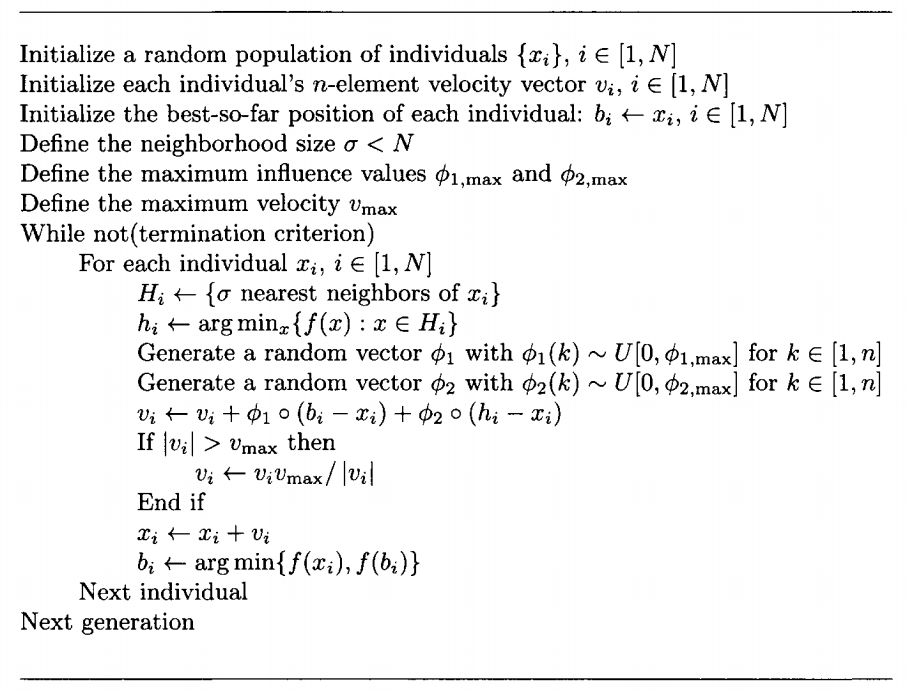
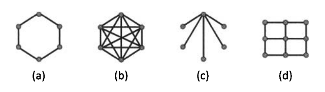

本文介绍粒子群算法及其原理和衍生算法。

<!--more-->

# 基本粒子群优化算法

假设问题定义在一个 $d$ 维连续域上。

我们选择一个包含 $N$ 个候选解的种群，记为 $\boldsymbol{x}_i \in \mathbb{R}^d$, $i \in [1,N]$。我们称这个种群为粒子群，每一个 $\boldsymbol{x}_i$ 是一个粒子。

假设每个粒子 $\boldsymbol{x}_i$ 以速度 $\boldsymbol{v}_i$ 在搜索空间中移动，其中 $\boldsymbol{v}_i \in \mathbb{R}^d$。

## 算法伪代码



其中 $\boldsymbol{b}_i$ 表示第 $i$ 个粒子历史上的最好位置，$\boldsymbol{h}_i$ 表示第 $i$ 个粒子的 $\sigma$ 个邻居中当代的最好位置。

每一次更新速度时，粒子 $i$ 都以一定概率向 $\boldsymbol{b}_i$ 和 $\boldsymbol{h}_i$ 两个最优位置偏移。

由于更新公式 $\boldsymbol{x}_i \leftarrow \boldsymbol{x}_i + \boldsymbol{v}_i$ 可能导致 $\boldsymbol{x}_i$ 超出搜索空间，因此可以增加一些限制将移动出搜索空间的粒子拉回搜索空间内，如
$$
\begin{align}
\boldsymbol{x}_i &\leftarrow \min \{ \boldsymbol{x}_i, \boldsymbol{x}_{max} \} \\ \boldsymbol{x}_i &\leftarrow \max \{ \boldsymbol{x}_i, \boldsymbol{x}_{min} \}
\end{align}
$$
此处 $[\boldsymbol{x}_{min}, \boldsymbol{x}_{max}$] 定义了搜索空间的界限。

## 算法涉及的超参数

+ 学习率 $\phi_{1}$ 被称为认知学习率，$\phi_{2}$ 被称为社会学习率，它们是分布在 $[0, \phi_{1,max}]$ 和 $[0, \phi_{2,max}]$ 上的随机向量。一个经验法则是 $\phi_{1,max}$ 和 $\phi_{2,max}$ 通常设置在 2.05 左右。
+ $v_{max}$ 是粒子允许的最大速度，当粒子速度超过限制的最大速度时，将速度归一化到最大速度。通常设置在搜索空间范围的10%到20%之间。

## 粒子群的拓扑

算法中涉及到了粒子的邻居，因此需要考虑粒子的邻域是怎么规定的，这里引入群的**拓扑(topology)**的概念。

拓扑的多种选择，此处给出几种：

+ 动态拓扑（dynamic topology）, 又称 lbest 拓扑
  + 每个粒子的邻域在每一代都会变化，比如最近邻。
+ 静态拓扑 （static topology)
  + 在算法运行前粒子的邻域就已经确定，不随迭代变化。
  + 全拓扑 (all topology)，又称 gbest拓扑：邻域包含所有粒子。
  + 环形拓扑 (wheel topology)：每个粒子与另外两个粒子连接构成邻域。
  + 


## Python实现

此处给出一个邻域为全拓扑的粒子群优化算法的实现。

```python
import numpy as np
import os
import matplotlib.pyplot as plt

class PSO:
    def __init__(self, num_generation, population_size, num_variable, lower_bound, upper_bound):
        self.num_generation = num_generation
        self.population_size = population_size
        self.num_variable = num_variable
        self.lower_bound = lower_bound
        self.upper_bound = upper_bound

        self.population_position = np.random.rand(self.population_size, self.num_variable) * (self.upper_bound -self.lower_bound).reshape(1, -1) + self.lower_bound.reshape(1, -1)
        self.population_velocity = np.random.randn(self.population_size, self.num_variable)
        self.history_best_position = np.zeros((self.population_size, self.num_variable))  # history best of each particle
        self.history_best_fitness = np.zeros((self.population_size,))
        self.global_best_position = np.zeros((self.num_variable,))  # global best of current population
        self.global_best_fitness = None

        # initialize
        for i in range(self.population_size):
            self.history_best_position[i] = self.population_position[i].copy()
            self.history_best_fitness[i] = self.fitness(self.population_position[i])
            if self.global_best_fitness is None or self.global_best_fitness < self.history_best_fitness[i]:
                self.global_best_position = self.population_position[i].copy()
                self.global_best_fitness = self.history_best_fitness[i]


    def update(self):
        c1 = 2  # learning factor
        c2 = 2
        w = 0.4  # self weight factor
        max_velocity = 10.0

        new_global_best_position = None
        new_gloabl_best_fitness = None
        for i in range(self.population_size):
            self.population_velocity[i] = w * self.population_velocity[i] + c1 * np.random.rand(self.num_variable) * (self.history_best_position[i] - self.population_position[i]) \
                                           + c2 * np.random.rand(self.num_variable) * (self.global_best_position - self.population_position[i])
            velocity = np.linalg.norm(self.population_velocity[i])
            if velocity > max_velocity:
                self.population_velocity[i] *= max_velocity / velocity

            self.population_position[i] += self.population_velocity[i]
            self.population_position[i] = np.where(self.population_position[i] < self.lower_bound, self.lower_bound, np.where(self.population_position[i] > self.upper_bound, self.upper_bound, self.population_position[i]))

            fitness = self.fitness(self.population_position[i])
            if fitness > self.history_best_fitness[i]:
                self.history_best_position[i] = self.population_position[i]
                self.history_best_fitness[i] = fitness

            if new_gloabl_best_fitness is None or new_gloabl_best_fitness < fitness:
                new_global_best_position = self.population_position[i]
                new_gloabl_best_fitness = fitness

        self.global_best_position = new_global_best_position.copy()
        self.global_best_fitness = new_gloabl_best_fitness


    def fitness(self, position):
        return -(position[0] - 50) ** 2 - (position[1] - 50) ** 2

    def run(self):
        best_fitness_of_each_generation = [self.global_best_fitness]
        for generation in range(self.num_generation):
            print("generation {}:".format(generation), end=' ')
            self.update()
            best_fitness_of_each_generation.append(self.global_best_fitness)
            print("best fitness: {}  best position: {}".format(self.global_best_fitness, self.global_best_position))
        print("searching end")

        plt.figure()
        plt.title("best fitness")
        plt.xlabel("generation")
        plt.ylabel("fitness")
        plt.plot(list(range(self.num_generation + 1)), best_fitness_of_each_generation, color='b', linewidth=2)
        os.makedirs("output", exist_ok=True)
        plt.savefig("output/simple_pso_best_fitness.png", dpi=240)

if __name__ == '__main__':
    pso = PSO(50, 5, 2, np.array([0., 0.]), np.array([100., 100.]))
    pso.run()
```


# 速度限制

考虑 $\phi_2=0$ 的简化版PSO算法，粒子位置和速度的更新如下：
$$
\begin{align}
\boldsymbol{v}_i(t+1) &= \boldsymbol{v}_i(t) + \phi_1(\boldsymbol{b}_i - \boldsymbol{x}_i(t)) \\
\boldsymbol{x}_i(t+1) &= \boldsymbol{x}_i(t) + \boldsymbol{v}_i(t+1)
\end{align}
$$
上式可写成
$$
\begin{bmatrix}
\boldsymbol{x}_i(t+1) \\
\boldsymbol{v}_i(t+1)
\end{bmatrix}
=
\begin{bmatrix}
1 - \phi_1 & 1 \\
-\phi_1 & 1
\end{bmatrix}
\begin{bmatrix}
\boldsymbol{x}_i(t) \\
\boldsymbol{v}_i(t)
\end{bmatrix}
+
\begin{bmatrix}
\phi_1 \\
\phi_2
\end{bmatrix}
\boldsymbol{b}_i
$$
右边矩阵的特征值为
$$
\lambda = \frac{2 - \phi_1 \pm \sqrt{\phi_1^2 - 4 \phi_1}}2
$$
特征值 $\lambda$ 支配着系统的稳定性（解释见附录）。

+ 当 $\phi_1 \in [0, 4]$ 时，$|\lambda| = 1$，系统处于临界稳定，对某些初始情况下的$\boldsymbol{x}_i(t)$ 和 $\boldsymbol{v}_i(t)$ 会无限增大。
+ 当 $\phi_1 > 4$ 时，存在 $|\lambda_2| > 1$，系统不稳定，$\boldsymbol{x}_i(t)$ 和 $\boldsymbol{v}_i(t)$ 会无限增大，无法收敛。

因此需要限制速度。


# 惯性权重

可以通过给速度 $\boldsymbol{v}_i(t)$ 添加一个惯性权重 $w$ 使得粒子在优化过程中减小惯性以获得更好的性能。
$$
\boldsymbol{v}_i \leftarrow w \boldsymbol{v}_i + \phi_1(\boldsymbol{b}_i - \boldsymbol{x}_i) + \phi_2 (\boldsymbol{h}_i - \boldsymbol{x}_i)
$$
惯性权重 $w$ 经常取从第一代的 0.9 减少到最后一代的 0.4 左右。

随着迭代进行，惯性权重有助于降低粒子的速度从而改善收敛性。


# 压缩系数

惯性权重常常使用压缩系数来实现而不是惯性权重。
$$
\boldsymbol{v}_i \leftarrow K[ \boldsymbol{v}_i + \phi_1(\boldsymbol{b}_i - \boldsymbol{x}_i) + \phi_2 (\boldsymbol{h}_i - \boldsymbol{x}_i) ]
$$
其中，$K$ 被称为压缩系数。

可以一般化的写成：
$$
\begin{align}
\boldsymbol{v}_i(t + 1) &= K[\boldsymbol{v}_i(t) + \phi_T (\boldsymbol{p}_i(t) - \boldsymbol{x}_i(t))] \\
\phi_T &= \phi_{1,max} + \phi_{2,max} \\
\boldsymbol{p}_i(t) &= \frac{\phi_1 \boldsymbol{b}_i(t) + \phi_2 \boldsymbol{h}_i(t)}{\phi_1+\phi_2}
\end{align}
$$


# 全局速度更新

$$
\boldsymbol{v}_i \leftarrow K[ \boldsymbol{v}_i + \phi_1(\boldsymbol{b}_i - \boldsymbol{x}_i) + \phi_2 (\boldsymbol{h}_i - \boldsymbol{x}_i) + \phi_3(\boldsymbol{g} - \boldsymbol{x}_i)]
$$

其中， $\boldsymbol{g}$ 为历史中所有粒子的最好位置。

可以一般化的写成：
$$
\begin{align}
\boldsymbol{v}_i(t + 1) &= K[\boldsymbol{v}_i(t) + \phi_T (\boldsymbol{p}_i(t) - \boldsymbol{x}_i(t))] \\
\phi_T &= \phi_{1,max} + \phi_{2,max} + \phi_{3,max} \\
\boldsymbol{p}_i(t) &= \frac{\phi_1 \boldsymbol{b}_i(t) + \phi_2 \boldsymbol{h}_i(t) + \phi_3 \boldsymbol{g}(t)}{\phi_1+\phi_2+\phi_3}
\end{align}
$$


# 完全知情的粒子群

让每个粒子的速度都根据当代所有粒子的位置来更新，而不是依据少数几个当代粒子或者历史上的最优粒子。

可以一般化的写成：
$$
\begin{align}
\boldsymbol{v}_i(t + 1) &= K[\boldsymbol{v}_i(t) + \phi_T (\boldsymbol{p}_i(t) - \boldsymbol{x}_i(t))] \\
\phi_T &= \frac1M \sum_{j=1}^M \phi_{j,max} \\
\boldsymbol{p}_i(t) &= \frac{ \sum_{j=1}^M w_{ij}\phi_j \boldsymbol{b}_i(t)}{\sum_{j=1}^M w_{ij} \phi_j}
\end{align}
$$
其中 $\boldsymbol{b}_j(t)$ 为第 $j$ 个粒子目前为止找到的最好的解：
$$
\boldsymbol{b}_j(t) = \arg \min_x f(\boldsymbol{x}): \boldsymbol{x} \in \{ \boldsymbol{x}_j(0), \boldsymbol{x}_j(1), \cdots, \boldsymbol{x}_j(t)\}
$$
常取：
$$
\begin{align}
\phi_{j,max} &\approx 2 \\
K &= \frac{2 \alpha}{M \phi_T - 2}, \alpha \in (0,1)
\end{align}
$$


# 负强化的粒子群优化算法

原本的PSO算法强调粒子应该向好的粒子靠近，而**负强化的粒子群优化算法(Negative inreforcement particle swarm optmization, NPSO)**除了要求向好的粒子靠近，还要求远离不好的粒子。
$$
\boldsymbol{v}_i \leftarrow K[ \boldsymbol{v}_i + \phi_1(\boldsymbol{b}_i - \boldsymbol{x}_i) + \phi_2 (\boldsymbol{h}_i - \boldsymbol{x}_i) + \phi_3(\boldsymbol{g} - \boldsymbol{x}_i) \\ - \phi_4(\boldsymbol{\bar b}_i - \boldsymbol{x}_i) - \phi_5 (\boldsymbol{\bar h}_i - \boldsymbol{x}_i) - \phi_6(\boldsymbol{\bar g} - \boldsymbol{x}_i)]
$$
其中，$\boldsymbol{\bar b}_i$ 是第 $i$ 个粒子以前最差的位置，$\boldsymbol{\bar h}_i$ 是第 $i$ 个粒子的领域当代最差的位置，$\boldsymbol{\bar g}$ 是整个种群以前最差的位置。


# 附录： 离散线性定常系统的稳定性

离散线性定常系统可以描述为
$$
\boldsymbol{x}(t+1)=\boldsymbol{A} \boldsymbol{x}(t)
$$
当 $t \rightarrow \infin$ 时，$\boldsymbol{x}(t) \rightarrow \boldsymbol{0}$ 则称该系统是稳定的。

我们可以使用 $\boldsymbol{A}$ 的特征值和特征向量来描述该系统的稳定性。

$\boldsymbol{A}$ 是一个用于将 $\boldsymbol{x}(t)$ 线性变换到另一个空间的变换。而 $\boldsymbol{A}$ 的特征向量的含义是这一变换中不变的基，可以理解为坐标轴。$\boldsymbol{A}$ 的特征值则代表每一个维度上的缩放比例。

一个直观的理解是想要让空间中的一个点在经过无数次空间变换后最终收敛到 $\boldsymbol{0}$，那么每一次空间变换都应该将空间缩小，因此 $\boldsymbol{A}$ 的特征值的模应该要小于1。


# 参考文献

[1] Simon D. Evolutionary optimization algorithms[M]. John Wiley & Sons, 2013: 265-289.

