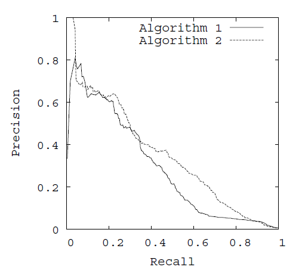
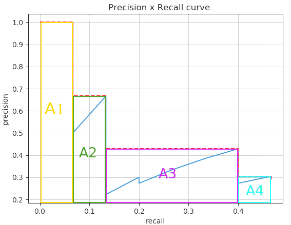

在分类模型的评价标准中，PR曲线和ROC曲线被广泛应用于模型的性能评估。本文对PR曲线和ROC曲线及其相关的性能指标AUC, EER, AP, mAP, F1-measure进行介绍。

<!--more-->

<table align="center" style= "vertical-align: middle;">
    <tr>
        <th colspan="2" rowspan="2"></td>
        <th colspan="2">Truth</td>
        <th rowspan="2"> $\sum$ </td>
    </tr>
    <tr>
        <th>1</td>
        <th>0</td>
    </tr>
    <tr>
        <th rowspan="2"> Estimate </td>
        <th> 1</td>
        <td> TP </td>
        <td> FP </td>
        <td> TP+FP </td>
    </tr>
    <tr>
        <th> 0 </td>
        <td> FN </td>
        <td> TN </td>
        <td> FN+TN </td>
    </tr>
    <tr>
        <th colspan="2"> $\sum$ </td>
        <td> TP+FN </td>
        <td> FP+TN </td>
        <td> TP+TN+FP+FN </td>
    </tr>
</table>

+ 真正例 (True Positive, TP): 预测值和真实值都为1
+ 假正例 (False Positive, FP): 预测值为1，真实值都为0
+ 真反例 (True Negative, TN): 预测值和真实值都为0
+ 假反例 (False Negative, FN): 预测值为0，真实值都为1

由这四个指标衍生出的指标：

+ 查准率/准确率:                       $ \text{Precision} = \frac{TP}{TP+FP} $
+ 查全率/召回率:                       $\text{Recall} = \frac{TP}{TP+FN}$
+ 真阳率(True Positive Rate): $\text{TPR} = \frac{TP}{TP+FN}$
+ 假阳率(False Positive Rate): $\text{FPR} = \frac{FP}{FP+TN}$

## ROC曲线

### ROC定义

ROC曲线(Receiver Operating Characteristic Curve, 受试者工作特征曲线)是比较分类模型好坏的可视化工具。

以FPR为x轴，TPR为y轴绘制图。如下图所示。

### ROC曲线的衍生指标

+ EER(equal error rate): TPR=FPR时的值。
+ AUC(area under curve): ROC曲线下的面积

## PR曲线

### PR定义

PR曲线中P是Precision, R是Recall。

以Recall为x轴，Precision为y轴。

1. **假设一次Object Detection的结果为：**（对于目标检测任务，当预测框与真实框[IoU](/post/what-is-iou)大于一定阈值时标记为TP；当预测框与真实框IoU小于一定阈值时标记为FP；一个真实框没有一个任何预测框与其重叠的为FN）

2. **对其confidence进行排序:** 
    
3. **根据上表的顺序绘制PR曲线：**
    

至此我们得到了一张PR图。

### PR图的衍生指标

+ AP (Average Precision) 
+ mAP (mean Average Precision)
+ F1-measure 综合评价指标

下面给出AP, mAP和F-measure的计算方法

#### 计算AP

AP 是针对某一类别进行计算的。

下面我们先从图的角度来理解AP。

**在2010年前，AP的计算方法是用11点插值法(11-point interpolation)**：

分别取 recall = [0.0, 0.1, 0.2, 0.3, 0.4, 0.5, 0.6, 0.7, 0.8, 0.9, 1.0] 十一个点插值，对每一个插值recall取 recall' >= recall 的点中precision最大的值作为该插值recall对应的precision。

计算公式为:

$$
P_{\text{interpolation}} (r) = \max_{r' \ge r}\left(P(r')\right)
$$

计算这11个插值recall对应precision的均值即是AP。

$$
\begin{align}
AP &= \frac1{11} \sum_{r \in \{0,0.1,...,1\}} P_{\text{interpolation}} (r) \\
&= \frac1{11} \left( 1 + 0.6666 + 0.4285 + 0.4285 + 0.4285 + 0 + 0 + 0 + 0 + 0 + 0  \right) \\
&= 26.84\%
\end{align}
$$

**2010年后，AP的计算方法不再使用11点插值法，而是考虑所有的点**: 

对所有Recall值，将Recall大于等于该Recall值的所有点中的最大precision作为该recall值对应的precision。公式仍是

$$
P_{\text{interpolation}} (r) = \max_{r' \ge r}\left(P(r')\right)
$$

不同点在于AP的计算公式:

$$
AP = \int_0^1 P_{\text{interpolation}}(r) \, dr
$$

可以画出图帮助理解：

按照上面的计算公式，则AP为：

$$
\begin{align}
A1 &= (0.0666 - 0) \times 1 = 0.0666 \\
A2 &= (0.1333-0.0666) \times 0.6666 = 0.04446222 \\
A3 &= (0.4-0.1333) \times 0.4285 = 0.11428095 \\
A4 &= (0.4666 - 0.4) \times 0.3043 = 0.02026638 \\
\\
AP &= A1+A2+A3+A4 \\
&= 0.0666 + 0.04446222 + 0.11428095 + 0.02026638 \\
&= 0.24560955 \\
&= 24.56\%
\end{align}
$$

以后的AP计算我会以2010年后的版本为准。

接下来我将演示**用表格来计算AP**，而不使用绘图的方式：

按Confidence置信度来降序做出表格:

<table>
    <tr>
        <th>Detection</th>
        <th>Precision</th>
        <th>Recall</th>
        <th>Max Precision for Any Recall $r' \ge r$</th>
        <th>Average Precision</th>
    </tr>
    <tr>
        <td>R</td>
        <td>1</td>
        <td rowspan="2">0.0666</td>
        <td rowspan="2">1</td>
        <td rowspan="24">24.56%</td>
    </tr>
    <tr>
        <td>Y</td>
        <td>0.5</td>
    </tr>
    <tr>
        <td>J</td>
        <td>0.6666</td>
        <td rowspan="7">0.1333</td>
        <td rowspan="7">0.6666</td>
    </tr>
    <tr>
        <td>A</td>
        <td>0.5</td>
    </tr>
    <tr>
        <td>U</td>
        <td>0.4</td>
    </tr>
    <tr>
        <td>C</td>
        <td>0.3333</td>
    </tr>
    <tr>
        <td>M</td>
        <td>0.2857</td>
    </tr>
    <tr>
        <td>F</td>
        <td>0.25</td>
    </tr>
    <tr>
        <td>D</td>
        <td>0.2222</td>
    </tr>
    <tr>
        <td>B</td>
        <td>0.3</td>
        <td rowspan="2">0.2</td>
        <td rowspan="13">0.4285</td>
    </tr>
    <tr>
        <td>H</td>
        <td>0.2727</td>
    </tr>
    <tr>
        <td>P</td>
        <td>0.3333</td>
        <td>0.2666</td>
    </tr>
    <tr>
        <td>E</td>
        <td>0.3846</td>
        <td>0.3333</td>
    </tr>
    <tr>
        <td>X</td>
        <td>0.4285</td>
        <td rowspan="9">0.4</td>
    </tr>
    <tr>
        <td>N</td>
        <td>0.4</td>
    </tr>
    <tr>
        <td>T</td>
        <td>0.375</td>
    </tr>
    <tr>
        <td>K</td>
        <td>0.3529</td>
    </tr>
    <tr>
        <td>Q</td>
        <td>0.3333</td>
    </tr>
    <tr>
        <td>V</td>
        <td>0.3157</td>
    </tr>
    <tr>
        <td>I</td>
        <td>0.3</td>
    </tr>
    <tr>
        <td>L</td>
        <td>0.2857</td>
    </tr>
    <tr>
        <td>S</td>
        <td>0.2727</td>
    </tr>
    <tr>
        <td>G</td>
        <td>0.3043</td>
        <td rowspan="2">0.4666</td>
        <td rowspan="2">0.3043</td>
    </tr>
    <tr>
        <td>O</td>
        <td>0.2916</td>
    </tr>
</table>

计算方法和原理同上，但画出表格可以直接计算AP:

$$
\begin{align}
AP &= 1 \times 0.0666 + 0.6666 \times (0.1333-0.0666) + 0.4285 \times(0.4-0.1333) + 0.3043 \times(0.4666 - 0.4) \\
&= 0.24560955
\end{align}
$$

#### 计算mAP

mAP的全程是mean Average Precision，即是所有AP的均值。因为AP只是正对一类的准确率进行评估，而在多类别检测/分类任务中就需要一个指标来对整个多分类任务的性能进行评估，这就是mAP。

**计算公式**:

$$
mAP = \frac{\sum_c AP_c}{N_{class}}
$$

#### 计算F1-measure综合评价指标

F-measure又称F-Score，是Precision和Recall的加权调和平均，常用于评价分类模型的好坏。

**计算公式**:

$$
F_\alpha = \frac{(\alpha^2+1)\text{Precision}\times\text{Recall}}{\alpha^2 \text{Precision} + \text{Recall}}
$$

常见的**F$_1$-measure**即为F-measure中$\alpha=1$的特例:

$$
F_1 = \frac{2 \times \text{Precision}\times\text{Recall}}{\text{Precision} + \text{Recall}}
$$

该公式的另外一种形式可以帮助记忆:

$$
\frac2{F_1} = \frac1{\text{Precision}} + \frac1{\text{Recall}}
$$

## 参考资料

[1] [rafaelpadilla/Object-Detection-Metrics](https://github.com/rafaelpadilla/Object-Detection-Metrics)

[2] [目标检测中的mAP是什么含义?](https://www.zhihu.com/question/53405779)

[3] [多标签图像分类任务的评价方法-mAP](http://blog.sina.com.cn/s/blog_9db078090102whzw.html) 