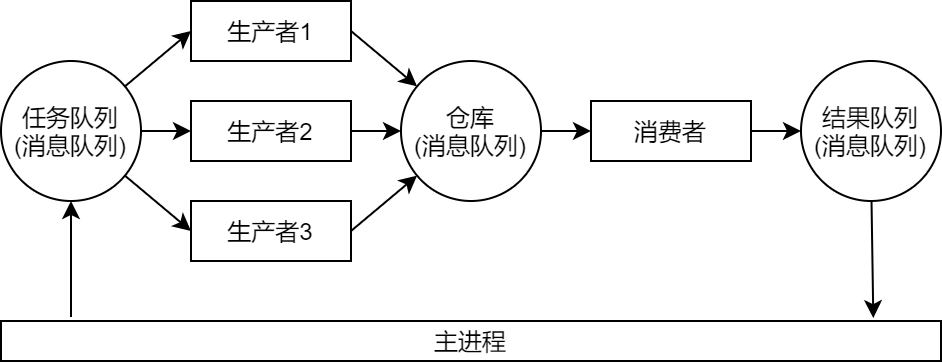

本文通过案例介绍我使用python自带的`multiprocessing`库进行多GPU并行推断的方案。

<!--more-->

# 阅前提示

本文采用的方案已在Linux经过测试，但在Windows不可行，原因是Windows和Linux在多进程的实现上不同，Windows使用spawn模式，而Linux使用fork模式，这导致了Windows下使用`multiprocessing`存在着一些限制：

+  必须保证传给 `Process.__init__()` 的所有参数均可pickle化。
+ 子进程访问父进程的全局变量时，得到的值并不能保证与父进程的全局变量相同(全局变量是模块级别除外)。
+ 必须确保在 `if __name__ == '__main__':` 之后调用。
+ 更详细的说明见[此处](https://docs.python.org/2/library/multiprocessing.html?highlight=process#windows)。

**注：**本文代码不能在Windows上运行，原因是违反第一项限制，虽然也有方法可以让它兼容Windows，但是目前我使用多进程的场景基本都在Linux上，~~哪天有需要了再写个Windows兼容的版本~~，**兼容Windows的实现已完成，请参见[easycore多GPU并行加速](/easycore-parallel-multi-gpu)**。

# 设计思路

我的方案是使用**多生产者-单消费者模型**。

一个简单的解释：众多生产者们不断地往仓库中放入产品(过程耗时长)，而有一个消费者将仓库中的产品一件件地放到自己的车上，拿到一定数量后整辆车拉走。

整体流程如下：

1. 将总任务拆分成多个可以并行的子任务。
2. 通知消费者需要从仓库中拿走的数量(即子任务的数量)。
3. 将子任务一项项加入任务队列，生产者只要看到任务队列有任务就会竞争这个任务。
4. 生产者执行完任务后，将产品(子任务的结果)放入仓库，消费者一看到仓库中有产品(子任务的结果)就会放到自己手上(对子任务的结果进行汇总和后处理)。
5. 主进程将所有子任务都加入任务队列后，就会等待消费者完成，从消费者处获得最终结果。



# 案例

## 无序并行：求列表元素平方和

我们先从一个简单的案例开始：求列表元素平方和。简单的案例更容易理解。

我们将这个任务分成两部分：一个是对单个元素求平方，一个是将平方后的所有值相加。前者只需要部分数据，可独立运行，我们将这个任务分给生产者`Sumer._TaskWorker`；后者需要汇总所有前者生成的所有数据，我们将其分配给消费者`Sumer._ReceiveWorker`。

```python
import multiprocessing as mp
import atexit

class Sumer:
    class _StopToken:
        pass

    class _TaskWorker(mp.Process):
        def __init__(self, input_queue, output_queue):
            super(Sumer._TaskWorker, self).__init__()
            self.input_queue = input_queue    # the queue to get task
            self.output_queue = output_queue  # the queue to put result
            
        def run(self):
            # initialization
            # anything
            
            # loop to get and do the tasks
            while True:
                task = self.input_queue.get()  # pick a task from the queue
                if isinstance(task, Sumer._StopToken):  # `_StopToken` is a signal to stop this worker
                    break
                
                # decode task, it can be anything you defined.
                num = task  
                
                # do the task. it's to get the suquare of the `num` here.
                result = num * num
                
                # put the result into the queue
                self.output_queue.put(result)  

    class _ReceiveWorker(mp.Process):
        def __init__(self, receive_func, input_queue, output_queue):
            super(Sumer._ReceiveWorker, self).__init__()
            self.receive_func = receive_func  # the function to get the result from '_TaskWorker'
            self.input_queue = input_queue  
            self.output_queue = output_queue

        def run(self):
            while True:
                task = self.input_queue.get()
                if isinstance(task, Sumer._StopToken):
                    break

                # decode task, get the number of tasks the worker will collect
                length = task

                # collect and postprocess the result from `_TaskWorker`
                sum = 0
                for _ in range(length):
                    # collect data
                    data = self.receive_func()
                    
                    # postprocess data. 
                    sum += data

                # put the final result into the queue
                task = self.output_queue.put(sum)

    def __init__(self, num_proc):
        self.num_proc = num_proc  # number of process

        self.task_worker_input_queue = mp.Queue(maxsize=self.num_proc * 3)
        self.task_worker_output_queue = mp.Queue(maxsize=self.num_proc * 3)
        self.receive_worker_input_queue = mp.Queue(maxsize=1)
        self.receive_worker_output_queue = mp.Queue(maxsize=1)

        # create workers
        self.task_workers = []
        for _ in range(self.num_proc):
            self.task_workers.append(Sumer._TaskWorker(self.task_worker_input_queue, self.task_worker_output_queue))

        self.receive_worker = Sumer._ReceiveWorker(self.get_from_task_worker, self.receive_worker_input_queue, self.receive_worker_output_queue)

        # start workers
        for worker in self.task_workers:
            worker.start()
        self.receive_worker.start()

        atexit.register(self.shutdown)

    def __del__(self):
        self.shutdown()

    def shutdown(self):
        for _ in range(self.num_proc):
            self.put_into_task_worker(Sumer._StopToken())
        self.put_into_receive_worker(Sumer._StopToken())

    def put_into_task_worker(self, data):
        self.task_worker_input_queue.put(data)

    def get_from_task_worker(self):
        return self.task_worker_output_queue.get()

    def put_into_receive_worker(self, data):
        self.receive_worker_input_queue.put(data)
    
    def get_from_receive_worker(self):
        return self.receive_worker_output_queue.get()

    def __call__(self, data_list):
        """
        Args:
            data_list (list[float]):
        
        Returns:
            float: sum of squares
        """
        # inform the receive worker the number of data to receive
        self.put_into_receive_worker(len(data_list))

        # put data to task worker
        for data in data_list:
            self.put_into_task_worker(data)

        # get result from receive worker
        result = self.get_from_receive_worker()
        return result


if __name__ == '__main__':
    num_proc = 3
    sumer = Sumer(num_proc)
    
    data_list = list(range(1000))
    result = sumer(data_list)

    print(result)

    del sumer  # delete the object to remove process manually, otherwise these process will be auto closed when the program exits.
```

**注：**

+ 最后的 `del` 通过删除该对象可以手动关闭开的所有子进程，如果没有手动`del`的话，所有子进程直到主进程结束时才会自动关闭。
+ **传入的数据不能过多**，多少合适呢？只要保证消费者对象`Sumer._ReceiveWorker`放到输出队列的结果别太大就行，这是因为python进程间的通信使用的是pickle序列化对象，而pickle限制了最大只能序列化4GB的对象。**PS: [easycore已克服该缺点](/easycore-parallel-multi-gpu)**。

## 有序并行：求列表元素平方

上个案例介绍了求列表元素平方和的案例，但在这过程中，每个生产者处理子任务的速度不能保证相同，所以时常会出现先接到任务的生成者后完成的情况，这种情况下，消费者从仓库中拿出产品的顺序就乱了，对于”求列表元素平方和“这一案例，顺序改变并没有影响，但对于部分任务，就必须要保证消费者处理的顺序。

接下来通过一个看似更简单的案例：求列表元素平方，我们来实现对数据的有序接收。

```python
import multiprocessing as mp
import atexit
import bisect

class Squarer:
    class _StopToken:
        pass

    class _TaskWorker(mp.Process):
        def __init__(self, input_queue, output_queue):
            super(Squarer._TaskWorker, self).__init__()
            self.input_queue = input_queue    # the queue to get task
            self.output_queue = output_queue  # the queue to put result
            
        def run(self):
            # initialization
            # anything
            
            # loop to get and do the tasks
            while True:
                task = self.input_queue.get()  # pick a task from the queue
                if isinstance(task, Squarer._StopToken):  # `_StopToken` is a signal to stop this worker
                    break
                
                # decode task, it can be anything you defined.
                task_id, num = task  
                
                # do the task. it's to get the suquare of the `num` here.
                result = num * num
                
                # put the result into the queue
                self.output_queue.put((task_id, result))  

    class _ReceiveWorker(mp.Process):
        def __init__(self, receive_func, input_queue, output_queue):
            super(Squarer._ReceiveWorker, self).__init__()
            self.receive_func = receive_func  # the function to get the result from '_TaskWorker'
            self.input_queue = input_queue  
            self.output_queue = output_queue

        def run(self):
            while True:
                task = self.input_queue.get()
                if isinstance(task, Squarer._StopToken):
                    break

                # decode task, get the number of tasks the worker will collect
                length = task

                # collect and postprocess the result from `_TaskWorker`
                data_list = []
                for _ in range(length):
                    # collect data
                    data = self.receive_func()
                    
                    # postprocess data. 
                    data_list.append(data)

                # put the final result into the queue
                task = self.output_queue.put(data_list)

    def __init__(self, num_proc):
        self.num_proc = num_proc  # number of process

        self.put_id = 0
        self.get_id = 0
        self.id_buffer = []
        self.data_buffer = []

        self.task_worker_input_queue = mp.Queue(maxsize=self.num_proc * 3)
        self.task_worker_output_queue = mp.Queue(maxsize=self.num_proc * 3)
        self.receive_worker_input_queue = mp.Queue(maxsize=1)
        self.receive_worker_output_queue = mp.Queue(maxsize=1)

        # create workers
        self.task_workers = []
        for _ in range(self.num_proc):
            self.task_workers.append(Squarer._TaskWorker(self.task_worker_input_queue, self.task_worker_output_queue))

        self.receive_worker = Squarer._ReceiveWorker(self.get_from_task_worker, self.receive_worker_input_queue, self.receive_worker_output_queue)

        # start workers
        for worker in self.task_workers:
            worker.start()
        self.receive_worker.start()

        atexit.register(self.shutdown)

    def __del__(self):
        self.shutdown()

    def shutdown(self):
        for _ in range(self.num_proc):
            self.task_worker_input_queue.put(Squarer._StopToken())
        self.receive_worker_input_queue.put(Squarer._StopToken())

    def put_into_task_worker(self, data):
        task_id = self.put_id
        self.put_id += 1
        self.task_worker_input_queue.put((task_id, data))

    def get_from_task_worker(self):
        if len(self.id_buffer) and self.id_buffer[0] == self.get_id:
            data = self.data_buffer[0]
            del self.id_buffer[0], self.data_buffer[0]
            self.get_id += 1
            return data
        
        while True:
            task_id, data = self.task_worker_output_queue.get()
            if task_id == self.get_id:
                self.get_id += 1
                return data
            insert_position = bisect.bisect(self.id_buffer, task_id)
            self.id_buffer.insert(insert_position, task_id)
            self.data_buffer.insert(insert_position, data)
    

    def put_into_receive_worker(self, data):
        self.receive_worker_input_queue.put(data)
    
    def get_from_receive_worker(self):
        return self.receive_worker_output_queue.get()

    def __call__(self, data_list):
        """
        Args:
            data_list (list[float]):
        
        Returns:
            list[float]: list of square of the data
        """
        # inform the receive worker the number of data to receive
        self.put_into_receive_worker(len(data_list))

        # put data to task worker
        for data in data_list:
            self.put_into_task_worker(data)

        # get result from receive worker
        result = self.get_from_receive_worker()
        return result


if __name__ == '__main__':
    num_proc = 3
    squarer = Squarer(num_proc)
    
    data_list = list(range(100))
    result = squarer(data_list)

    print(result)

    del squarer  # delete the object to remove process manually, otherwise these process will be auto closed when the program exits.
```

**注：**

+ 上述代码主要修改了`Squarer.get_from_task_worker`部分，使其获取到的结果不是当前想要的下一个结果时，先将该结果缓存起来，直到获取到想要的结果，后续需要该结果时就可以直接从缓存中将其取出。这样的好处是不会导致生产者的输出队列积累过多结果导致死锁。

## 多GPU并行：推断

以前面有序并行的案例为蓝本，我们来实现将pytorch模型并行到多个gpu上。

首先我们先来设计一个简单的模型：

```python network.py
import torch
import torch.nn as nn
import torch.nn.functional as F

class Net(nn.Module):
    def __init__(self):
        super(Net, self).__init__()
        self.fc = nn.Linear(1, 3)
    
    def forward(self, x):
        x = self.fc(x)
        x = F.relu(x)
        return x
```

接下来将网络并行到多个设备上：

```python
import torch.multiprocessing as mp
import atexit
import bisect
from network import Net
import torch

class Predictor:
    class _StopToken:
        pass

    class _TaskWorker(mp.Process):
        def __init__(self, input_queue, output_queue, device):
            super(Predictor._TaskWorker, self).__init__()
            self.input_queue = input_queue    # the queue to get task
            self.output_queue = output_queue  # the queue to put result
            self.device = device
            
        def run(self):
            # initialization
            model = Net()
            model.to(self.device)
            
            # loop to get and do the tasks
            while True:
                task = self.input_queue.get()  # pick a task from the queue
                if isinstance(task, Predictor._StopToken):  # `_StopToken` is a signal to stop this worker
                    break
                
                # decode task, it can be anything you defined.
                task_id, x = task  
                
                with torch.no_grad():
                    # do the task
                    x = x.to(self.device)
                    output = model(x)
                    
                    # put the result into the queue
                    output = output.cpu()  # copy to cpu before send to another process
                self.output_queue.put((task_id, output))  

    class _ReceiveWorker(mp.Process):
        def __init__(self, receive_func, input_queue, output_queue):
            super(Predictor._ReceiveWorker, self).__init__()
            self.receive_func = receive_func  # the function to get the result from '_TaskWorker'
            self.input_queue = input_queue  
            self.output_queue = output_queue

        def run(self):
            while True:
                task = self.input_queue.get()
                if isinstance(task, Predictor._StopToken):
                    break

                # decode task, get the number of tasks the worker will collect
                length = task

                # collect and postprocess the result from `_TaskWorker`
                data_list = []
                for _ in range(length):
                    # collect data
                    data = self.receive_func()
                    
                    # postprocess data. 
                    data_list.append(data)

                # put the final result into the queue
                data = torch.cat(data_list, dim=0)
                task = self.output_queue.put(data)

    def __init__(self, device_list):
        self.num_proc = len(device_list)  # number of process

        self.put_id = 0
        self.get_id = 0
        self.id_buffer = []
        self.data_buffer = []

        self.task_worker_input_queue = mp.Queue(maxsize=self.num_proc * 3)
        self.task_worker_output_queue = mp.Queue(maxsize=self.num_proc * 3)
        self.receive_worker_input_queue = mp.Queue(maxsize=1)
        self.receive_worker_output_queue = mp.Queue(maxsize=1)

        # create workers
        self.task_workers = []
        for device in device_list:
            self.task_workers.append(Predictor._TaskWorker(self.task_worker_input_queue, self.task_worker_output_queue, device))

        self.receive_worker = Predictor._ReceiveWorker(self.get_from_task_worker, self.receive_worker_input_queue, self.receive_worker_output_queue)

        # start workers
        for worker in self.task_workers:
            worker.start()
        self.receive_worker.start()

        atexit.register(self.shutdown)

    def __del__(self):
        self.shutdown()

    def shutdown(self):
        for _ in range(self.num_proc):
            self.task_worker_input_queue.put(Predictor._StopToken())
        self.receive_worker_input_queue.put(Predictor._StopToken())

    def put_into_task_worker(self, data):
        task_id = self.put_id
        self.put_id += 1
        self.task_worker_input_queue.put((task_id, data))

    def get_from_task_worker(self):
        if len(self.id_buffer) and self.id_buffer[0] == self.get_id:
            data = self.data_buffer[0]
            del self.id_buffer[0], self.data_buffer[0]
            self.get_id += 1
            return data
        
        while True:
            task_id, data = self.task_worker_output_queue.get()
            if task_id == self.get_id:
                self.get_id += 1
                return data
            insert_position = bisect.bisect(self.id_buffer, task_id)
            self.id_buffer.insert(insert_position, task_id)
            self.data_buffer.insert(insert_position, data)
    

    def put_into_receive_worker(self, data):
        self.receive_worker_input_queue.put(data)
    
    def get_from_receive_worker(self):
        return self.receive_worker_output_queue.get()

    def __call__(self, data_list):
        """
        Args:
            data_list (list[float]): input data list
        
        Returns:
            torch.FloatTensor:
        """
        # inform the receive worker the number of data to receive
        self.put_into_receive_worker(len(data_list))

        # put data to task worker
        for data in data_list:
            data = torch.Tensor([[data]])  # preprocess data
            self.put_into_task_worker(data)

        # get result from receive worker
        result = self.get_from_receive_worker()
        return result


if __name__ == '__main__':
    device_list = ["cuda:0", "cuda:1", "cuda:2", "cuda:3"]
    predictor = Predictor(device_list)
    
    data_list = list(range(100))
    result = predictor(data_list)

    print(result.shape)

    del predictor  # delete the object to remove process manually, otherwise these process will be auto closed when the program exits.
```

**注：**

+ 首先，这里将python自带的`multiprocessing`库替换成了`torch.multiprocessing`，这是因为pytorch官方对`multiprocessing`做了一层封装，使得不同进程之间可以共享`Tensor`，完全兼容`multiprocessing`的接口。本例中将`torch.multiprocessing`替换回`multiprocessing`并无影响。
+ 生产者`Predictor._TaskWorker`在将结果放进输出队列之前，最好将结果从GPU移到CPU(实际上是内存)，以避免GPU上的`Tensor`在不同进程间移动。
+ 通过`device_list = ["cuda:0", "cuda:1"]` 可以指定多个GPU，而使用`device_list = ["cpu", "cpu"]`还可以实现**多CPU并行** (在有多个CPU的情况下，系统会自动将进程分配给不同的CPU)，当然也可以混合使用CPU和GPU: `device_list = ["cpu", "cuda:0"]`。

