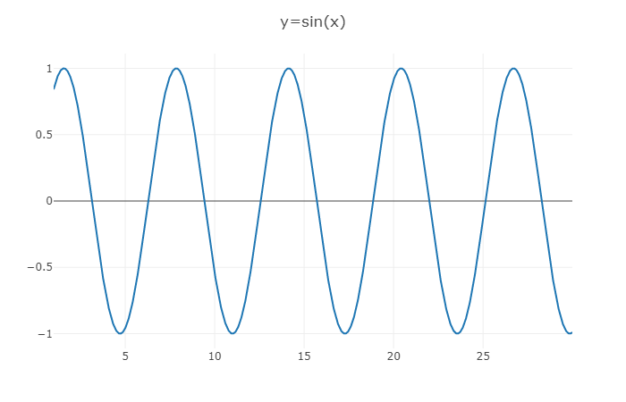
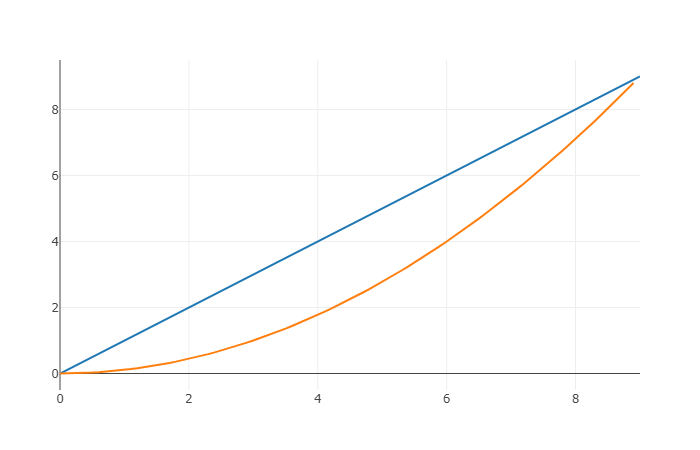
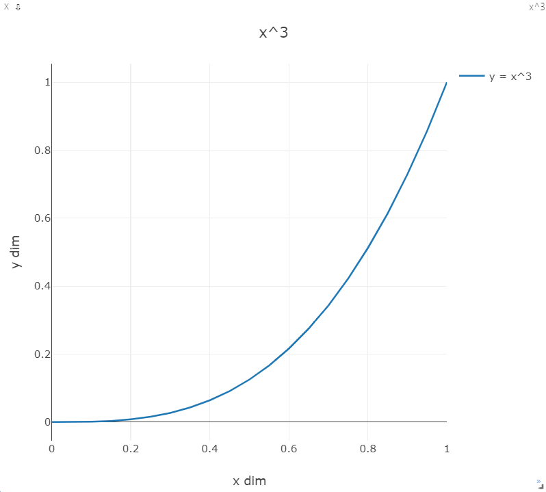
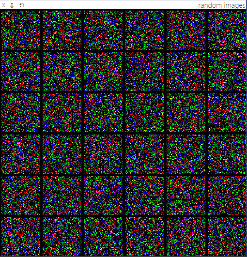
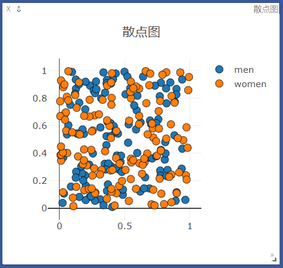
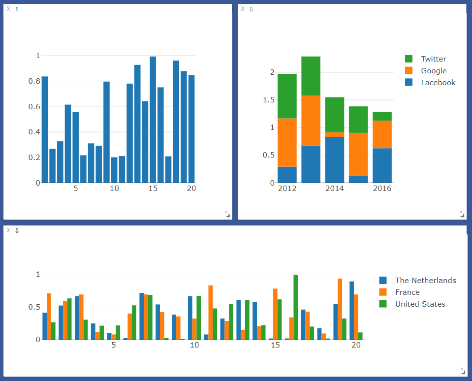
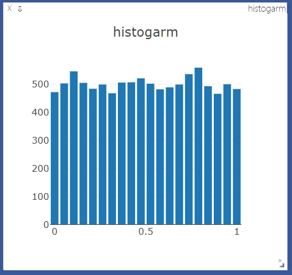
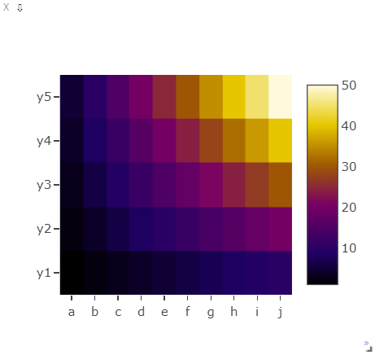
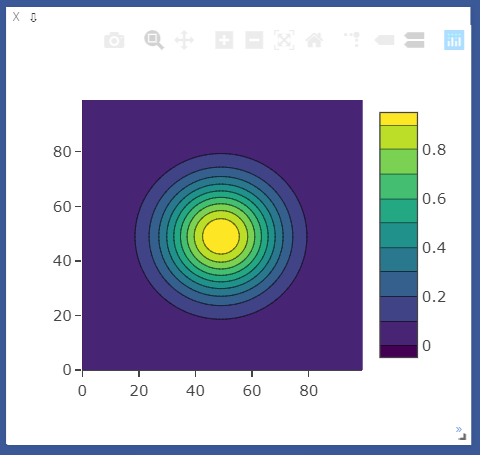
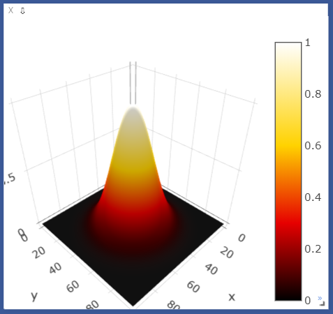

**Visdom:**一个灵活的可视化工具，可用来对于实时，富数据的创建，组织和共享。支持Torch和Numpy还有PyTorch。

**visdom** 可以实现**远程**数据的可视化，对科学实验有很大帮助。我们可以远程的发送图片和数据，并进行在ui界面显示出来，检查实验结果，或者debug。

<!--more-->


## 安装与启动

**安装**

```shell
$ pip install visdom
```

**启动**

```shell
$ python -m visdom.server
```

## 接口

大多数接口可以输入一个tensor(保存数据），和一个可选的tensor Y（标签或者时间戳）, 另外都可以指定窗口win,和汇出图添加到那个env上，另外options输入可以修改默认的绘图属性，输入参数基于表中键的匹配，有一些通用的options可以选择,下面列出了通用的可视化options(除了plot.image和plot.text外）

- `opts.title` : figure title
- `opts.width` : figure width
- `opts.height` : figure height
- `opts.showlegend` : show legend (`true` or `false`)
- `opts.xtype` : type of x-axis (`'linear'` or `'log'`)
- `opts.xlabel` : label of x-axis
- `opts.xtick` : show ticks on x-axis (`boolean`)
- `opts.xtickmin` : first tick on x-axis (`number`)
- `opts.xtickmax` : last tick on x-axis (`number`)
- `opts.xtickvals` : locations of ticks on x-axis (`table` of `number`s)
- `opts.xticklabels` : ticks labels on x-axis (`table` of `string`s)
- `opts.xtickstep` : distances between ticks on x-axis (`number`)
- `opts.ytype` : type of y-axis (`'linear'` or `'log'`)
- `opts.ylabel` : label of y-axis
- `opts.ytick` : show ticks on y-axis (`boolean`)
- `opts.ytickmin` : first tick on y-axis (`number`)
- `opts.ytickmax` : last tick on y-axis (`number`)
- `opts.ytickvals` : locations of ticks on y-axis (`table` of `number`s)
- `opts.yticklabels` : ticks labels on y-axis (`table` of `string`s)
- `opts.ytickstep` : distances between ticks on y-axis (`number`)
- `opts.marginleft` : left margin (in pixels)
- `opts.marginright` : right margin (in pixels)
- `opts.margintop` : top margin (in pixels)
- `opts.marginbottom`: bottom margin (in pixels)


## 使用

### 导入

```python
import torch
import numpy as np
from visdom import Visdom

# 新建一个连接客户端
# 指定env = u'test1'，默认端口为8097，host是‘localhost'
vis = visdom.Visdom(env="test1", use_incoming_socket=False)
assert vis.check_connection()
```

### 曲线 `vis.line`

```python
# win窗口名为 'sinx', 如果不指定回自动新分配一个pane，两次使用同一个win将覆盖
# 标题为 'y=sin(x)'
# visdom 支持pytorch的tensor 和 numpy的ndarray类型， 但不支持python的int,float等原生类型，需要转换成ndarray或者tensor
x = torch.arange(1, 30, 0.01)
y = torch.sin(x)
vis.line(X=x, Y=y, win='sinx', opts={'title': 'y=sin(x)'}) 
```



**追加数据**

```python
# append 追加数据
# y = x
# 窗口名: polynomial
for i in range(0, 10):
    x = torch.Tensor([i])  # 要转成tensor，Visdom不支持python原生的int,float等
    y = x
    vis.line(X=x, Y=y, win='polynomial', update='append' if i>0 else None)
```

**在同一附图新增曲线，而不覆盖**

```python
# update Trace 新增一条线，而不覆盖
# y= (x**2)/9
# 窗口名: polynomial
x = torch.arange(0, 9, 0.1)
y = (x ** 2) / 9
vis.line(X=x, Y=y, win='polynomial', name='this is a new Trace', update='new')
```



**附带label和对轴的控制**

```python
# y = x**3
x = torch.arange(0, 2, 0.05)
y = x**3
vis.line(
    X = x, 
    Y = y, 
    win = 'x3', 
    opts = dict(
        title = 'x^3',
        legend = ['y = x^3'],
        xlabel = 'x dim',
        ylabel = 'y dim',
        xtickmin = 0,
        xtickmax = 1,
        ytickmin = 0,
        ytickmax = 1
    )
)
```



### 图像 `vis.image / vis.images`

```python
# 图像 vis.image / vis.images
# image的画图功能可分为如下两类：
# image接收一个二维或三维向量，H x W 或 3 x H x W，前者是黑白图像，后者是彩色图像。
# images接收一个四维向量 N x C x H x W ，C可以是1或3，分别代表黑白和彩色图像。可实现类似torchvision中make_grid的功能，将多张图片拼接在一起。images也可以接收一个二维或三维的向量，此时它所实现的功能与image一致。

# 可视化一个随机的黑白图片
vis.image(torch.randn(64, 64).numpy())

# 可视化一个随机的彩色图片
vis.image(torch.randn(3, 64, 64).numpy(), win='random2')

# 可视化36张随机彩色图片，每行6张
vis.images(torch.randn(36, 3, 64, 64).numpy(), nrow=6, win='random3', opts={'title': 'random images'})
```



```python
import numpy as np 
import cv2 as cv 

# visdom 显示图像
img = cv.imread('e:/image/avator.jpg')    # H x W x C (BGR)
img = cv.cvtColor(img, cv.COLOR_BGR2RGB)  # H x W x C (RGB)
img = np.transpose(img, [2, 0, 1])        # C x H x H
vis.image(img, win='image_example')
```


### 文本 `vis.text`

```python
# 文本 vis.text
# 支持所有html标签
vis.text(u''' <h1> Hello Visdom </h1> <br> 测试 ''',
        win='visdom',
        opts={'title': 'visdom简介'}
)
```


### 散点图（2D/3D） `vis.scatter`

```python
# 散点图 vis.scatter
x = torch.rand(255, 2)          # [0, 1) 均匀分布
y = (torch.randn(255) > 0) + 1  # 标准正太分布
vis.scatter(X=x, Y=y, win='scatter', opts={'title': '散点图', 'maskersize':10, 'legend':['men', 'women']})
```



### 条形图 `vis.bar`

```python
# 条形图 bar
vis.bar(X=np.random.rand(20))
vis.bar(
    X = np.abs(np.random.rand(5, 3)),
    opts = dict(
        stacked = True,
        legend = ['Facebook', 'Google', 'Twitter'],
        rownames = ['2012', '2013', '2014', '2015', '2016']
    )
)
vis.bar(
    X = np.random.rand(20, 3),
    opts = dict(
        stacked = False,
        legend = ['The Netherlands', 'France', 'United States']
    )
)
```



### 直方图 `vis.histogram`

```python
# 直方图 histogram (横坐标0-1（最大值与最小值之间）， 纵坐标频数)
vis.histogram(X=np.random.rand(10000), opts=dict(numbins=20, title='histogarm'))
```



### 热程图 `vis.heatmap`

```python
# heatmap
vis.heatmap(
    X=np.outer(np.arange(1, 6), np.arange(1, 11)),
    opts=dict(
        columnnames=['a', 'b', 'c', 'd', 'e', 'f', 'g', 'h', 'i', 'j'],
        rownames=['y1', 'y2', 'y3', 'y4', 'y5'],
        colormap='Electric',
    )
)
```



### 等值线图 `vis.contour`

```python
# 等值线图 contour
x = np.tile(np.arange(1, 101), (100, 1))
y = x.transpose()
X = np.exp((((x - 50) ** 2) + ((y - 50) ** 2)) / -(20.0 ** 2))
vis.contour(X=X, opts=dict(colormap='Viridis'))
```



### 表面图 `vis.surf`

```python
# 表面图 surface
vis.surf(X=X, opts=dict(colormap='Hot'))
```



### 视频 `vis.video`

```python
# 视频 video
videofile = 'e:/video/001.mp4'
vis.video(videofile=videofile, opts={'width': 864, 'height':480})
```


## 保存与读取

**创建时指定保存文件路径**

```python
vis = visdom.Visdom(env="test1", log_to_filename="./log/test1.log")
```

**读取时**

```python
import visdom
visdom.Visdom().replay_log("./log/test1.log")
```


