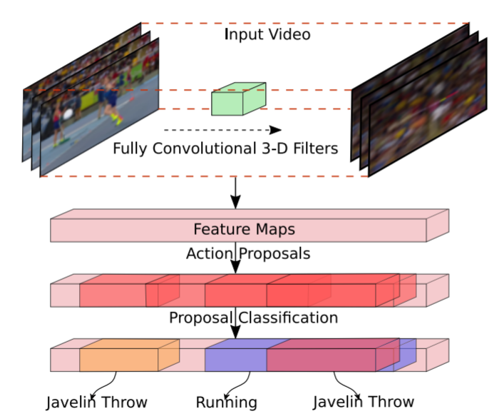
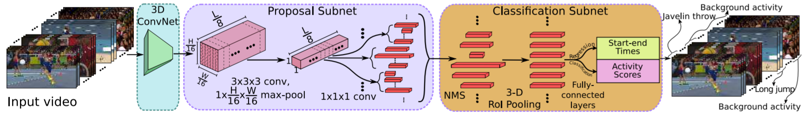
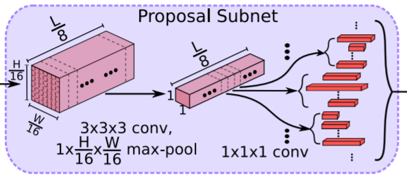
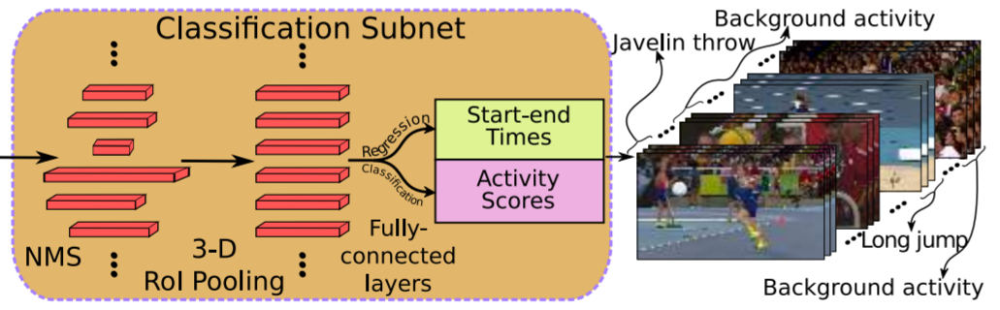

作者提出了R-C3D模型用于连续视频的行为检测(Activity Detection in Continuous Videos)。连续视频的行为检测需要完成两个目标：

1. 识别出行为的类别
2. 定位行为发生的时间范围

这两个问题正是R-C3D着力解决的。

<!--more-->

## 术语缩写

| 缩写  | 全称                            |
| ----- | ------------------------------- |
| R-C3D | Region Convolutional 3D Network |
| RoI   | Region of Interest              |
| RPN   | Region Proposal Network         |

## R-C3D 的特点

+ 端到端的训练方式；
+ 可以检测出任意时长的行为；
+ 检测速度快，一次性能计算的帧仅受限于GPU内存；
+ 推广Faster-RCNN的Region Proposal Network到时域；
+ 推广Faster-RCNN的RoI Pooling算法到时域，提出3D RoI Pooling。
+ 有监督学习(特别之处是允许一个视频中包含多种行为，且行为的时间范围有重叠)

## R-C3D 的网络结构

>  上图为本人理解后绘制的网络结构图，如有错误，欢迎批评指正。

作者提出的 R-C3D 网络包含3个组件：

+ **a shared 3D ConvNet feature extractor**
+ **a temporal proposal stage**
+ **an activity classification and refinement stage**

### 3D Convolutional Feature Hierarchies

**Input:** sequence of RGB video frames with dimension $\mathbb{R}^{3 \times L \times H \times W}$. 

+ The input to the model is of **variable length** (**$L$ can be arbitrary** and is only limited by memory)
+ Adopt **the convolutional layers (conv1a to conv5b) of C3D**
+ 本例中，$H=W=112$

**Output:** a feature map $C_{conv5b} \in \mathbb{R}^{512 \times \frac{L}8 \times \frac{H}{16} \times \frac{W}{16} }$ (512 is the channel dimension of the layer conv5b) (activations)

+ **$C_{conv5b}$ activations are the shared input to the proposal and classification subnets**.

### Temporal Proposal Subnet

**Function:** predicts **potential proposal segments with respect to anchor segments** and **a binary label indicating whether the predicted proposal contains an activity or not**.

+ The anchor segments are pre-defined multi-scale windows centered at $L/8$ uniformly distributed temporal locations.
+ Each temporal locaiton specifies $K$ anchor segments, each at a different fixed scale. Thus, the total number of anchor segments is $(L/8) * K$ .
+ a **3D convolutional filter with kernel size $3 \times 3 \times 3$** on top of $C_{conv5b}$ to extend the temporal proposal subnet.
+ a **3D max-pooling filter with kernel size $1 \times \frac{H}{16} \times \frac{W}{16}$** to downsample the spatial dimensions (from $\frac{H}{16} \times \frac{W}{16}$ to $1 \times 1$) to a temporal only feature map $C_{tpn} \in \mathbb{R}^{512 \times \frac{L}8 \times 1 \times 1}$. 
+ The 512-dimensional feature vector at each temporal location ($512 \times 1 \times 1 \times 1$) in $C_{tpn}$ is used **to predict** :
  + **a relative offset $\{ \delta c_i, \delta l_i \}$ to the center location**
  + **the length of each anchor segment $\{ c_i, l_i \},\, i \in \{ 1, \cdots, K \}$** 
  + **the binary scores for each proposal being an activity or background**
+ **two $1 \times 1 \times 1$ convolutional layers** on top of $C_{tpn}$ to predict proposal offsets and scores.

#### Training Temporal Proposal Subnet

+ **Positive Label:**
  + if the anchor segment **overlaps with some ground-truth activity with IoU > 0.7**.
  + or if the anchor segment has the **highest IoU overlap with some ground-truth activity**.
+ **Negative Label:**
  + if the anchor has **IoU overlap lower than 0.3 with all ground-truth activities**
+ All others are held out from training
+ sample balanced batches with a **positive/negative ratio of 1:1**

### Activity Classification Subnet

**Functions:**

+ **selecting proposal segments** from the previous stage.
+ three-dimensional region of interest **(3D RoI) pooling to extract fixed-size features for selected proposals**.
+ **activity classification and boundary regression** for the selected proposals based on the pooled features.

+ greedy **Non-Maximum Suppression (NMS, threshold=0.7)** to eliminate highly overlapping and low confidence proposals.

#### 3D RoI Pooling

+ 对于一个 $l \times h \times w$ 的不定输入张量（每次输入的张量的尺寸可以不一样），3D RoI Pooling 将其规约到固定的大小 $l_s \times h_s \times w_s$ .
  + $l \times h \times w$ 先被分成 $l_s \times h_s \times w_s$ 个大小约为 $\frac{l}{l_s} \times \frac{h}{h_s} \times \frac{w}{w_s}$ 的小张量，每个张量内做max pooling 得到 $l_s \times h_s \times w_s$ 的张量。
+ 在本例中，由于$H=W=112$，$C_{conv5b} \in \mathbb{R}^{512 \times \frac{L}8 \times 7 \times 7}$，将 $512 \times \frac{L}8 \times 7 \times 7$  的张量固定为 $512 \times 1 \times 4 \times 4$.
+ The output of the 3D RoI pooling is fed to a series of **two fully connected layers**.
+ 3D RoI pooling 的两层 fully connected layers 之后是 classification layer 和 regression layer.
  + **classification layer 和 regression layer 是两个独立的双层 fully connected layers, 它们的输入都是 3D RoI pooling 后 fully connected layers 的输出。**

#### Training Classification Subnet

+ **Positive Label:**
  + if the proposal has the **highest IoU** overlap with a ground-truth activity and **IoU > 0.5**.
+ **Negative Label:**
  + proposals with IoU overlap lower than 0.5 with all grouth-truth activities.
+ **Positive : Negative = 1 : 3**

## Optimization

**Loss Function:**

$$
Loss = \frac1{N_{cls}} \sum_i L_{cls}(a_i, a_i^*) + \lambda \frac1{N_{reg}} a_i^* L_{reg}(t_i, t_i^*)
$$

where, 

+ $L_{cls}$ is softmax loss function
+ $L_{reg}$ is smooth L1 loss function 
+ $N_{cls}$ is batch size
+ $N_{reg}$ is the number of anchor/proposal segments
+ $\lambda$ is the loss trade-off parameter and is set to 1. 
+ $i$ is the anchor/proposal segments index in a batch
+ $a_i$ is the predicted probability of the proposal or activities
+ $a_i^*$ is the ground truth
+ $t_i = \{ \delta \hat{ c_i} , \delta \hat{ l_i} \}$ represents predicted relative offset to anchor segments or proposals.
+ $t_i^* = \{ \delta c_i , \delta l_i \}$ represents the coordinate transformation of ground truth segments to anchor segments or proposals.

$$
\begin{cases}
\delta c_i = (c_i^* - c_i) / l_i \\
\delta l_i = \log (l_i^* / l_i)
\end{cases}
$$

where $c_i$ and $l_i$ are the center location and the length of anchor segments or proposals while $c_i^*$ and $l_i^*$  denote the same for the ground truth activity segment.

+ **The above loss function is applied for both the temporal proposal subnet and the activity classification subnet.**
+ **In proposal subnet,** 
  + $L_{cls}$ predicts whether the proposal contains an activity or not.
  + $L_{reg}$ optimizes the relative displacement between proposals and ground truths.  
+ **In classification subnet,**
  + $L_{cls}$ predicts the specific activity class for the proposal. (The number of classes are the number of activities + one for background)
  + $L_{reg}$ optimizes the relative displacement between activities and ground truths. 

## Prediction

+ 预测出$t_i$后需要逆变换把相对坐标变成绝对坐标。
+ 为了充分利用向量化实现的优势，用最后一帧去填充视频较短不足的部分。
+ NMS at a lower threshold (0.1 less than the mAP evalution threshold) is appled to the predicted activities to get the final activity predictions.

## Experiments

### Experiments on THUMOS'14

+ divide 200 untrimmed videos from the validation set into 180 training and 20 held out videos to get the best hyperparameter setting.
+ Since the GPU memory is limited, the authors first create a buffer of 768 frames at 25 fps which means approximately 30 seconds of video.
+ The authors create the buffer by sliding from the beginning of the video to the end, denoted as the "one-way buffer". An additional pass from the end of the video to the beginning is used to increase the amount of training data, denoted as "two-way buffer".
+ initialize the 3D ConvNet part of our model with C3D weights trained on Sports-1M and finetuned on UCF101.
+ allow all the layers of R-C3D to be trained on THUMOS'14 with a **fixed learning rate of 0.0001**.
+ **K = 10, with scale values [2, 4, 5, 6, 8, 9, 10, 12, 14, 16]**

### Experiments on ActivityNet

+ sample frames at 3 fps
+ input buffer: 768
+ **K=20, with scale values [1, 2, 3, 4, 5, 6, 7, 8, 10, 12, 14, 16, 20, 24, 28, 32, 40, 48, 56, 64]**

### Experiments on Charades

+ sample frames at 5 fps
+ input buffer: 768
+ **K=18, with scale values [1, 2, 3, 4, 5, 6, 7, 8, 10, 12, 14, 16, 20, 24, 28, 32, 40, 48]**