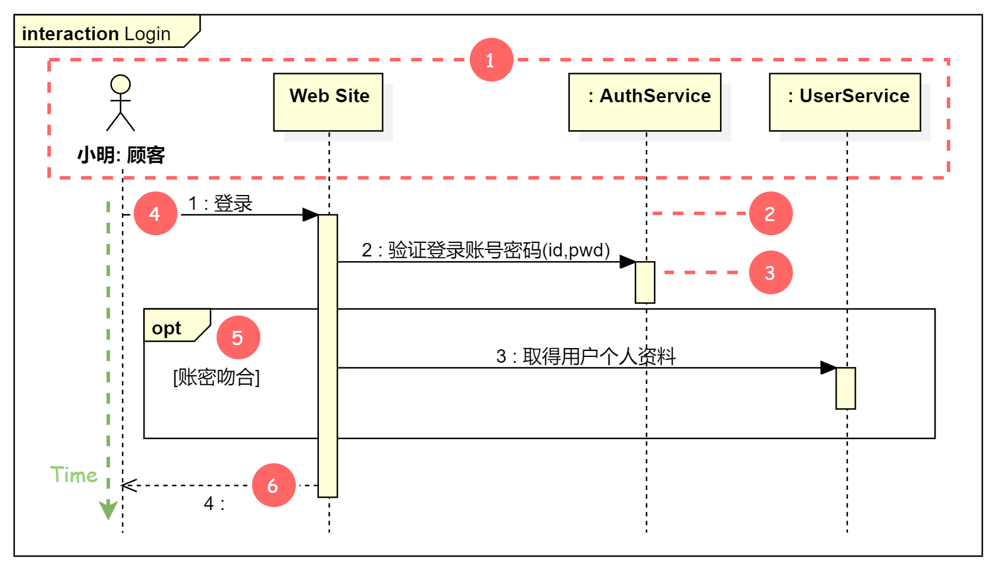
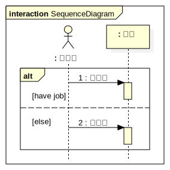
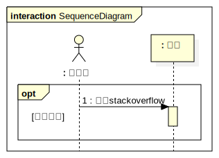
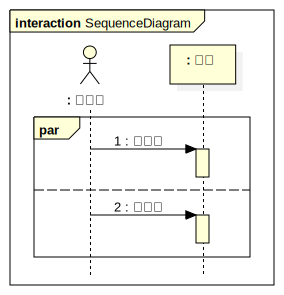
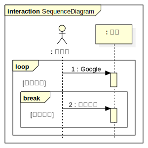

---

title: 使用UML顺序图表示物件交互及时序关系
tags: ["uml", "sequence-diagram"]
categories: []
reward: true
copyright: true
date: 2019-10-24 19:13:36
thumbnail:
---

本文介绍UML顺序图(Sequence Diagram，又称时序图)表示物件间的交互以及时序关系。
<!--more-->

# 顺序图说明

使用顺序图就是要清楚地传达各物件在时间轴上的交互情景，下面通过一张图来展示构成顺序图的所有物件有哪些，以及在各时间点彼此交互的情况。

1. 参与者(Participants)：参与交互的物件，内文格式为 `名称 : 类别名称`
2. 生命线(Lifeline)：表示交互发生的时间轴
3. 执行发起(Execution Occurrence)：描述生命线内某个执行单元
4. 讯息(Message)：呼叫目标物件的实际行为
5. 合并片段(Combined Fragment)：描述不同情况下可能发生的变化
6. 回传讯息(Reply Message)：非必须符号，因为执行发起的结束点就隐含此意了

# 范例

假定这样一个场景：医院里，病患看病都是需要预约挂号的，最直接的就是跟经理约个时间，而经理通常回询问病患是否为初诊，如果是初诊就会要求病患填写基本资料，并且通过医院系统注册新病患的资料。接着就会询问要挂哪一位医生的门诊，所以需要通过医院系统来查询门诊是否额满，此时就会有两种情况，因此需要通过 alt 片段来区分不同情况下所发生的变化。当满诊的情况下，助理会将病患列入候补清单，若有其他病患退挂会主动通知（此流程于此不详述）；当该医生的门诊尚未额满时，助理会通过医院系统建立一张预约表，并且执行预约作业（输入病患及医生门诊信息），完成后会取得一组预约序号。最后整个流程结束后由助理回应病患此次预约挂号的处理结果。

# 组合片段类型

在绘制顺序图时经常会使用到组合片段，且会因各种情景存在许多种类型，以下介绍一些比较常见的片段。

## `alt` 互斥条件

**`alt`  (Alternatives)：互斥条件，任何情况只有一个序列发生**

例：工程师有工作就用电脑写程序，否则就用电脑听音乐

## `opt` 选择项

**`opt` (Option)：选择项，不一定会发生的序列（符合条件才会执行）**

例：工程师遇到问题的时候会查询 stackoverflow 求解答

## `par` 并行处理

**`par` (Parallel)：并行处理，片段中的事件并行执行**

例：工程师用电脑边写程序边听音乐

## `loop` 重复片段

**`loop` ：重复片段。可以设立重复的条件，若未设定最小级最大重复次数，默认表示无限制**

例：工程师只要遇到问题，直接无尽无尽的使用电脑进行Google搜索，直到找到解决方案为止

## `ref` 参考

**`ref` (Reference)：表示参考另一个交互顺序图，属于 Interaction Use 范畴**

例：顾客在使用网站时都需要登录，而登录细节就此不再赘述（直接参考登录顺序图即可）

以下是被参考的 Login 交互顺序图，所有登录细节统一在这个顺序图中说明。

# 参考资料

+ [[UML] 使用循序圖傳達各物件互動及時序關係](https://dotblogs.com.tw/wasichris/2016/03/17/232341)

+ [Combined Fragment](http://www.uml-diagrams.org/sequence-diagrams-combined-fragment.html)