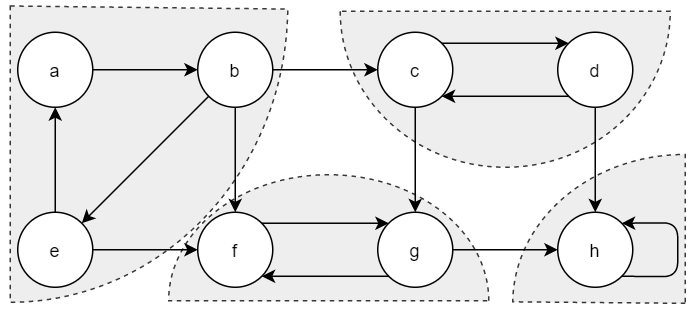
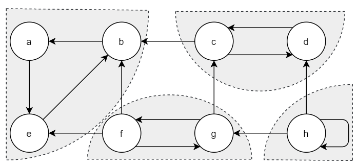
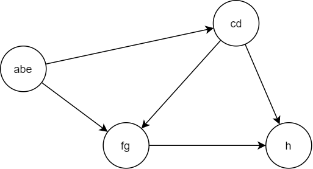

本文描述强连通分量的概念及使用深度优先搜索将有向图分解为强连通分量的方法。

<!--more-->

## 什么是强连通分量

有向图 $G=(V,E)$ 的强连通分量(Strongly Connected Component)是一个最大结点子集 $C \subseteq V$，对于该集合中的任意一对结点 $u$ 和 $v$ 来说，路径 $u \leadsto v$ 和路径 $v \leadsto u$ 同时存在，即结点 $u$ 和 $v$ 可以互相到达。

上图(有向图 $G$)是一个强连通分量的例子，其中每个阴影区域都是一个强连通分量。

值得注意的是有向图 $G$ 的转置图 $G^T=(V, E^T)$ (调转所有有向边的方向)的强连通分量与 $G$ 相同。

找到强连通分量后可以将强连通分量合并成一个点，将原本的有向图变成有向无环图，即分量图。

## 怎么计算强连通分量

### 算法步骤

深度优先搜索算法(DFS)在每个结点上盖上一个时间戳。每个结点 $v$ 有两个时间戳：

1. 第一个时间戳 $v.d$ 记录结点 $v$ 第一次被发现的时间
2. 第二个时间戳 $v.f$ 记录搜索完成对结点 $v$ 的邻接链表扫描的时间

**算法伪代码：**

1. 调用 $DFS(G)$ 计算每个结点 $u$ 的完成扫描时间 $u.f$ 
2. 计算 $G^T$
3. 调用 $DFS(G^T)$，但在DFS的主循环中，以 $u.f$ 的降序选择下一个进行搜索的根节点
4. 输出 $DFS(G^T)$ 得到的森林，森林中每棵树都是一个强连通分量

### 为什么第二次DFS得到的每棵树都是强连通分量

假定图 $G$ 有强连通分量 $C_1$, $C_2$, $\cdots$, $C_k$。

首先由于分量图是一个有向无环图，可以得到引理1。

**引理1**：设 $C$ 和 $C'$ 为有向图 $G=(V,E)$ 的两个不同的强连通分量，设结点 $u,v \in C$，结点 $u', v' \in C'$，假定图 $G$ 包含一条从结点 $u$ 到结点 $u'$ 的路径 $u \leadsto u'$。那么图 $G$ 不可能包含一条从结点 $v'$ 到结点 $v$ 的路径 $v' \leadsto v$。

将结点的发现时间 $v.d$ 和完成时间 $v.f$ 的概念推广到结点集合上：如果结点集合 $U \subseteq V$，则定义 $d(U)=\min_{u \in U} \{u.d\}$ 和 $f(U) = \max_{u \in U} \{u.f\}$。即 $d(U)$ 和 $f(U)$ 分别是结点集合 $U$ 中所有结点里最早发现时间和最晚的完成时间。

**引理2**：设 $C$ 和 $C'$ 为有向图 $G=(V,E)$ 的两个不同的强连通分量。假设存在一条边 $(u, v) \in E$，这里 $u \in C$, $u' \in C'$，则 $f(C) > f(C')$。

**推论1**：设 $C$ 和 $C'$ 为有向图 $G=(V,E)$ 的两个不同的强连通分量。假设存在一条边 $(u, v) \in E^T$，这里 $u \in C$, $u' \in C'$，则 $f(C) < f(C')$。

第二次DFS运行在 $G^T$ 上。从完成时间最晚的强连通分量 $C$ 开始。DFS从 $C$ 中的某个结点 $x$ 开始访问 $C$ 中所有的结点。根据推论1，$G^T$ 不可能包含从 $C$ 到任何其他强连通量的边，因此从结点 $x$ 开始的搜索不会访问任何其他分量中的结点。因此以 $x$ 为根结点的树仅包含了 $C$ 中所有结点。在完成对 $C$ 中所有结点的访问后，从另一个强连通分量 $C'$ 中选择一个结点作为根结点再进行DFS，这里 $f(C')$ 的取值再除 $C$ 以外的所有强连通分量中最大。与在 $C$ 上搜索的情况相同，得到的树也是一个强连通分量，以此类推，每棵深度优先树恰好是一个强连通分量。

