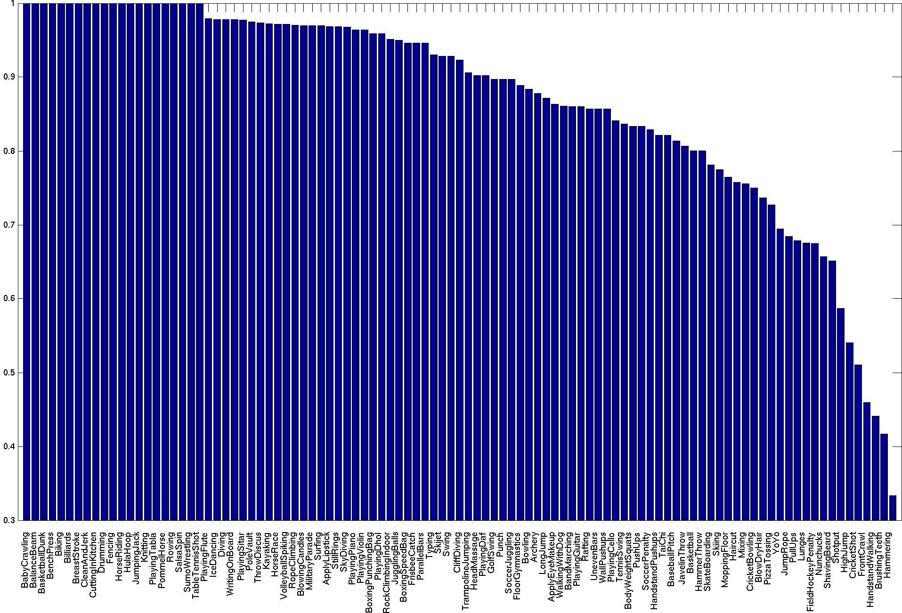

[paper]: https://arxiv.org/pdf/1406.2199.pdf	"Two-Stream Convolutional Networks for Action Recognition in Videos"

The [paper] is by Karen Simonyan, Andrew Zisserman.

**Publication date :** 12 Nov 2014

<!--more-->

# Basic Idea

The authors' contribution is:

- propose **a two-stream ConvNet architecture which incorporates spatial and temporal networks**.
- demonstrate that **a ConvNet trained on multi-frame dense optical flow is able to achieve very good performance**.
- **multi-task learning can increase the amount of training data and improve the performance on both**.

## Optical flow

### Optical flow stacking

A dense optical flow can be seen as a set of displacement vector field $d_t$ between the pairs of consecutive frames $t$ and $t+1$. 

 **$d_t(u,v)$ denotes the displacement vector at point $(u,v)$ in frame $t$**, which moves the point to corresponding point in the following frame $t+1$.

The horizontal and vertical components of the vector field, **$d_t^x$ and $d_t^y$, can be seen as image channels.**

To represent the motion across a sequence of frames, the authors **stack the flow channels $d_t^{x,y}$ of $L$ consecutive frames to form a total of $2L$ input channels.**

let $w$ and $h$ be the width and height of a video.

a ConvNet input volume $I_\tau \in \mathbb R^{w \times h \times 2L}$ for an arbitrary frame $\tau$ is then constructed as follows:
$$
\begin{align}
I_\tau(u,v,2k-1) &= d_{\tau+k-1}^x(u,v) \\
I_\tau(u,v,2k) &= d_{\tau+k-1}^y(u,v) \\
u=[1;w], v&=[1;h], k=[1;L]
\end{align}
$$
For an arbitrary point $(u,v)$, the channels $I_\tau(u,v,c), c=[1;2L]$ encode the motion at that point over a sequence of L frames.

### Trajectory stacking

An alternative motion representation, inspired by the trajectory-based descriptors, replaces the optical flow, sampled at the same locations across several frames, with the flow, sampled along the motion trajectories.
$$
\begin{align}
I_\tau(u,v,2k-1) &= d_{\tau+k-1}^x (p_k) \\
I_\tau(u,v,2k) &= d_{\tau+k-1}^y (p_k) \\
u=[1;w], v&=[1;h],k=[1;L]
\end{align}
$$
where $p_k$ is the $k$-th point along the trajectory, which starts at the location (u,v) in the frame $\tau$ and is defined by the following recurrence relation:
$$
p_1=(u,v) \\p_k=p_{k-1}+d_{\tau+k-2}(p_{k-1}), k>1
$$

### Bi-directional optical flow

Construct an input volume $I_\tau$ by stacking **$L/2$ forward flows** between frame $\tau$ and $\tau + L/2$ and **$L/2$ backward flows** between frames $\tau-L/2$ and $\tau$.

### Mean flow subtraction

Given a pair of frames, the optical flow between them can be dominated by a particular displacement, e.g. caused by the camera movement. A global motion component can be estimated and subtracted from the dense flow. But the authors consider a simpler approach: **from each displacement field $d$ they subtract its mean vector**.

# Two-stream architecture

Video can be decmposed into **spatial and temporal components**.

- **Spatial Part**
  - in the form of individual frame **appearance**.
  - carries **information about scenes and objects depicted in the video**.
- **Temporal Part**
  - in the form of **motion** across the frame.
  - conveys **the movement of the observer (the camera) and the objects**.

**Softmax scores are fused using either averaging or a linear SVM.**

**ConvNets configuration**

- All hidden weight layers use the rectification (ReLU) activation function.
- Maxpooling is performed over 3 × 3 spatial windows with stride 2
- The only difference between spatial and temporal ConvNet configuration is that the second normalisation layer from the latter to reduce memory consumption.

**Training**

- **optimizer:** **mini-batch SGD with momentum (set to 0.9)**. The learning rate is initially set to $10^{-2}$, and then decreased according to a fixed schedule (see the paper for details).
- At each iteration, **a mini-batch of 256 samples** is constructed by sampling 256 training videos.
- In spatial nets training, a 224 × 224 sub-image is randomly cropped from the selected frame; it then undergoes random horizontal flipping and RGB jittering. The videos are rescaled beforehand, so that the smallest side of the frame equals 256.
- In temporal nets training, the sub-image is sampled from the whole frame, not just its 256 × 256 center. an optical flow volume $I$ is computed. From the volume, a fixed-size $224 × 224 × 2L$ input is randomly cropped and flipped.

**Testing**

- Given a video, the authors sample a fixed number of frames (25 in their experiments) with equal temporal spacing between them. **From each of the frames they then obtain 10 ConvNet inputs by cropping and flipping four corners and the center of the frame**.
- **The class scores for the whole video are then obtained by averaging the scores** across the sampled frames and crops therein.

**Optical flow is computed using the off-the-shelf GPU implementation from the OpenCV toolbox.**

# Evaluation

The evaluation is performed on UCF-101 and HMDB-51 action recognition benchmarks.

- UCF-101 contains 13K videos (180 frames/video on average) of 101 actions.
- HMDB-51 includes 6.8K videos of 51 actions.

## Spatial ConvNets

Three scenarios are considered:

- training from scratch on UCF-101.
- pre-training on ILSVRC-2012 followed by fine-tuning on UCF-101.
- pre-training on ILSVRC-2012 and keeping the pre-trained network fixed, only training the last (classification) layer.

## Temporal ConvNets

## Two-stream ConvNets

**Per-class recall of a two-stream model on the first split of UCF-101:**

