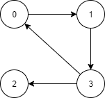

本文介绍使用 Warshall 算法求解传递闭包。

<!--more-->


# 定义

一个 $n$ 顶点有向图的**传递闭包(transitive-closure)**可以定义为一个 $n$ 阶布尔矩阵 $T = \{ t_{ij}\}$，如果从第 $i$ 个顶点到第 $j$ 个顶点之间存在一条有效的有向路径(即长度大于0的有向路径)，矩阵第 $i$ 行($1 \le i \le n$)第 $j$ 列($1 \le j \le n$)的元素为1，否则，$t_{ij}$ 为 0。

### 例子

**有向图：**



**对应的邻接矩阵：**

$$
A = 
\begin{bmatrix}
0 & 1 & 0 & 0 \\
0 & 0 & 0 & 1 \\
0 & 0 & 0 & 0 \\
1 & 0 & 1 & 0
\end{bmatrix}
$$

**对应的传递闭包：**

$$
T = 
\begin{bmatrix}
1 & 1 & 1 & 1 \\
1 & 1 & 1 & 1 \\
0 & 0 & 0 & 0 \\
1 & 1 & 1 & 1 
\end{bmatrix}
$$

# 算法思想

Warshall 算法通过一系列 $n$ 阶布尔矩阵来构造传递闭包。

$$
R^{(0)}, \cdots , R^{(n-1)}, R^{(n)}
$$

其中 $R^{(0)}$ 就是有向图的邻接矩阵 $A$，$R^{(n)}$ 就是对应的传递闭包。

矩阵间的关系如下：

$$
R_{ij}^{(k)} = R_{ij}^{(k-1)} \lor \left( R_{ik}^{(k-1)} \land R_{kj}^{(k-1)} \right)
$$

利用动态规划即可求解。

# 代码实现

## C++实现

```cpp
#include <iostream>

/* Warshall Algorithm 
 * to calcualte the transitive closure
 * 
 * Args:
 *     src (int*): a source matrix of n x n, each element of it is either 0 or 1
 *     dst (int*): a destination matrix of n x n to store the generated transitive closure, 
 *                 if dst is NULL, the result will be stored in the src
 *     n (int): the width and height of matrix src and dst
 */
void Warshall(int* src, int* dst, int n) {
    if (dst != NULL) {
        // copy the src to dst
        for(int i = 0; i < n * n; i++) {
            dst[i] = src[i];
        }
    }
    else {
        dst = src;
    }
    
    // calcualte the transitive closure
    for (int k = 0; k < n; k++) {
        for (int i = 0; i < n; i++) {
            for (int j = 0; j < n; j++) {
                dst[i * n + j] = (dst[i * n + j] || (dst[i * n + k] && dst[k * n + j]));
            }
        }
    }
}

void Test() {
    int A[4][4] = {
        {0, 1, 0, 0},
        {0, 0, 0, 1},
        {0, 0, 0, 0},
        {1, 0, 1, 0}
    };

    int B[4][4];

    Warshall(&A[0][0], &B[0][0], 4);
    
    for (int i = 0; i < 4; i++) {
        for (int j = 0; j < 4; j++) {
            std::cout << B[i][j] << " ";
        }
        std::cout << std::endl;
    }
    
}

int main() {
    Test();
    return 0;
}
```

