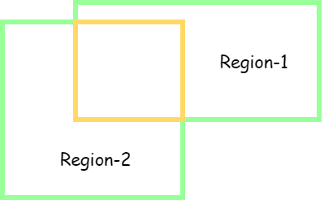

在目标检测任务中常常用IoU来计算预测窗口与真实窗口的交叠率。本文介绍IoU的概念。

<!--more-->

IoU (Intersection over Union, 交并比) 是两个窗口的交集与并集面积之比。

+ 区域 Region-1 与 Region-2 的交集如上图黄色区域
+ 区域 Region-1 与 Region-2 的并集如上图绿色区域

**IoU计算公式**:

$$
IoU = \frac{\text{Region-1} \cap \text{Region-2}}{\text{Region-1} \cup \text{Region-2}}
$$
