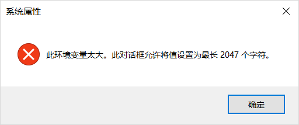

最近使用windows安装一些软件的过程中，出现了环境变量PATH最长限制2047个字符的问题。所幸我习惯下载软件的zip包，自己解压后再将其添加到环境变量中，因此才能及时发现这个问题。用安装包安装可能还不会提示这个问题，出情况也就比较难去定位问题了。

<!--more-->

## Problem 问题

- 环境变量PATH (或者是Path，windows的环境变量不区分大小写) 最大长度为2047个字符，要添加新的位置到环境变量中就超出了限制。

## Solution 解决方法

**用一个新的环境变量PATH2来拓展PATH**，具体步骤如下：

1. 打开 `计算机 >> 属性 >> 高级系统设置 >> 环境变量`
2. 在**系统变量**中找到 `PATH` (不区分大小写)， 将其名称改成 `PATH2`。
3. 新建一环境变量 `PATH`，在其中添加一个值`%PATH2%` 用于将 `PATH2` 包含进来。

完成。

由于新的 `PATH` 的只有 `%PATH2%` 一个值，后续要添加到环境变量中的位置都可以添加到 `PATH` 中，相当于扩容了 `PATH`，而 `PATH2` 是透明的，对以后的操作并不会有什么影响。

